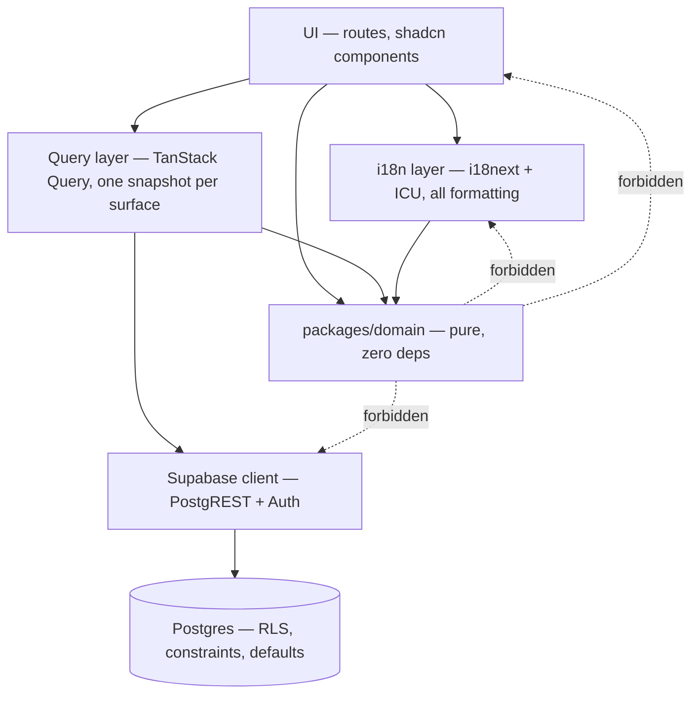
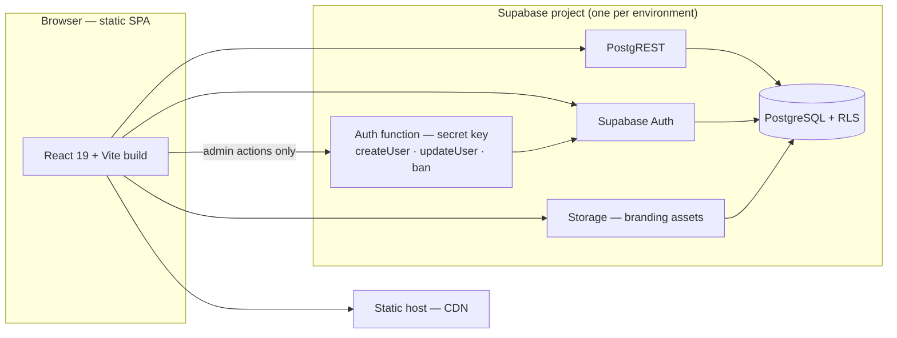
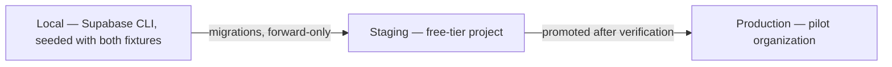
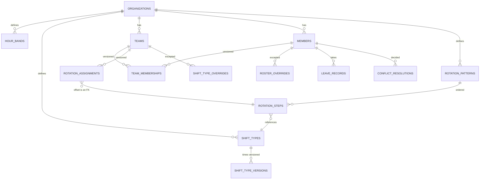

# Architecture Spine — Shift

## Design Paradigm

**The database stores only what a human asserted; everything else is a pure function of it.**

Three kinds of row exist, and nothing else does:

| Kind | Contents |
| --- | --- |
| **Rules** | organization settings, hour bands, shift types, teams, members, allowances, rotation patterns and steps, rotation assignments |
| **Exceptions** | shift-type overrides, roster overrides, leave records |
| **Decisions** | conflict resolutions, each with its attribution |

Everything a user reads is derived from those: the projected schedule, shift rosters, band hours, total hours, leave-day counts, leave balances, leave/schedule collisions, and coverage and rest-gap warnings.

The derivation lives in one pure package that cannot reach for data. The store enforces who may assert what. There is nothing in between.

## Invariants & Rules

### AD-1 — Nothing derived is ever persisted

- **Binds:** all; CAP-11, CAP-13, CAP-14, CAP-15, CAP-16
- **Prevents:** one unit reading a materialized row while another recomputes, and the two disagreeing — the drift that makes DI-1 and DI-2 unverifiable.
- **Rule:** No table may hold a value the domain package can compute. Adding a column that caches a derived figure requires amending this AD, not a migration.

### AD-2 — Every rule that feeds derivation declares whether it is versioned or current-state

- **Binds:** CAP-3, CAP-4, CAP-6, CAP-8, CAP-9, CAP-11; engine-rules R1.1, R1.2, R2.10, R7.4
- **Prevents:** history silently rewriting itself. Under AD-1 there are no stored shifts, so a rule edit re-derives *every past date* through the new value by default — which quietly violates CAP-4's "alters no past shift", CAP-6's "forward only, rewrites no history", and CAP-9's "shifts before the effective date are unchanged".
- **Rule:** Retroactivity is never incidental. Each rule kind is classified below, and a versioned rule carries a validity range, is never updated in place, and is selected by the date being derived.

  | Rule | Classification | Because |
  | --- | --- | --- |
  | Rotation assignment | **Versioned** | CAP-9 — shifts before the effective date are unchanged |
  | Team membership | **Versioned** | CAP-6 — a team move changes the schedule forward only |
  | Member active status | **Versioned** | CAP-4 — deactivation removes from *future* rosters and alters no past shift |
  | Rotation pattern and steps | **Versioned** | reached through a versioned assignment; editing in place would defeat it |
  | Shift type **times** | **Versioned** | an edit would otherwise change accepted totals for closed months, and there is no period locking to catch it |
  | Shift type **name** | **Current-state** | a rename is cosmetic; versioning it would churn the hot path for a typo fix |
  | Hour bands | **Current-state** | CAP-3 explicitly *wants* retroactivity — moving a boundary recomputes reported band hours, and changes no total |
  | Leave allowance | **Current-state** | CAP-15 — allowance minus used equals balance at all times |

  A new rule kind is unclassified until it appears in this table.

### AD-3 — Illegal states are made unrepresentable, not validated

- **Binds:** CAP-3, CAP-4, CAP-8, CAP-15; engine-rules R1.5, R1.6, R4.4; quality-requirements Q6
- **Prevents:** a guard existing only in client code, so a direct PostgREST call writes a state the engine cannot interpret.
- **Rule:** Prefer schema shape to a check. Hour bands store a name and start time only, windows derived. A rotation offset is a foreign key to a step **of that pattern**, never an integer. Overlapping leave is refused by `EXCLUDE USING gist (member_id WITH =, during WITH &&)`, which requires the `btree_gist` extension. A validation that could have been a shape is a defect.
- **Named exception:** Q6 — an organization may never be left with zero admins and the last admin's role may not be downgraded — is the one refusal that *cannot* be made unrepresentable, because it is a cross-row cardinality rule. It is enforced by a constraint trigger, and it is the only such trigger permitted. A second one is a signal that AD-9's no-server-tier decision needs revisiting, not that another trigger should be written.

### AD-4 — A conflict is derived; only its resolution is stored

- **Binds:** CAP-16; engine-rules R6.1–R6.5; quality-requirements Q11
- **Prevents:** a missed recomputation path producing a silent false negative — the exact failure the product exists to prevent — and stale conflict rows surviving a rotation change as false positives.
- **Rule:** No conflicts table. A collision is `leave ∩ working shift ∩ roster`, computed on read. A `conflict_resolutions` row keyed by `(organization_id, member_id, date, team_id)` records the kind, the acting admin, and the timestamp — `team_id` is load-bearing, because a roster override can place a member on another team's shift on a date they already work, producing two distinct collisions the same day; replace-member and amend-leave also reference the override or leave change they caused. An unresolved conflict is a derived collision with no matching resolution.

### AD-5 — A configuration change diffs the collision set and surfaces what it would erase

- **Binds:** CAP-9, CAP-16; engine-rules R6.3
- **Prevents:** a rotation or roster change silently deleting an unresolved conflict an admin had queued — the failure mode AD-4 opens up.
- **Rule:** Any write that can change the projected schedule computes the unresolved collision set before and after, and surfaces every erased collision for explicit confirm, amend, or discard. The change is not applied until they are dispositioned. This never blocks on warnings — only on erasures. The diff is bounded, not unbounded over all future dates: a collision requires a leave record, so the window is the union of existing leave ranges intersected with the change's own validity range.

### AD-6 — Time is integer minutes since midnight, over nominal wall-clock

- **Binds:** CAP-3, CAP-7, CAP-14; engine-rules R3.1–R3.10; DI-5, DI-6
- **Prevents:** the whole daylight-saving class of bug, and a second unit reaching for elapsed real time because it was available.
- **Rule:** No `Date`, no `timestamptz`, and no instant enters a calculation. Shift types store `start_time`/`end_time` as `time` plus `is_working`; nominal duration is derived (`end <= start` means it crosses midnight, add 1440). Instants are computed for display in the organization timezone only, and never for accounting.

### AD-7 — One pure domain package, and it cannot reach for data

- **Binds:** all; quality-requirements Q7, Q8
- **Prevents:** the same calculation existing in a component, a query hook, and a Postgres function, agreeing today and diverging later.
- **Rule:** `packages/domain` holds every calculation, as pure TypeScript with zero runtime dependencies, no React import, no Supabase import, and no I/O. Its shape is `(config snapshot, exception layer, window) -> derived values` over plain data. It is a leaf: everything may depend on it, it depends on nothing. Recomputing outside it is a defect even when the answer matches.

### AD-8 — The domain returns codes and operands, never prose

- **Binds:** CAP-10, CAP-16; localization L4, L7
- **Prevents:** a translated string originating in the engine, which makes Croatian's three plural forms unimplementable because the count never reaches the formatter as a number.
- **Rule:** Warnings, refusals, and states are data — `{ code: 'REST_GAP', hours: 24 }`, `{ code: 'COVERAGE_GAP', dates: [...] }`. The i18n layer resolves them. A domain function returning `"24 sati"` is a defect.

### AD-9 — No server tier for domain writes; clients write directly to Postgres under RLS

- **Binds:** all domain writes; quality-requirements Q1, Q2
- **Prevents:** domain logic acquiring a second home, and a service-role key bypassing the row-level policies the spec requires.
- **Rule:** Every domain write goes through PostgREST. Isolation and role are enforced by RLS, integrity by schema shape (AD-3), attribution by column default (AD-11). Any rule that cannot be expressed declaratively is escalated to this spine, not solved by adding a function. The sole exception is the privileged auth boundary of AD-16, which touches no domain table.

### AD-10 — RLS reads the organization from a claim and the role from the table

- **Binds:** CAP-1, CAP-4; quality-requirements Q1, Q2, Q3
- **Prevents:** a deactivated or demoted account retaining write access until its token expires — which all-claims policies would allow, contradicting CAP-4's "blocks authentication."
- **Rule:** `organization_id` rides in a JWT claim, safe only because one user belongs to exactly one organization. Role and active status are read on every policy evaluation through a `SECURITY DEFINER STABLE` helper. If multi-organization membership is ever added, this AD is void — see Deferred.

### AD-11 — Attribution comes from column defaults the client cannot forge

- **Binds:** CAP-9, CAP-12, CAP-16; DI-11; quality-requirements Q11, Q12
- **Prevents:** an unattributable or falsely attributed change — which matters more than usual because AD-9 leaves no server tier to enforce it.
- **Rule:** Every override, leave record, and resolution carries `created_by uuid default auth.uid()` and `created_at timestamptz default now()`, with an RLS `WITH CHECK (created_by = auth.uid())`. The attribution outlives what it modified. No audit-log interface exists.

### AD-12 — Identity is an admin-issued username mapped to a synthesized address

- **Binds:** CAP-1, CAP-4; quality-requirements Q5
- **Prevents:** an unbuildable requirement. Supabase Auth binds a password to an email or phone and has no username identity, while CAP-1 requires a usable account with no email present.
- **Rule:** Members sign in with a username; the app resolves it to a non-routable synthesized address in `auth.users`. **Consequence:** email-based self-service reset is impossible for these accounts, so password reset is an admin-issued action. No phone number is collected.

### AD-13 — One snapshot per surface

- **Binds:** CAP-13, CAP-14, CAP-15, CAP-17; quality-requirements Q19
- **Prevents:** a screen showing a stale total beside a fresh one, which independent TanStack Query keys do by default.
- **Rule:** Each surface fetches one composite payload — configuration plus the exception layer for its window — under a single query key. Every figure on that surface is derived from that one snapshot. Two figures on a screen may never come from two reads.

### AD-14 — No server runtime beyond the privileged auth boundary

- **Binds:** all; quality-requirements Q13
- **Prevents:** a server tier reappearing incrementally and reopening Q8.
- **Rule:** The frontend is a static SPA build. No SSR and no application server. Exactly one Edge Function exists — the privileged auth boundary of AD-16 — and a second one amends this AD.

### AD-15 — Every rule is asserted without a browser, against two fixtures

- **Binds:** all; quality-requirements Q9, Q10; engine-rules R8.1–R8.3
- **Prevents:** an engine verified only through the UI, where a passing screen hides a wrong number.
- **Rule:** Vitest in the node environment — no jsdom, no browser. Every AD here and every rule in `engine-rules.md` carries at least one assertion, run against both the pilot and the UJ-5 security organization. A rule exercised only through a rendered component is not covered.

### AD-16 — One privileged auth boundary, and it may not think

- **Binds:** CAP-1, CAP-4; quality-requirements Q2, Q5, Q8
- **Prevents:** two failures at once. Without it, `admin.createUser` has nowhere to run and CAP-1's admin-issued credentials are unbuildable; without its second clause, the one component holding the secret becomes the place every awkward rule migrates to, and AD-7's leaf property dies quietly.
- **Rule:** Exactly one Edge Function holds the secret key. It exposes only `createUser`, `updateUserById` and ban/unban, each callable only by an admin of the target member's own organization, verified against the database rather than the request. It **performs no domain calculation and contains no rule from `engine-rules.md`** — adding either is a defect, not a refactor.

  Two further clauses, because the secret key bypasses RLS entirely:

  - **The function holds two clients.** The secret key is used *only* for the auth call. Every domain-table write it makes — the `members` row above all — goes through a client built from the **caller's JWT**, so RLS, AD-11's `auth.uid()` defaults and its `WITH CHECK` all still apply. A domain write made with the secret key is a defect.
  - **Organization provisioning does not use this function.** It is an operator CLI task outside the application, and is the single write in the system exempt from AD-11 — no admin exists yet to attribute it to.

### AD-17 — The secret key exists in exactly one place

- **Binds:** all environments; quality-requirements Q1, Q2
- **Prevents:** the service key reaching a browser bundle, a committed file, or a migration — which would make every RLS policy in the system decorative.
- **Rule:** The SPA ships the publishable key (`sb_publishable_*`) only. The secret key (`sb_secret_*`) exists solely in the AD-16 function's environment, per environment. Supabase's legacy `anon`/`service_role` keys are deprecated at the end of 2026 and are not used.

### Dependency direction



## Consistency Conventions

| Concern | Convention |
| --- | --- |
| Naming — database | `snake_case`, plural tables (`leave_records`), singular columns. Every organization-scoped table carries `organization_id` as its first column. |
| Naming — TypeScript | `camelCase` values, `PascalCase` types. Domain terms match `glossary.md` exactly — `ShiftType`, `HourBand`, `RotationAssignment`, `ScheduledShift`, `LeaveDay`. A synonym is a contract violation. |
| Ids | `uuid` primary keys, generated database-side. |
| Dates and times | Dates as `date`. Times as `time` without zone. Durations and clock arithmetic as integer minutes (AD-6). Never a `timestamptz` outside `created_at`. |
| Derived-value shape | Plain serializable objects from `packages/domain`. No classes, no getters, no dates-as-objects. |
| Error and warning shape | `{ code, ...operands }` (AD-8). Codes are `SCREAMING_SNAKE`, stable, and translated only at the edge. |
| Refusals vs warnings | A refusal means the state is unrepresentable and is enforced by schema shape (AD-3). Everything else warns and never blocks — except an AD-5 erasure. |
| Snapshot shape | One canonical `OrganizationSnapshot(window)` type. A surface narrows it by selecting fields — it never defines its own shape for the same rows, so two surfaces cannot name the same data differently. |
| Mutation | Writes are direct PostgREST calls invalidating exactly their surface's snapshot key (AD-13). No optimistic updates for hours, leave balance, or conflict state. |
| Auth context | `organization_id` from the JWT claim; role and active status from the helper (AD-10). Never trust a client-supplied organization or role. |
| Migrations | Files in `supabase/migrations`, forward-only, promoted local → staging → prod. Never edited after promotion. |
| Strings | No literal user-facing text outside `i18n`. Domain and database return codes and values only. |

## Stack

Verified against the npm registry and vendor documentation on 2026-09-02.

| Name | Version |
| --- | --- |
| React | 19.2.8 |
| TypeScript | 7.0.2 |
| Vite | 8.2.2 |
| Tailwind CSS | 4.3.3 |
| shadcn/ui | current (Tailwind v4 + React 19 supported) |
| @tanstack/react-router | 1.170.32 |
| @tanstack/react-query | 5.102.8 |
| @tanstack/react-table | 9.2.4 |
| @supabase/supabase-js | 2.113.0 |
| i18next | 26.4.1 |
| Vitest | current, node environment |
| PostgreSQL | Supabase-managed |

## Structural Seed

### Containers and environments





### Core entities

Attributes appear only where the attribute is itself an invariant.



No `schedules`, `shifts`, `shift_members`, or `conflicts` table exists — each is derived (AD-1, AD-4).

### Source tree

```text
shift/
  packages/
    domain/            # AD-7 — pure engine, zero runtime deps
      src/             # projection, rosters, bands, hours, leave, collisions, warnings
      test/            # AD-15 — vitest node env; pilot + security fixtures
  supabase/functions/
    admin-auth/        # AD-16 — the only privileged component; no domain logic
  apps/
    web/
      src/
        routes/        # TanStack Router file routes
        surfaces/      # AD-13 — one snapshot loader per surface
        components/    # shadcn primitives + DESIGN.md domain components
        i18n/          # resources + the single formatting module
        supabase/      # generated types + client
  supabase/
    migrations/        # forward-only, promoted local -> staging -> prod
    seed.sql           # both fixtures
```

## Capability → Architecture Map

| Capability | Lives in | Governed by |
| --- | --- | --- |
| CAP-1 Authenticated, scoped access | Supabase Auth, RLS policies, privileged auth function | AD-9, AD-10, AD-12, AD-16, AD-17 |
| CAP-2 Organization config and branding | `organizations`, Storage | AD-9, AD-10 |
| CAP-3 Hour bands | `hour_bands`, `domain/bands` | AD-3, AD-6 |
| CAP-4 Member management | `members`, RLS helper, privileged auth function | AD-10, AD-11, AD-16 |
| CAP-5 Team roster visibility | derived roster, RLS read policy | AD-1, AD-10 |
| CAP-6 Teams of any number | `teams` | AD-9 |
| CAP-7 Shift types incl. midnight-crossing | `shift_types`, `domain/duration` | AD-6 |
| CAP-8 Rotation pattern and assignment | `rotation_*`, `domain/projection` | AD-2, AD-3, AD-7 |
| CAP-9 Rotation change with effective date | assignment versioning | AD-2, AD-5, AD-11 |
| CAP-10 Warnings that inform | `domain/warnings` | AD-8, AD-3 |
| CAP-11 Schedule projection and rosters | `domain/projection` | AD-1, AD-2, AD-7 |
| CAP-12 Overrides as a separable layer | `*_overrides` | AD-1, AD-11 |
| CAP-13 Monthly calendar | calendar surface | AD-13, AD-1 |
| CAP-14 Hours by band intersection | `domain/hours` | AD-6, AD-7, AD-13 |
| CAP-15 Annual leave | `leave_records`, `domain/leave` | AD-3, AD-13 |
| CAP-16 Conflicts resolved explicitly | `conflict_resolutions`, `domain/collisions` | AD-4, AD-5, AD-11 |
| CAP-17 Role-appropriate landing surfaces | dashboard surfaces | AD-13 |

## Deferred

- **Multi-organization membership.** Not built; the current non-goal licenses AD-10's claim. **Revisit when** a user genuinely needs two organizations — the claim becomes a set or a per-request selection, and every policy reading it changes together, as one coordinated move.
- **Materialization for scale.** AD-1 holds at the pilot's scale and at Q20's several hundred members. **Revisit when** a surface misses Q17's two-second budget on real data, measured rather than assumed.
- **Conflict-resolution history.** Resolutions are current-state rows. **Revisit when** someone needs to see a resolution that was later superseded.
- **Realtime.** No subscriptions; surfaces refetch. **Revisit when** two admins working the same conflict queue becomes a real scenario rather than a hypothetical.
- **Typed linting.** TypeScript 7 has no stable programmatic API until 7.1. **Revisit at** 7.1, or sooner if typed lint rules are wanted — fallback is pinning TypeScript 5.x, which nothing else in this spine depends on.
- **Storage-level policy detail** for branding assets beyond Q4's ownership rule. **Revisit when** the upload surface is built.
- **Claim-code identity**, the fully server-free alternative to AD-16: an admin issues a one-time code, the member signs up, and the exchange is an ordinary RLS-governed write linking their auth user to a pre-created member row — an unlinked account reads nothing, so open signup is harmless. Rejected now because it reworks CAP-1 and CAP-4 and moves password choice to the member. **Revisit if** the AD-16 function ever needs to be removed, or if it starts accreting responsibilities its rule forbids.
