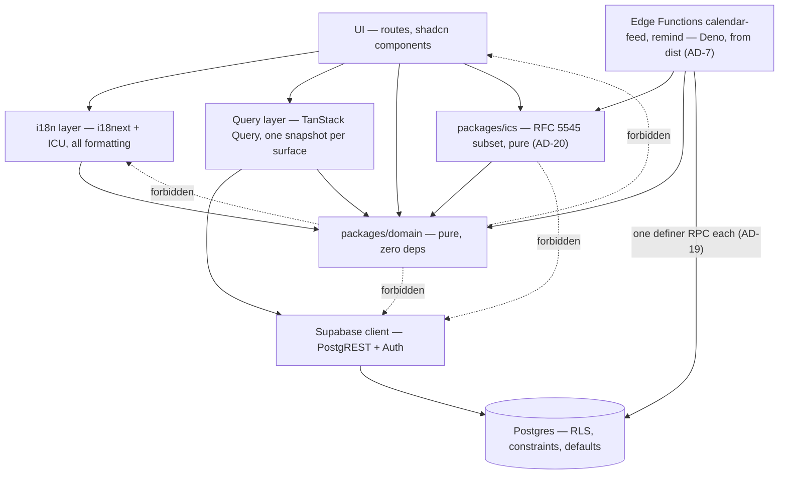
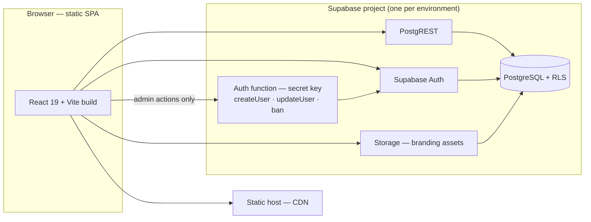
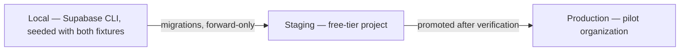
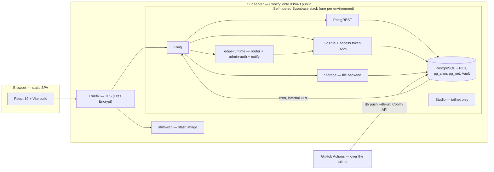
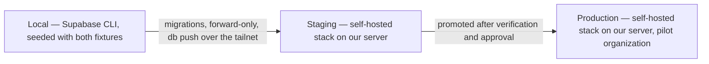
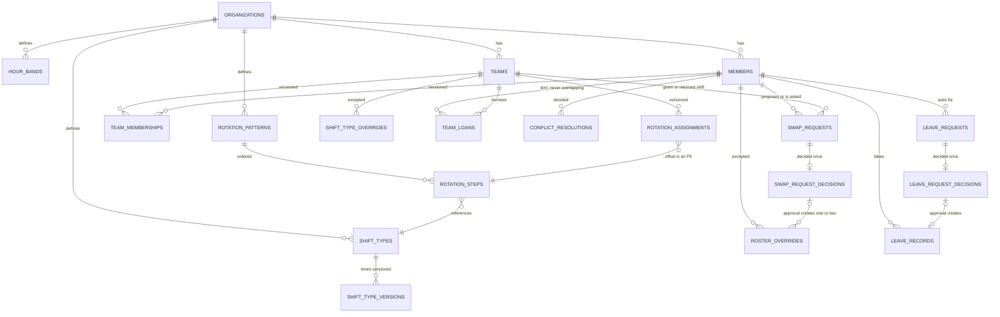

# Architecture Spine — Shift

## Design Paradigm

**The database stores only what a human asserted; everything else is a pure function of it.**

Three kinds of row exist, and nothing else does:

| Kind | Contents |
| --- | --- |
| **Rules** | organization settings, hour bands, shift types, teams, members, allowances, rotation patterns and steps, rotation assignments |
| **Exceptions** | shift-type overrides, roster overrides, leave records |
| **Decisions** | conflict resolutions, each with its attribution |

Everything a user reads is derived from those: the projected schedule, shift rosters, band hours, total hours, leave-day counts, leave balances, leave/schedule collisions, and coverage and rest-gap warnings.

The derivation lives in one pure package that cannot reach for data. The store enforces who may assert what. There is nothing in between.

## Invariants & Rules

### AD-1 — Nothing derived is ever persisted

- **Binds:** all; CAP-11, CAP-13, CAP-14, CAP-15, CAP-16
- **Prevents:** one unit reading a materialized row while another recomputes, and the two disagreeing — the drift that makes DI-1 and DI-2 unverifiable.
- **Rule:** No table may hold a value the domain package can compute. Adding a column that caches a derived figure requires amending this AD, not a migration.

- **Amended 2026-11-21 (Architect pass 1) — the scope note.** Derivation may also run on the server, inside the `calendar-feed` and `remind` Edge Functions (AD-14), using the same domain package (AD-7) over one assembly of asserted rows (AD-19). Nothing derived is persisted for it: not in a table, not in a cache, not in a worker's memory across requests. Those two functions write only `calendar_feed_tokens.last_fetched_at`, an attribution instant, and `notification_outbox` rows, codes and operands under AD-18's one exception. The rule itself is unchanged.

### AD-2 — Every rule that feeds derivation declares whether it is versioned or current-state

- **Binds:** CAP-3, CAP-4, CAP-6, CAP-8, CAP-9, CAP-11; engine-rules R1.1, R1.2, R2.10, R7.4
- **Prevents:** history silently rewriting itself. Under AD-1 there are no stored shifts, so a rule edit re-derives *every past date* through the new value by default — which quietly violates CAP-4's "alters no past shift", CAP-6's "forward only, rewrites no history", and CAP-9's "shifts before the effective date are unchanged".
- **Rule:** Retroactivity is never incidental. Each rule kind is classified below, and a versioned rule carries a validity range, is never updated in place, and is selected by the date being derived.

  | Rule | Classification | Because |
  | --- | --- | --- |
  | Rotation assignment | **Versioned** | CAP-9 — shifts before the effective date are unchanged |
  | Team membership | **Versioned** | CAP-6 — a team move changes the schedule forward only |
  | Member active status | **Versioned** | CAP-4 — deactivation removes from *future* rosters and alters no past shift |
  | Rotation pattern and steps | **Versioned** | reached through a versioned assignment; editing in place would defeat it |
  | Shift type **times** | **Versioned** | an edit would otherwise change accepted totals for closed months, and there is no period locking to catch it |
  | Shift type **name** | **Current-state** | a rename is cosmetic; versioning it would churn the hot path for a typo fix |
  | Hour bands | **Current-state** | CAP-3 explicitly *wants* retroactivity — moving a boundary recomputes reported band hours, and changes no total |
  | Leave allowance | **Versioned per leave year** | carry-over (13.4) reads last year's allowance as it was, and a past year's balance uses that year's allowance; `members.leave_allowance_days` is the starting allowance and `leave_allowances` holds append-only versions, each for one leave year (CAP-15 holds per leave year) (amended 2026-11-10, story 13.3). Amended 2026-11-10 (story 13.3b): sessions cannot update the starting allowance (`0056`), so it is written only when a member is created, and the app writes only versions |
  | Team position | **Versioned** (on the team-membership version) | a promotion takes effect from a date; the roster for a past date shows the position then held (added 2026-09-25, sprint change) |
  | Member fire rank | **Current-state** | descriptive only, like shift type name; nothing derived reads it (added 2026-09-25, sprint change) |
  | Minimum members | **Current-state** | FR-70 — changing it changes the short-staffed state of past and future shifts alike, as moving an hour band re-reports band hours; `organizations.minimum_members`, nullable, empty reports nothing (added 2026-11-04, story 11.1) |
  | Absence type | **Current-state** | like a shift type name: a rename is cosmetic, and whether a type draws down the allowance is its present setting; `absence_types` holds a name and `draws_allowance` and nothing else, no reason (Q5) (added 2026-11-08, story 13.1) |
  | Carry-over setting | **Current-state** | like minimum members: a change re-derives every balance (R4.15); four nullable columns on `organizations` (`carry_over_max_days`, `carry_over_expiry_month`, `carry_over_expiry_day`, `carry_over_first_leave_year`), all four or none, no default (DI-8) (added 2026-11-11, story 13.4) |
  | Loan | **Exception** (dated, never versioned) | like a leave record: it covers an inclusive date range, is removed rather than edited, and a past date stays covered unless the loan is removed; a removal returns every covered date to what it would be with no loan (R11.4). `team_loans` (added 2026-11-20, story 18.2) |

  A new rule kind is unclassified until it appears in this table.
- **Amended 2026-11-04 (story 11.1).** The table gains the minimum-members row, current-state, as `0048` ships it: one nullable `smallint` on `organizations` (`>= 1`), with no history and no default (DI-8). `domain/staffing` derives short-staffed shifts from it on read (R10.1–R10.5); no table stores a count or a state (AD-1).
- **Amended 2026-11-08 (story 13.1).** The table gains the absence-type row, current-state, as `0052` ships it: `absence_types`, keyed `(organization_id, id)`, a name (0024's `name_key` rules, at most 100 characters) and `draws_allowance`. Annual leave has the one fixed id `00000000-0000-0000-0000-000000000001` in every organization; it may be renamed, is never deleted, and always draws (a check). `leave_records.absence_type_id` is `not null default` that id, with a composite foreign key to `absence_types (organization_id, id)` and no trigger, so every existing record and every insert that names no type is annual leave and every figure reads as before. Every organization has annual leave: `0052` seeds the existing ones, and the AFTER INSERT row trigger `organizations_seed_absence_types` (definer `private.seed_absence_types()`, `search_path = ''`, callable by nobody) seeds each new one. It refuses nothing and computes nothing, so it is no AD-3 refusing trigger.
- **Amended 2026-11-10 (story 13.3).** The leave-allowance row changes from current-state to **versioned per leave year**, as `0055` ships it. `members.leave_allowance_days` stays as the member's STARTING allowance, which covers every leave year until a version sets another, so member creation stays one insert and nothing is backfilled. `leave_allowances` holds the versions: `organization_id` first, `id bigint generated always as identity`, `member_id` (composite key to `members (organization_id, id)`, no cascade), `leave_year smallint` (1–9999, the calendar year in which the leave year begins), `days smallint >= 0`, and AD-11 attribution. A version is APPEND-ONLY: no session holds an update or delete privilege, and a same-year correction is a new row with a higher `id`. An active admin inserts; an active admin reads the organization's versions and a member their own. RESOLUTION is `packages/domain/leave`'s alone (AD-7): the allowance of leave year Y is the highest-`id` version for Y; otherwise the highest-`id` version of the latest year before Y; otherwise the starting allowance. No leave-year arithmetic, trigger or function in SQL. The validity range of a version is its leave year, selected by the leave year being derived.
- **Amended 2026-11-10 (story 13.3b).** No session updates the starting allowance: `0056` revokes UPDATE on `members` from `authenticated` and `anon` and grants `authenticated` UPDATE on `name`, `email`, `role`, `username` and `fire_rank` only, every column a session updates (the app's member PATCH and admin-auth's caller-client username update). INSERT is unchanged, so admin-auth's create still writes `leave_allowance_days`. Any column later added to `members` that sessions must update needs its own column grant. The member page's *Promijeni pravo* appends a `leave_allowances` version for the current leave year, held when the dialog opens; setting any other year is out of scope.
- **Amended 2026-11-11 (story 13.4).** The table gains the carry-over setting row, current-state, as `0057` ships it: four nullable `smallint` columns on `organizations`, with no history and no default (DI-8), each under a named check — the cap `>= 1` (`organizations_carry_over_max_days_check`), the expiry month 1–12 (`…_expiry_month_check`), the expiry day 1 to its month's last day with February at 28 (`…_expiry_day_check`, so 30.06. fits and 31.06. and 29.02. do not), and the first leave year carried INTO, 1–9999 like `leave_allowances.leave_year` (`…_first_leave_year_check`) — and `organizations_carry_over_all_or_none`: all four null (no carry-over) or all four set. `authenticated` gains UPDATE on the four columns; who may write them is `0004`'s update policy, unchanged. Nothing is derived or stored from it in 13.4; the derivation of carried days, their expiry and the balance is `packages/domain/leave`'s on read (AD-1, AD-7), story 13.4b. The expiry in leave year Y is the first date on or after Y's first day with the stored day and month.
- **Amended 2026-11-13 (stories 13.5, 13.5b; epic 13 retro A6).** A half day is a fact of the record, not a rule, so it adds no row to the table. `leave_records.half` (`0058`) and `leave_requests.half` (`0059`) are nullable text, `FIRST` or `SECOND` of the member's working shift that date, under named checks (`…_half_check`, and `…_half_one_date`: a half only on a one-date range). Null is a whole day, so every existing row and every insert that names no half reads as before. `amend_leave_record` gains `p_half text default null`, and null amends to a whole day. `decide_leave_request` copies the request's half into the record it creates and never chooses one. Whether that date holds exactly one working shift is DERIVED (AD-1), so the database cannot check it. The client refuses a half at ENTRY: a new record, a member's request, and an amend that chooses another date or the other half. A STORED half is never refused for its shift: the request's decision, and an amend that keeps the record's own date and half (epic 13 retro A2). `packages/domain/leave` costs it on read, 0.5 on a date with exactly one working shift and 0 otherwise, and splits that shift at its nominal midpoint for hours.
- **Amended 2026-11-20 (story 18.2).** The table gains the Loan row, an **exception** like a leave record, neither versioned nor current-state, as `0062` ships it. `team_loans`: `organization_id` first; the member and the loan team, each a composite key to its own tenant's row, no cascade; `during daterange`, inclusive, bounded, non-empty, in years 0001–9999, with no length cap; a `reason` of 1–200 code points after 0036's trim (FR-88); AD-11's `created_by`/`created_at`; `removed_by`/`removed_at`, both or neither, which no session writes yet (18.4). A **live** loan has `removed_at is null`; ending a loan early is 18.4's amend, which removes the row and inserts a shorter one, so the dates already worked stay covered. Refused by shape (AD-3): two live loans of one member sharing a date (`team_loans_no_overlap`, an `EXCLUDE USING gist`, 23P01); a loan to an archived team, and a loan to the team the member is on, by their membership versions, on any covered date — both conjuncts of the insert policy (42501), decided on the statement's snapshot, so a team move written after the loan can still make it point home, which the domain derives as the home team (R11.3), and a team archived concurrently is a residual race, as for leave records. No trigger but AD-11's two. Only an active admin reads and inserts the table, which holds the reason (FR-92); every active member reads the live loans through the definer `calendar_team_loans()` — id, member, loan team, first and last date, no reason, no author — because R11.2 needs every member's loans to derive any roster a member is shown. The calendar snapshot (AD-13) reads it as a fourth rpc and carries each member's loans on their `members` entry and the viewer, so every roster, hour, conflict and staffing figure follows a loan through `packages/domain`'s one rule (`effectiveTeamOn`, AD-7). Nothing derived is stored (AD-1).
- **Amended 2026-11-21 (story 18.4).** A loan changes only through two attributed definers (`0064`), still with no update or delete grant: `remove_team_loan` soft-removes a live loan, and `amend_team_loan` soft-removes it and inserts the replacement (same member; the named team, inclusive range and reason, or the stored reason when none is named) in one transaction. Changing the dates or the team and ending a loan early are all that amend. Both take 0023's organization lock first and re-read the caller (42501); a loan not live is P0002 `TEAM_LOAN_NOT_LIVE`. The amend writes as the owner, past the insert policy, so 0062's two team conjuncts (archived, or the member's team on a covered date) are stated once more as `private.team_loan_team_refused`, which the amend asks (42501 `TEAM_LOAN_TEAM_REFUSED`) and 0035's re-check now asks too: a plain `team_loans` insert takes the lock and `refuse_write_by_stale_admin()`, which re-reads the caller and both conjuncts after it, closing 18.2's residual races. A team is not archived while a live loan to it ends on or after the organization's today (23514 `TEAM_HAS_LOANS`, a BEFORE trigger ordered after the caller's re-check); a wholly past loan does not block. A removal leaves `conflict_resolutions` as a team move does: a resolution keyed to the loan team matches no collision once the member is off it (AD-4's load-bearing `team_id`). The history pairs the amend on `member_id` (`AMEND_KEYS`); the loan's record and wording are 18.5's.

### AD-3 — Illegal states are made unrepresentable, not validated

- **Binds:** CAP-3, CAP-4, CAP-8, CAP-15, CAP-19, CAP-24; engine-rules R1.5, R1.6, R4.4, R9.4; quality-requirements Q6
- **Prevents:** a guard existing only in client code, so a direct PostgREST call writes a state the engine cannot interpret.
- **Rule:** Prefer schema shape to a check. Hour bands store a name and start time only, windows derived. A rotation offset is a foreign key to a step **of that pattern**, never an integer. Overlapping leave is refused by `EXCLUDE USING gist (member_id WITH =, during WITH &&)`, which requires the `btree_gist` extension. A validation that could have been a shape is a defect.
- **Named exception:** Q6 — an organization may never be left with zero admins and the last admin's role may not be downgraded — is the one refusal that *cannot* be made unrepresentable, because it is a cross-row cardinality rule. It is enforced by a constraint trigger, and it is the only constraint trigger and the only cardinality rule enforced by trigger that is permitted. A second one is a signal that AD-9's no-server-tier decision needs revisiting, not that another trigger should be written. The one other refusing trigger is the named, non-computing exception below (story 9.2); any further refusing trigger needs its own named exception here. *(Superseded 2026-11-16 by the epic 14 retro A5 inventory below, which lists every refusing trigger, 0023's second last-admin trigger among them; the constraint-trigger rule stands.)*
- **Named exception (story 9.2, human decision 2026-10-27):** a leave request may not share a date with its member's live leave (R9.4). The rule crosses `leave_requests` and `leave_records`, and no exclusion constraint can span two tables, so the BEFORE INSERT row trigger `refuse_leave_request_over_leave()` (0040) refuses it with 23P01 and the message `LEAVE_REQUEST_OVERLAPS_LEAVE`. It computes nothing: it reads whether a live leave range of the same member overlaps the new one. It acts only for a request session whose caller is an active account inserting for its own member row, and leaves every other insert to the policy's 42501. The overlap between two pending requests of one member stays schema shape: `EXCLUDE USING gist (member_id WITH =, during WITH &&) WHERE (closed_at IS NULL)`. An admin's direct leave record is never refused because a pending request overlaps it; the approval then aborts on the leave exclusion.
- **Amended 2026-10-30 (retro 8–9 item 17, 0047; recording 0041 too).** The same trigger, behind the same gates, also refuses a request reaching a date on which its member is inactive (55000 `LEAVE_REQUEST_MEMBER_INACTIVE`, 0041) and, first, a request whose first day is before `organization_today(organization_id)` (55000 `LEAVE_REQUEST_IN_PAST`, product owner decision 2026-10-30): a member requests leave from today on, and past leave is an admin's leave record, which no rule here touches. Each compares the new row with a fact read as it stands (the organization's date in its own zone, the member's status, a live range); none derives a schedule or a balance, and none is a new trigger. What became of an approved request's leave record (amended or removed since) is derived on read by the SECURITY INVOKER computed field `leave_record_change(leave_request_decisions)`, and is no stored state.
- **Amended 2026-11-16 (Architect pass for Epic 14, applied by story 14.1).** A second permitted trigger class: **append-only audit triggers**, which copy a row write of an audited organization table (AD-11's list) into `audit_events`. One function, `private.record_audit_event()` — SECURITY DEFINER, owned by the migration owner, `search_path = ''`, every name qualified, execute revoked from `public`, `anon`, `authenticated` and `service_role` — is attached to each audited table as two AFTER ROW triggers: `<table>_audit` (INSERT OR DELETE) and `<table>_audit_update` (UPDATE, `WHEN (old.* IS DISTINCT FROM new.*)`, so a no-op update records nothing). Its two `tg_argv` name the organization column and the key column (`organizations`: `id`, `id`; `leave_request_decisions` and `swap_request_decisions`: `organization_id`, `request_id`; every other table `organization_id`, `id`). It inserts one row of `to_jsonb(OLD)`/`to_jsonb(NEW)`, `auth.uid()`, `current_setting('role')`, `pg_current_xact_id()` and `now()`, reads no other table, computes nothing and refuses nothing, and is never gated on `pg_trigger_depth()`, so a write made by a definer RPC or a nested trigger (0041's deactivation close) is recorded too. It is the class 13.1's `organizations_seed_absence_types` already belongs to, so it is no refusing trigger and adds none: the Q6 constraint trigger and the 9.2 named exception stay the refusing triggers this AD names. An event commits or rolls back with the write it records, so history holds only committed writes. The refusing triggers that 0023, 0031, 0035, 0036 and 0039 ship as "ordinary triggers" (0023's `member_status_versions_keeps_an_admin`, a second trigger-enforced last-admin rule, and the stale-admin, archived, in-rotation, off-leave and TRUNCATE refusals) are not named in this AD; that gap is recorded for reconciliation and is not ratified by this pass. *(Closed 2026-11-16 by the epic 14 retro A5 inventory below.)*
- **Applied 2026-11-16 (story 14.1, `0061`).** As amended: `private.record_audit_event()` is a plpgsql definer whose body is one `insert` and `return null`, with no `raise`, no `pg_trigger_depth()` and no read of another table. It is attached as 42 triggers, `<table>_audit` (AFTER INSERT OR DELETE, `tgtype` 13) and `<table>_audit_update` (AFTER UPDATE `WHEN (old.* IS DISTINCT FROM new.*)`, `tgtype` 17), on the 21 tables. Execute is revoked from `public`, `anon`, `authenticated` and `service_role` once the triggers exist. No refusing trigger and no constraint trigger was added. `test/supabase-scaffold.test.ts` pins the shape, and `test/provisioning.test.ts` pins the catalog.
- **Amended 2026-11-16 (epic 14 retro A5; ratifies the code, no SQL changes).** The refusing triggers are an inventory, not two exceptions. Every trigger in the migrations that refuses a write is listed here with its refusal and origin; a new refusing trigger amends this list in the migration's own story, and the constraint-trigger rule above stands (Q6's is still the only constraint trigger).
  - **Q6, constraint trigger** — `members_organization_keeps_an_admin` (`refuse_organization_with_no_admin()`, AFTER DELETE OR UPDATE on `members`, deferrable initially deferred; 0002, function redefined by 0008 to require an active admin on every date from today on): 23514 `ORGANIZATION_WOULD_HAVE_NO_ADMIN`.
  - **Q6's second half, ordinary row trigger** — `member_status_versions_keeps_an_admin` (`refuse_status_version_leaving_no_admin()`, AFTER INSERT OR DELETE on `member_status_versions`; 0023): 23514 `ORGANIZATION_WOULD_HAVE_NO_ADMIN` when a status version would leave the organization with no active admin, and 42501 (the RLS wording) for a caller who may not write it.
  - **TRUNCATE** — `members_refuse_truncate`, `member_status_versions_refuse_truncate`, `team_membership_versions_refuse_truncate` (`refuse_truncate()`, BEFORE TRUNCATE, per statement; 0023): 23001 `TRUNCATE_REFUSED`. 0061 also revokes TRUNCATE on the 21 audited tables.
  - **Stale admin** — `refuse_write_by_stale_admin()` (0035, redefined 0036), BEFORE row triggers on `members` (insert, `role` update, delete), `team_membership_versions` (insert, update, delete), `teams` (`archived` update), `rotation_steps` and `rotation_assignments` (insert, delete) (0035), and `shift_types` (`archived` update; 0036): 42501 with the RLS wording, for a session whose admin access is no longer current; with the same 42501 it refuses an insert of a `team_membership_versions` or `rotation_assignments` row onto an archived team (0035) and of a `rotation_steps` row whose shift type is archived (0036).
  - **Archived** — `shift_type_overrides_refuse_write_while_archived` and `roster_overrides_refuse_write_while_archived` (`refuse_override_on_archived()`, BEFORE INSERT; 0036): 23514 `SHIFT_TYPE_OVERRIDE_ARCHIVED` / `ROSTER_OVERRIDE_ARCHIVED` on an archived team (both tables) or an archived shift type (`shift_type_overrides` only), for an active admin's `authenticated` session; `rotation_assignments_refuse_write_while_archived_type` (`refuse_assignment_on_archived_type()`, BEFORE INSERT; 0039): 23514 `ROTATION_PATTERN_ARCHIVED_TYPE`.
  - **In rotation** — `shift_types_refuse_write_while_in_rotation` (`refuse_archive_in_rotation()`, BEFORE UPDATE OF `archived` when it becomes true; 0036, function narrowed by 0037): 23514 `SHIFT_TYPE_IN_ROTATION`. The teams trigger `teams_refuse_write_while_in_rotation` (0036, `TEAM_IN_ROTATION`) was dropped by 0037.
  - **Off leave** — `conflict_resolutions_on_live_leave` (`refuse_conflict_resolution_off_leave()`, BEFORE INSERT; 0031, redefined 0038): P0002 `CONFLICT_RESOLUTION_NOT_ON_LEAVE`.
  - **Story 9.2's named exception** — `leave_requests_refuse_over_leave` (`refuse_leave_request_over_leave()`, BEFORE INSERT; 0040, redefined 0041 and 0047): 23P01 `LEAVE_REQUEST_OVERLAPS_LEAVE`, 55000 `LEAVE_REQUEST_MEMBER_INACTIVE`, 55000 `LEAVE_REQUEST_IN_PAST`, as above.
  - **Email identity's username** *(added 2026-11-21, Architect pass 2; story 19.2)*. `members_username_follows_email_identity` (`private.refuse_username_change_of_email_identity()`, BEFORE UPDATE OF `username` on `members`, a definer with `search_path = ''`): when the member's auth address is not synthesized (AD-12's SQL predicate), it refuses any new value other than `lower(split_part(email, '@', 1))` of that address, with 23514 `SIGN_IN_IS_EMAIL`. It reads `auth.users` and computes nothing. A username identity's rename is unchanged. That a direct PATCH can still make a username identity's username disagree with its address is a v1 gap this pass does not widen (`deferred-work.md`).
  - **Refuse nothing, so are not in this list:** the `*_serialize_organization_writes` triggers (0023, 0035, 0036, 0040, 0049: a lock, no refusal), the deactivation closes (0041's `member_status_versions_close_leave_requests`, 0049's `member_status_versions_close_swap_requests`), `notification_outbox_filter` (it drops an opted-out outbox row by returning null, raising nothing) and `notification_settings_touch` (0044), `organizations_seed_absence_types` (0052), the notify triggers (0043, 0050, 0051) and the audit triggers (0061). The 14.1 Architect pass's sentence that the gap "is not ratified by this pass" is closed by this amendment.

### AD-4 — A conflict is derived; only its resolution is stored

- **Binds:** CAP-16, CAP-19; engine-rules R6.1–R6.5; quality-requirements Q11
- **Prevents:** a missed recomputation path producing a silent false negative — the exact failure the product exists to prevent — and stale conflict rows surviving a rotation change as false positives.
- **Rule:** No conflicts table. A collision is `leave ∩ working shift ∩ roster`, computed on read. A `conflict_resolutions` row keyed by `(organization_id, member_id, date, team_id)` records the kind, the shift type the key had when it was decided (`shift_type_id`, since 0038; null on older rows), the acting admin, and the timestamp — `team_id` is load-bearing, because a roster override can place a member on another team's shift on a date they already work, producing two distinct collisions the same day; replace-member and amend-leave also reference the override or leave change they caused. An unresolved conflict is a derived collision with no matching resolution. A replace-member resolution matches only while the override it references is live, in force and applied on that date (story 5.5d, decided in the browser, never by a roster computed in the database); removing that override ends the resolution in the same call (0033), so the key can be decided again. A resolution with a stored shift type matches only while the team's schedule has that same type on its date today (0038, decided in the browser's one resolution filter, `effectiveResolutionsOf`), so a decision left dormant when its key stopped colliding never re-applies to a different shift; a row with no stored type matches by key alone. A new decision on the key naming another type supersedes the stored one in the same insert (soft-removed, attributed to the new decision's author), comparing stored values only, so the database still derives no schedule.
- **Amendment (story 9.2):** *Za odluku* is a union of three sets: derived collisions that have no resolution, pending leave requests, and (in Epic 12) pending swap requests. Requests are stored rows (`leave_requests`, 0040), and only a decision clears one: `decide_leave_request` writes one `leave_request_decisions` row per request, keyed by the request, and the member's `withdraw_leave_request` closes it with no decision. A request's status is derived and never stored twice: pending is `closed_at IS NULL`, approved or rejected is the decision's `outcome`, and a closed request with no decision is withdrawn. A pending request derives nothing: it is no leave record, so it raises no collision and charges no balance. An approval only adds leave, so it can add collisions and erase none, and AD-5's erasure diff does not apply to it. There is still no conflicts table.
- **Amendment (story 12.1, 0049):** the third set is swap requests waiting for an admin: open (`closed_at IS NULL`) and accepted by the addressee. A swap is a stored row (`swap_requests`), and only a decision clears an accepted one: `decide_swap_request` writes one `swap_request_decisions` row per swap, keyed by the swap. Its status is derived and never stored twice: open with no answer is proposed; open and accepted waits for an admin; closed and declined is declined (`answer_swap_request` closes a decline in the same call); closed with a decision is the decision's `outcome` (approved, rejected, or `deactivated` when a party's deactivation closed it, as 0041 does for leave); closed otherwise is withdrawn, and `closed_by` says by whom. A proposed or accepted swap derives nothing (R9.1): it is no roster override, so it moves no shift, hour, collision or staffing figure. An approval writes ordinary roster overrides (the proposer off and the addressee on the given shift, and the reverse on the return shift when there is one), attributed to the admin and carrying the reason the screen supplies; the decision names them, so "this override is a swap" is structural and `roster_overrides` is unchanged. Those overrides change the projected schedule, so unlike a leave approval a swap approval is not exempt from AD-5's erasure diff (story 12.4). Whether the given shift is on the proposer's roster, or the return shift on the addressee's, is the browser's domain question (12.2 when sent, 12.4's stale check when approved); the database never projects a roster. Both checks, and AD-5's erasure diff, run on the screens alone: a direct insert bypasses the send-time check, and an admin's direct `rpc/decide_swap_request` call bypasses the stale check and the erasure diff, as every direct roster override insert already bypasses the diff. Such an approval writes overrides the domain treats as inert when they do not apply.

### AD-5 — A configuration change diffs the collision set and surfaces what it would erase

- **Binds:** CAP-9, CAP-16; engine-rules R6.3
- **Prevents:** a rotation or roster change silently deleting an unresolved conflict an admin had queued — the failure mode AD-4 opens up.
- **Rule:** Any write that can change the projected schedule computes the unresolved collision set before and after, and surfaces every erased collision for explicit confirm, amend, or discard. The change is not applied until they are dispositioned. This never blocks on warnings — only on erasures. The diff is bounded, not unbounded over all future dates: a collision requires a leave record, so the window is the union of existing leave ranges intersected with the change's own validity range. As shipped for the rotation save (story 5.5a): `domain/collisions` owns the bound (`leaveRecordsFrom`, leave clipped to the change's effective date onward) and the set difference (`erasedCollisionsOf`, unresolved keys before minus after, through the one resolution filter); "after" is the snapshot with the draft's versions and a save stamp newer than every override, so overrides from the effective date go pending as a real save makes them. Added collisions are never erasures. Each erasure is confirmed row by row in the save's dialog; nothing is recorded. A diff that cannot be derived refuses the save. Since story 5.5b the calendar roster overrides are guarded too, saving a change and removing one, through the same diff and dialog. Since story 5.5e so are the member page's team move (to another team or to no team, and withdrawing a scheduled move) and status change (deactivation, and withdrawing a scheduled reactivation): "after" changes only that member's versions, and a version already dated the day, a scheduled version gone or a missing or archived team is the write's own refusal. Since story 5.5f so are the calendar's shift-type overrides, setting one in the day detail and removing one: one surface-neutral "after" covers every override write (a set appends an override newer than every instant and unconfirmed; a removal filters it out; a confirm stamps it newest; an amend replaces it with a newest one of the new type), and a live override already on the team and date, an override gone, or an archived team or type is the write's own refusal. Every removal is checked against the fresh read; one pending review there is not applied, lists nothing, and removes at once. A set's preflight is run again on the day as the check read it. Since story 5.5g so is cancelling a scheduled rotation change: "after" is the snapshot without the active teams' versions and save stamps dated the scheduled day (an archived team's are kept, as the delete keeps them; the steps stay; no stamp is added, so the overrides the cancelled stamp had made pending are in force again), the diff runs from the scheduled date, and a calendar and rotation read that disagree on the active teams or on the scheduled versions themselves (team, pattern, offset step, anchor) cannot be checked. A fresh rotation that no longer schedules the confirmed date, or a dialog saved after the organization's day has turned, is the cancel's own stale refusal; a landed cancel re-reads the calendar, the leave and the resolutions. Since story 5.5h so is the rotation builder's override review, confirming or amending an override a rotation change left pending: the same surface-neutral "after" (a confirm stamps it newest; an amend replaces it with a newest one of the new type), the override matched by id in the fresh calendar and the diff run from its date. The row's own offers (no version governs the date) and the amend's preflight refuse first, with no check; an override gone, an archived team or type, or (for a confirm since 0035, and for an amend since 0036) a version governing the override's date other than the one the review was derived from is the review's own stale refusal. A landed confirm or amend re-reads the calendar, the leave and the resolutions beside the rotation. Discarding a pending override is never checked, since it is not applied. Since 0039 the same review disposes of a pending roster override, guarded the same way: a confirm (`confirm_roster_override`) stamps it newest, and an amend of who arrives (`amend_roster_override`, the member taken off kept) replaces it with a newest one putting the new member on, both in the calendar roster guard's "after" (5.5b's), the override matched by id and the diff run from its date. Both definers take the organization lock and carry the governing version's save time, as 0035 and 0036 do for the shift-type layer; an override gone, an archived team, the new member already put on by another live change, or another governing version is the review's own stale refusal. An amend moves the live `replace_member` resolution linked to the old row onto the new one; a removal still ends it. The roster override's pending rule reads `confirmed_at ?? created_at`, as the shift-type layer's does.
- **Amended 2026-11-21 (story 18.3).** A loan's save is a write that changes the projected schedule, so it is guarded too. "After" is the calendar snapshot with the draft loan appended to the lent member's `members` entry (and to the viewer when the viewer is the member); memberships, rotations and overrides are unchanged (R11.5). The diff runs from the loan's first date over the three core reads, fresh. A team missing from the read or archived, the member's home team on any covered date, a live loan of the member sharing a date, or a reversed range is the write's own refusal, before any diff. *Što se mijenja* derives from the same "after": the shifts lost and gained per date, two teams' working shifts at once and work joined with no rest over the range and a day either side, the short-staffed block for both teams, and every roster override in force in the range that applies before and not after. Such an override is listed and kept, never discarded; the admin removes it from the calendar's day detail. Everything but an erasure warns and never blocks. Amending, ending early and removing a loan (story 18.4) take the same rule.
- **Amended 2026-11-21 (story 18.4).** An amend or a removal of a loan is guarded by the same rule. Its "after" is the member's loans with the old one replaced by the draft (amend) or without it (removal), and the diff, *Što se mijenja* and the short-staffed block run over the change's window: from the earlier first date to the later last date of the old and new ranges (a removal: the old range). The amended loan gone from the fresh read, the home team or an archived team, a reversed range, or another live loan of the member sharing a date is the write's own refusal, before any diff. A removal returns every covered date to what it would be with no loan ever recorded. Dates the member is inactive on are a warning line, never a refusal.

### AD-6 — Time is integer minutes since midnight, over nominal wall-clock

- **Binds:** CAP-3, CAP-7, CAP-14; engine-rules R3.1–R3.10; DI-5, DI-6
- **Prevents:** the whole daylight-saving class of bug, and a second unit reaching for elapsed real time because it was available.
- **Rule:** No `Date`, no `timestamptz`, and no instant enters a calculation. Shift types store `start_time`/`end_time` as `time` plus `is_working`; nominal duration is derived (`end <= start` means it crosses midnight, add 1440). Instants are computed for display in the organization timezone only, and never for accounting.

- **Amended 2026-11-21 (Architect pass 1) — zone arithmetic at the edges.** Every rule stays nominal wall-clock minutes, and no instant enters a calculation of hours, leave, rosters or conflicts. Two consumers need an instant: a reminder's due time (`remind`) and a calendar's timezone definition (`@shift/ics`, AD-20). Both get it from **one** domain module, `packages/domain/src/zone.ts`. It converts an organization-local date and minute to an instant, and lists a zone's offset transitions over a range. It uses only the runtime's built-in `Intl` (no timezone library, no I/O), and it is the only domain module that names `Intl`. An "N hours before" lead is the shift start's real instant minus N hours, so on a DST date it is N real hours (FR-86). "The evening before" is 20:00 local on the day before the shift's start date. A half day's lead counts from the worked half's start (R12.2). The due instant is one exported function beside the conversion (`reminderDueAt(lead, date, startMinute, zone)`; the story may rename it), and `remind` never computes it inline. The domain's purity test also asserts that no domain module other than `zone.ts` names `Intl` or `Date`. The runtime-parity test (AD-19) covers both DST dates of both years in its window. A second local-to-UTC conversion anywhere, in a function, in SQL or in `apps/web`'s download, is a defect.
- **Amended 2026-11-21 (16.2) — `zone.ts` as shipped.** It exports `instantOf(date, minute, zone)` (epoch milliseconds; `minute` 0–2879, so a midnight-crossing end is written on its start date), `offsetMinutesAt(instant, zone)` (minutes east of UTC), `utcIsoOf(instant)` (`YYYY-MM-DDTHH:MM:SSZ`), `zoneTransitionsOf(zone, from, to)` (each transition's first instant and the offsets either side, local dates both inclusive, at most 4018 days) and `checkTimeZone(zone)`. A local time a transition skips is read with the offset before the gap, and a repeated one is its earlier instant (RFC 5545 §3.3.5's and Temporal's "compatible"). It names `Intl` and no `Date`; the purity test strips comments and strings and finds `Intl` or `Date` in no other module. `reminderDueAt` is not in 16.2: the lead kinds are 17.2's, and it lands there beside these. Which transition is "the last one before the window" (AD-20) is `@shift/ics`'s choice over `zoneTransitionsOf` (16.4).

### AD-7 — One pure domain package, and it cannot reach for data

- **Binds:** all; quality-requirements Q7, Q8
- **Prevents:** the same calculation existing in a component, a query hook, and a Postgres function, agreeing today and diverging later.
- **Rule:** `packages/domain` holds every calculation, as pure TypeScript with zero runtime dependencies, no React import, no Supabase import, and no I/O. Its shape is `(config snapshot, exception layer, window) -> derived values` over plain data. It is a leaf: everything may depend on it, it depends on nothing. Recomputing outside it is a defect even when the answer matches.

- **Amended 2026-11-21 (Architect pass 1) — the package under Deno.** The package is consumed by the SPA (from source, through Vite's alias, as today) **and** by the `calendar-feed` and `remind` Edge Functions. A function consumes it as its **tsc-built `dist`**, the package's existing `exports` target, through the bare specifier `@shift/domain` mapped in the function's own `deno.json` `imports`. Never `src/`: the pinned runtime (Deno 2.1.4 inside `edge-runtime` v1.74.3) does not resolve the `.js` specifiers that TypeScript requires onto `.ts` files. Never a committed copy, and never an `npm:` or `jsr:` specifier. Every function uses one and the same map target.
  - **The map target is the package's `dist` by relative path** (`"@shift/domain": "../../../packages/domain/dist/index.js"`, and likewise `"@shift/ics"` for AD-20's package). The review checked this against the pinned CLI 2.116.0: `supabase functions serve` follows a function's `deno.json` import map and bind-mounts every file it reaches inside the git root at the same path, so `dist` resolves, provided it is built before `serve` starts (a `dist` module added later needs a restart). Story 16.2 confirms it on the CLI and records the result here.
  - **The image.** `deploy/functions/Dockerfile` copies `packages/domain/dist` and `packages/ics/dist` to the path where the relative map lands inside the image, and bundles them into each eszip. So whatever builds the image builds both packages first.
  - **The deploy's source hash.** It must cover the tracked sources of `packages/domain` and `packages/ics`, their `package.json` and `tsconfig*.json`, `tsconfig.base.json` and `pnpm-lock.yaml`, and never `dist`. That hash is `FUNCTIONS_SOURCES` in `scripts/ci/deploy-images.sh`, which decides whether an image is reused. Otherwise a change to only the domain would reuse a stale image, and the feed and reminders would run old rules beside a new SPA. `test/coolify-deploy.test.ts` asserts it (story 16.2). The package stays dependency-free, and its purity test is unchanged.
  - *Spike, 2026-11-21 (no container started).* The pinned image was taken with `docker image save` and run under `chroot` in a private network namespace with loopback only. Its binary reports `edge-runtime 0.1.0 / deno 2.1.4`, and the image ships no separate `deno`. Results:
    - (a) `src/` as it is fails to bundle and to serve: `Module not found ".../src/index.js". Maybe change the extension to '.ts'`.
    - (b) The tsc output bundles (a 396 kB eszip with the fixtures) and serves.
    - (c) A function importing `@shift/domain` through a `deno.json` import map onto `dist/index.js` bundles (200 kB) and serves from the eszip, which is the production path.
    - The probe covered both fixtures' month schedules for 2026-01, 2026-03, 2026-10, 2026-11 and 2027-02, a member's month with a loan, and both fixtures' derived hour bands. Its output was byte-identical between (b), (c) and Node 22 running the same build: 183,563 bytes, SHA-256 `93ddbb9b…a040`.
    - The runtime's `Intl` carries full zone data. `Europe/Zagreb` answers +01:00 and +02:00 correctly on either side of 2026-03-29 and 2026-10-25.
  - **R12, a member's at-work shifts, is one function of this package** (FR-81's rule: the member's shifts after overrides and loans, without a date of full-day leave, and a half day keeping the worked half's interval). The feed, the reminders and the browser's `.ics` download read R12 only (R12.3). Story 16.2 adds it, and names it.
- **Amended 2026-11-21 (16.2) — the package under Deno, confirmed, and R12 named.**
  - **R12 is `atWorkShiftsOf(inputs, from, to)`** in `packages/domain/src/at-work.ts`, over AD-19's `ScheduleInputs`, answering `AtWorkShift` `{ date, teamId, shiftTypeId, startMinute, endMinute, viaOverride, loanId?, workedHalf? }` in minutes after the start date's midnight (the worked second half of a night starts past 1440). Overrides apply only IN FORCE (`overrideStandingOf` over the assembly's stamps); a working shift with no version of its times in effect is not at work; on a date holding two working shifts a half day splits none, as hours. At most 732 days per call.
  - **The map target is confirmed on the pinned runtime**, not yet on the CLI: `deploy/parity/index.ts` imports `@shift/domain` through `deploy/parity/deno.json` (`"../../packages/domain/dist/index.js"`), and the image's `edge-runtime bundle` builds it (248 kB with the parity fixture) and `start --main-service <eszip>` serves it, chrooted with no network. That entry is the runtime-parity probe, not an Edge Function. `supabase functions serve` over the map was not run in 16.2; 16.4, whose e2e serves `calendar-feed` with the CLI, confirms it and records it here, with the Dockerfile's copy of `dist` and the image jobs building it first.
  - **The deploy's source hash covers the domain now**: `FUNCTIONS_SOURCES` adds `packages/domain/src`, its `package.json`, `tsconfig.json` and `tsconfig.test.json`, `tsconfig.base.json` and `pnpm-lock.yaml`, never `dist`, held by `test/coolify-deploy.test.ts`. `@shift/ics` joins it in 16.4.

### AD-8 — The domain returns codes and operands, never prose

- **Binds:** CAP-10, CAP-16; localization L4, L7
- **Prevents:** a translated string originating in the engine, which makes Croatian's three plural forms unimplementable because the count never reaches the formatter as a number.
- **Rule:** Warnings, refusals, and states are data — `{ code: 'REST_GAP', hours: 24 }`, `{ code: 'COVERAGE_GAP', dates: [...] }`. The i18n layer resolves them. A domain function returning `"24 sati"` is a defect.

### AD-9 — No server tier for domain writes; clients write directly to Postgres under RLS

- **Binds:** all domain writes; quality-requirements Q1, Q2
- **Prevents:** domain logic acquiring a second home, and a service-role key bypassing the row-level policies the spec requires.
- **Rule:** Every domain write goes through PostgREST. Isolation and role are enforced by RLS, integrity by schema shape (AD-3), attribution by column default (AD-11). Any rule that cannot be expressed declaratively is escalated to this spine, not solved by adding a function. The exceptions are the two Edge Functions of AD-14, and neither writes a domain table: the privileged auth boundary of AD-16, and `notify` (AD-18), which reads and writes only through two `service_role`-only functions (`claim_notifications`, `settle_notification`) and writes only the outbox's delivery columns.
- **Amended 2026-10-30 (retro-10 batch, recording what 10.4 and 0046 shipped).** `notify` now reaches the database through four `service_role`-only functions (AD-14). Three write nothing but the outbox's delivery columns or nothing at all (`claim_notifications`, `settle_notification`, `push_devices_for_send`, the last a read). The fourth, `delete_push_subscription` (0045), is the one named exception in which `notify` writes a domain table: it deletes a single `push_subscriptions` row the push service reported gone (404, 410), and only when its id, endpoint and member all still match what the claim returned, so a device handed to another member since is never deleted. Nothing else changes. A second exception, also escalated here: `register_push_subscription` (0045) is a `SECURITY DEFINER` RPC for a member's own write. A device's endpoint is unique and may be held by another member (a shared browser, possibly another organization's), whom the caller can neither see nor delete under RLS; the definer hands the row to the caller in one statement, checks the push-service host and caps a member at ten devices. The caller is the active member of the token's organization, matched by `auth_user_id`, never a value in the request. Every other push-subscription write (read own, delete own) is plain RLS.

### AD-10 — RLS reads the organization from a claim and the role from the table

- **Binds:** CAP-1, CAP-4; quality-requirements Q1, Q2, Q3
- **Prevents:** a deactivated or demoted account retaining write access until its token expires — which all-claims policies would allow, contradicting CAP-4's "blocks authentication."
- **Rule:** `organization_id` rides in a JWT claim, safe only because one user belongs to exactly one organization. Role and active status are read on every policy evaluation through a `SECURITY DEFINER STABLE` helper. If multi-organization membership is ever added, this AD is void — see Deferred.
- **Amendment (story 9.2):** a member may insert, and withdraw, rows they own: the first member-role domain writes. As shipped in 0040, any active account (member or admin) inserts a `leave_requests` row only for its own member row, under the self-owned row policy `leave_requests_insert_own_by_active_member`: `member_id` is matched against `members.auth_user_id = auth.uid()` in the claimed organization, the organization comes from the claim and the active status from `current_member_access()`, never from the request. The member withdraws only their own pending request, through `withdraw_leave_request`. A member writes no decision, no leave record and no colleague's request; only an active admin decides, through `decide_leave_request`. Epic 12 adds answering a swap addressed to the member.
- **Amendment (story 12.1, 0049):** as shipped, any active account inserts a `swap_requests` row only as its own proposer, under `swap_requests_insert_own_by_active_member`: `proposer_id` is matched against `members.auth_user_id = auth.uid()` in the claimed organization, `created_by` is pinned to the caller, and both the given and the return date are `organization_today(organization_id)` or later (a refusal is 42501; no trigger). The column grant admits the seven facts of a proposal alone, never the answer, the close or the attribution. An active admin reads the organization's swaps and decisions; a member-role account reads those it proposed or was asked. Three definers, each with the claim, the organization lock inline and an empty `search_path`, write the rest: `answer_swap_request` (the addressee alone, while proposed), `withdraw_swap_request` (the proposer while open, or the addressee once accepted: FR-69's "either member", and before accepting the addressee declines) and `decide_swap_request` (an active admin alone, only an accepted swap; an admin who is a party may decide it). An approval's override inserts keep 0026's live keys and checks, so a collision with a live override aborts the whole call and the swap stays accepted. The insert policy also refuses a swap that puts an inactive member on a shift (the addressee inactive on the given date, or the proposer on the return date, a scheduled deactivation included), through the narrow definer helper `swap_parties_active`, and the approval refuses it with 55000 `SWAP_REQUEST_MEMBER_INACTIVE` (product owner, 2026-11-06).
- **Amended 2026-11-20 (self-hosting, `sprint-change-proposal-2026-11-20-self-hosting.md`).** Every environment is a self-hosted Supabase stack on our own server, run by Coolify; there is no hosted project and no `supabase config push`. The custom access token hook is enabled by GoTrue's environment in the stack's compose file (`deploy/coolify/supabase/docker-compose.yml`, story 20.1): `GOTRUE_HOOK_CUSTOM_ACCESS_TOKEN_ENABLED=true` and `GOTRUE_HOOK_CUSTOM_ACCESS_TOKEN_URI=pg-functions://postgres/public/custom_access_token_hook`, beside the signup switches (`GOTRUE_DISABLE_SIGNUP=true`, `GOTRUE_EXTERNAL_EMAIL_ENABLED=true`, anonymous sign-ins off). A test pins those values to `supabase/config.toml`'s, which stays the one source of truth for auth settings. The order rule is unchanged: the migration that creates the hook function (`0003`) is applied before GoTrue runs with the hook enabled, so a fresh stack gets its first `db push` before its auth service is started (or restarted) with the hook on. A claimless token still reads zero rows.
- **Amended 2026-11-21 (Architect pass 2) — accounts with no organization, and suspension** *(D-S9, FR-100, FR-101; stories 19.1, 19.3, 19.5)*. No new isolation mechanism. The claim still comes only from the hook reading `members`.
  - **An account with no `members` row has no claim.** That is the hook's existing branch, unchanged: it strips `organization_id` and refuses nothing, so a verified signup gets a session it can use for exactly one thing, `create_organization` (AD-23). Every policy fails closed on the missing claim, and `current_member_access()` yields nothing, so every definer that re-reads its caller refuses. Story 19.1 proves it **from the catalog, not from a list**: as a confirmed, claimless account it selects every table and view in `public`, attempts an insert, update and delete on each, calls every function `authenticated` may execute (enumerated through `has_function_privilege`), writes to Storage, and calls all four Edge Functions. Every read is zero rows, every function answers zero rows, a null or a refusal, and every write is refused. `create_organization` is the one function allowed to succeed. A table or function added later is covered without editing the suite.
  - **Suspension is one column, read through one predicate.** `organizations.suspended boolean not null default false`. It is outside every `authenticated` column grant for UPDATE, so only the operator writes it, by script (AD-25). SELECT on `organizations` is table-wide as today, and a suspended organization's own members cannot read the row anyway.
    - **One reader.** `private.organization_live(p_organization uuid)` is the only function that names the column. A scaffold pin fails any other function body that does. Its callers:
      - `current_member_access()`, which yields no row for a member of a suspended organization, so every policy and every definer re-read refuses (the claim alone never authorizes);
      - the access token hook, which refuses a sign-in or refresh with the existing `SIGN_IN_REFUSED`;
      - `calendar_feed_inputs`, which answers null (AD-14's one 404);
      - `reminder_inputs`, `enqueue_shift_reminders`, `private.notify_members` and `push_devices_for_send`, which write or send nothing;
      - `claim_notifications`, which settles the organization's queued rows `ORGANIZATION_SUSPENDED`.
    - **How fast.** A request made after the commit reads nothing. A device's offline copy (AD-13) stays readable on that device until its 30 days lapse or it signs out. It cannot sync or write.
    - **Unsuspending** restores access and deletes nothing. Notifications settled while suspended are not sent again.
    - Suspension feeds no derivation, so it adds no AD-2 row. 19.5 runs the same catalog sweep as the claimless account's, as a suspended admin.
  - **A second hook.** `public.before_user_created_hook(event jsonb)` (AD-21) is enabled by `GOTRUE_HOOK_BEFORE_USER_CREATED_ENABLED`/`_URI` (`pg-functions://postgres/public/before_user_created_hook`), with the access token hook's grants: execute for `supabase_auth_admin` only. The order rule applies to it too: its migration lands before GoTrue runs with it enabled. The pinned GoTrue (v2.196.0) runs it on every user-creating path except `POST /admin/users` (AD-21 lists them, and AD-22 leaves only `/signup` open). So `admin-auth`'s `createUser` and the operator script are unaffected.
  - **Superseded in part.** The 2026-11-20 sentence above that calls `config.toml` "the one source of truth for auth settings" now covers local and staging. Production's closed door is pinned in `production.env.example` (AD-21).

### AD-11 — Attribution comes from column defaults the client cannot forge

- **Binds:** CAP-9, CAP-12, CAP-16, CAP-24; DI-11; quality-requirements Q11, Q12
- **Prevents:** an unattributable or falsely attributed change — which matters more than usual because AD-9 leaves no server tier to enforce it.
- **Rule:** Every override, leave record, and resolution carries `created_by uuid default auth.uid()` and `created_at timestamptz default now()`, with an RLS `WITH CHECK (created_by = auth.uid())`. The attribution outlives what it modified. The change history (CAP-24) reads `audit_events`; the attribution columns stay the source of truth for the rows they sit on (amended 2026-11-16; until then "No audit-log interface exists").
- **Amended 2026-11-16 (Architect pass for Epic 14, applied by story 14.1; decision D4).**
  - **The table.** `audit_events`: `organization_id uuid not null` first; `id bigint generated always as identity` primary key (write order); `table_name text`; `operation text` (`INSERT`, `UPDATE`, `DELETE`, or `HISTORY_BEGINS`, the backfill's marker); `row_id text`, the audited row's key; `old_row jsonb` and `new_row jsonb`, whole rows, null where the operation has none; `actor uuid`, `auth.uid()`, nullable; `session_role text`, the raw `current_setting('role')`; `origin text` (`trigger` or `backfill`); `transaction_id xid8`, null on backfill; `occurred_at timestamptz default now()`, which joins `created_at` as a permitted `timestamptz`. It stores whole rows, never a diff: the diff, the kind of change and its subject are derived on read (AD-1, AD-7). It has **no foreign key**: history outlives what it records, and a foreign key to `organizations` would make the operator's organization delete abort, because the cascade's own audit inserts would reference the row being deleted. One index serves the read: `(organization_id, occurred_at desc, id desc)`.
  - **Attribution.** `actor` is the only author an event has, on live and backfilled events alike. Live, it is the JWT user of the request that made the write, including a write made inside a definer RPC (`decide_swap_request`, `amend_leave_record`), a nested definer trigger running in that request (0041's and 0049's deactivation closes), or `admin-auth`'s caller-client `members` write (AD-16). A write with no JWT user — an owner write (a migration, the seed, an operator task), a GoTrue cascade (an auth-user delete, `admin-auth`'s clean-up `deleteUser` included) or a `service_role` write — has a null `actor`; the surface names it by one code chosen from `session_role` (`service_role`, or a system write for every other role), never by an attribution column. No `notify` function writes an audited table today. An actor who is no longer a member is named from the `members` rows history holds (its DELETE event's old row), else as the departed-admin wording *Odlučeno* already uses. Writes to `auth.users` (a password reset, AD-16's flag) are not organization records and are not recorded.
  - **Append-only by privilege.** RLS is enabled. The migration revokes ALL on `audit_events` from `public`, `anon`, `authenticated` and `service_role`, TRUNCATE included, then grants `authenticated` SELECT alone; there is no insert, update or delete policy, so no session, an admin's included, writes, changes or deletes an event, and only the definer trigger inserts. Row triggers do not see TRUNCATE, so 14.1 also revokes TRUNCATE on the 21 audited tables from `anon`, `authenticated` and `service_role` (PostgREST never issues it; this closes direct SQL). `test/provisioning.test.ts` lists the table's privileges and `record_audit_event` among the definers. No refusing trigger guards the table (AD-3): the owner is the operator, outside the application as AD-16's provisioning is, and an owner could drop a trigger anyway.
  - **Who reads (D4).** One policy, `audit_events_select_by_own_active_admin`: `organization_id` equals the JWT claim and the organization of `current_member_access()` where `is_active` and `member_role = 'admin'` (AD-10). A member-role account, an inactive admin, `anon` and `service_role` read nothing, through the UI or a direct call (Q2).
  - **Audited.** The 21 organization tables: `organizations`, `members`, `member_status_versions`, `team_membership_versions`, `teams`, `hour_bands`, `shift_types`, `shift_type_versions`, `rotation_patterns`, `rotation_steps`, `rotation_assignments`, `shift_type_overrides`, `roster_overrides`, `leave_records`, `conflict_resolutions`, `leave_requests`, `leave_request_decisions`, `swap_requests`, `swap_request_decisions`, `absence_types`, `leave_allowances`. **Excluded:** `audit_events` itself; `notification_outbox` (`notify`'s delivery state, every row a consequence of an audited fact, AD-18); `push_subscriptions` (an endpoint and its `p256dh`/`auth` keys are delivery credentials and are never copied); `notification_settings` (a member's own delivery preference; the organization's switch `organizations.email_notifications` is audited). **Amended 2026-11-16 (epic 14 retro A6, founder decision):** CAP-24's "a setting" is an organization setting; a member's own `notification_settings` (their e-mail opt-out) is not recorded, and nothing schedules auditing it. No column is pruned, because no audited table holds a secret. A table that holds a credential is excluded whole, and a secret column added to an audited table amends this AD. A new organization-scoped table attaches both triggers in its own migration, or is named excluded here; `test/supabase-scaffold.test.ts` fails a table that does neither.
  - **Deletes.** A DELETE event keeps the old row, so a deleted member's or team's name stays readable in history. No session deletes a `members` row (0036). An auth-user delete cascades to its `members` row and that row's cascading children, each recorded; it aborts when a non-cascading reference (leave, overrides, swaps, resolutions, allowances) still names the member, as it does today. An organization delete is an operator act: it leaves that organization's cascaded DELETE events, and erasing a tenant's history is a separate statement by the owner. Events are never rewritten by a later migration: a column renamed or dropped on an audited table leaves old events under the old key, and the domain reads every key shape a migration ever wrote.
  - **Backfill (the 14.1 migration).** In one transaction: create the table, attach the triggers (each `CREATE TRIGGER` holds its table's lock to commit, so no write falls between the triggers and the backfill), then backfill with `origin = 'backfill'` and `transaction_id` null; `actor` is the attribution column the event comes from. For each row of the 15 tables with `created_by`/`created_at`, one `INSERT` event at `created_at` by `created_by`, its `new_row` the row as it stands with every later attribution pair set to null. Then, per row, its non-null later pairs (`removed_by`/`removed_at`, `confirmed_by`/`confirmed_at`, `closed_by`/`closed_at`, `answered_by`/`answered_at` with `answer`) in time order, the pairs of one row that share a timestamp merged into one event (a swap decline sets the answer and the close in one write, as live): one `UPDATE` event at that time by that pair's author, whose `old_row` is the whole row with this and every later pair null and whose `new_row` is the same row with this pair set, so a backfilled event names its member and team as a live one does. For each row of the two decision tables, one `INSERT` event at `decided_at` by `decided_by`, with `row_id` the request id. `organizations`, `members`, `hour_bands` and `absence_types` have no author column and get no backfilled event. Last, one `HISTORY_BEGINS` event for each existing organization: `table_name` `organizations`, `row_id` its id, null rows, null `actor`, `occurred_at` the migration's `now()`. **Before the migration, hard deletes and current-state edits (a rename, an archive flag, a member's details) were never recorded and are unrecoverable.** A backfilled event carries the row's other values as they were at the migration, not as first written, and the surface marks a backfilled entry as reconstructed and says where history begins: at the marker, else at the organization's own `INSERT` event (an organization created after 14.1), else at the earliest event read (a reset or seeded database).
  - **Reading it (14.2).** A direct PostgREST select under RLS (AD-9), with no RPC and no view: one period of whole days in the organization's zone, required and at most 366 days, newest first, paged by keyset on `(occurred_at, id)` with the cursor the raw `occurred_at` string and `id` as read (never through a JS `Date`, which drops the microseconds), pages of at most `max_rows` (1000) and the read done at the first short page; plus the organization's `HISTORY_BEGINS` and `organizations` `INSERT` events. The whole period is one snapshot key (AD-13); the member, team and kind chips filter it in the browser. History is **not** kept on the device and is unavailable offline: it holds departed members' details, and the offline role guard trusts a cached role, so a demoted admin's device would keep it for 30 days. `packages/domain` owns the meaning in one module: the kind code from table, operation and changed columns; the field-level *bilo → sada* from `old_row`/`new_row`; the subject ids a row names; and the filter. A decision names its subject through its request: the request's event in the same `transaction_id` (every decision path closes its request in the same transaction), or for a backfilled decision the request with that `row_id`, read from the period or the current requests. It returns codes and operands (AD-8). A subject is matched by the ids a row names, never by a membership derived for the event's date.
  - **The PDF (14.3).** The hours export's pattern: `features/history/services/history-export.ts` builds the document from exactly the filtered rows the table rendered, in their order, with no second read (AD-13), and one module alone knows the writer and loads it by dynamic `import()`, registering the fonts itself (`addVirtualFileSystem`, 0.3's API). The writer is `pdfmake`: client-side, MIT, declarative tables with a repeated header row, and its bundled Roboto draws č, ć and đ, which the standard fonts of jsPDF and pdf-lib do not. Roboto has no `→`, so the PDF gives *bilo* and *sada* their own columns, and a 14.3 test holds that every character the document draws is in the font. The writer's chunks (about 1.7 MB) are kept out of the service worker's precache (`globIgnores`), so no install downloads them; as the history is online-only, so is its export. No server and no paid service.
  - **Cost.** One more row insert per audited row written, in the writer's transaction: four for a swap approval (decision, two overrides, the request), one per step and version for a rotation save. Negligible at Q20's scale. The seed, the demo script and e2e helpers now leave owner-attributed events; no test may assume an empty `audit_events`.
  - **Deploy order.** The 14.1 migration needs no SPA or function change: `db push` alone, outside the pilot's working hours, because each attached trigger holds its table's lock until the migration commits. 14.2's SPA ships after it; deployed first, it would read a table the database lacks. `notify` and `admin-auth` do not change.
  - **Retention.** Unbounded (PRD open question 9). See Deferred.
- **Applied 2026-11-16 (story 14.1, `0061`).** The migration follows the amendment above, with these refinements made in code:
  - **Shape checks.** Four named checks hold only what the recorder and the backfill always write: `audit_events_operation_known` (the four operations), `audit_events_origin_known` (`trigger`, `backfill`), `audit_events_transaction_by_origin` (`(origin = 'trigger') = (transaction_id is not null)`) and `audit_events_rows_by_operation` (INSERT has a new row only, UPDATE has both, DELETE has an old row only, and `HISTORY_BEGINS` has neither and is a backfill). `table_name`, `operation`, `row_id`, `session_role` and `origin` are `not null`.
  - **Privileges and index.** The read index is `audit_events_organization_occurred_idx`. Besides the table, ALL is revoked on its identity sequence `audit_events_id_seq` from `public`, `anon`, `authenticated` and `service_role`. TRUNCATE on the 21 tables is revoked in one statement.
  - **Backfill authors and roles.** The backfill's `session_role` is the migration's own `current_setting('role')`, so it is a system role, never `authenticated`. When a row's pairs share an instant, the merged event is attributed to the lower-ranked pair's author: `confirmed_*` before `removed_*`, and `answered_*` before `closed_*`. Each source row is read as `to_jsonb(r)`, so its keys and `row_id` match a live event's exactly.
  - **Id order.** Every dated backfilled event is written by one statement, ordered by `occurred_at` with an INSERT before an UPDATE at the same instant, so ids follow time. The `HISTORY_BEGINS` markers are written last, by a second statement.
  - **The block.** The backfill sits between the literal lines `-- BACKFILL BEGINS` and `-- BACKFILL ENDS` and is the end of the file. `test/rls-isolation.test.ts` runs it again, DML only, in a rolled-back transaction.
  - **Scaffold pin.** The pin in `test/supabase-scaffold.test.ts` also fails a table created after `0061` whose triggers are attached in a migration other than the one that creates it.
- **Applied 2026-11-16 (story 14.2).** The read follows "Reading it (14.2)" above, with these refinements made in code, and no migration, index, grant, RPC or view:
  - **The window.** The period is a chip choice — the last 7, 30 (default), 90 or 365 days ending the organization's today (`?razdoblje=7-dana`, `30-dana`, `90-dana`, `365-dana`: codes, never bare numbers, which the router reads as JSON), or one of the last twelve months (`YYYY-MM`) — never more than 366 days. PostgREST is asked for a padded UTC window, `occurred_at >= (from − 1 day)T00:00Z` and `< (to + 2 days)T00:00Z`, which holds the period's instants in any zone (±14 h); the browser then keeps the events whose zone day (`organizationIsoDate`) lies in the period. Order stays the read's `(occurred_at, id)` desc.
  - **The keyset.** The next page is `or=(occurred_at.lt."<raw>",and(occurred_at.eq."<raw>",id.lt.<id>))` on the last row's raw string and id; pages of 1000, stopping at the first short page. Every load reads the whole period afresh (no incremental cache), so an event that committed behind the cursor during a read is on the next one (focus, reconnect, retry, period change). The query key is `['change-history', from, to]`, in neither persisted key list; `/povijest-promjena` is not offline-readable, and its read is disabled offline.
  - **The marker read.** One more small query: `table_name = 'organizations'` and `operation in (HISTORY_BEGINS, INSERT)`, by `id`, at most 10 rows, inside RLS and the index's organization prefix. Where history begins is the marker, else that INSERT, else the earliest entry read; the page states it when the period's first day is on or before it — the marker's statement says what was never recorded, the INSERT's only that history starts at the organization's creation — and states nothing for the earliest entry read. The marker is a row of its own, badged, and no change in the counts. A `trigger` event dated before the marker is an ordinary entry; *reconstructed* is `origin = 'backfill'` alone.
  - **The meaning.** `packages/domain/src/history.ts`: 21 record codes (one per audited table), 12 action codes (an UPDATE's action is the first of `removed_at`, `confirmed_at`, `answered_at`, `closed_at` set, `archived` flipped, else `changed`; a decision INSERT is `decided`), field codes with typed operands (an unknown column is `raw`), and a 22nd record, `other`, for a table this build does not know, so an audited table shipped before the SPA never fails the read, subject ids from `member_id`, `member_out_id`, `member_in_id`, `proposer_id`, `addressee_id`, `team_id`, `return_team_id` and a `members` or `teams` row's own id. **Amend pairing:** a `removed` UPDATE and an INSERT of `leave_records` (key `member_id`), `roster_overrides` or `shift_type_overrides` (key `team_id, date`) are one `amended` entry when they share `transaction_id`, or are both backfilled at one `occurred_at`; several under one key pair in `id` order. **Decision subjects:** the request event with the same `transaction_id`, else (backfill) one read with that `row_id`, the same instant first, else none — no current-requests read (superseded by the epic 14 retro A3 amendment below, which restores the current-requests fallback this bullet had narrowed). **Author codes:** a member (current list, else a `members` row an event holds), `departed`, `service` (`session_role = 'service_role'`, no actor) or `system`.
  - **No index.** Amend pairing and decision subjects are joins in the browser over the period already read, and there is no per-record read of `audit_events`, so `(transaction_id)` and `(table_name, row_id)` indexes are not needed (deferred-work, resolved). *Amended 2026-11-16 (epic 14 retro A3):* the one per-record read A3 adds is of the current request rows, by primary key, which the primary key serves; it needs no index.
- **Applied 2026-11-16 (story 14.3).** The PDF follows "The PDF (14.3)" above, with no server, migration or dependency beyond `pdfmake` 0.3.13:
  - **The model.** `features/history/services/history-export.ts` builds a writer-agnostic document from the ready view's `rows` (the array the table and stacked rows render, memoized on the snapshot, the chips and the zone so its identity is the view's) and the words the page already shows: the organization snapshot's name, the period's choice words and dates, the Osoba, Smjena and Vrsta chips' labels (or `… sve`), the summary, the generation time in the organization's zone, and the begins statement when shown. Each change's sides are the screen's own `{field}: {value}` words. Guarded as `exportHours`: a failed build or writer is logged as `HISTORY_EXPORT_FAILED` and answered `null`. The file name is `Povijest promjena <organization> <from> <to>.pdf`, the organization through the hours module's `fileNameSafeOf`.
  - **The writer.** `features/history/services/pdf.ts` is the only module importing `pdfmake`, both `pdfmake/build/pdfmake` and `pdfmake/build/vfs_fonts`, by `import()` only (a source test pins it); it calls `addVirtualFileSystem(vfs)` and `createPdf(...).download(fileName)`. The layout is landscape A4 in Roboto, `headerRows: 1`, and *Bilo*/*Sada* as one `colSpan: 2` cell holding a borderless two-column table, so each change's sides align; a row with no visible field spans both with *Bez promijenjenih polja*; `Stranica n od m` in the footer.
  - **Chunks and precache.** Rolldown emits the writer as `assets/pdfmake-<hash>.js` and the fonts as `assets/vfs_fonts-<hash>.js`, plus a small shared `rolldown-runtime-<hash>.js` for CommonJS interop, which the entry imports and the worker precaches. `workbox.globIgnores` adds `assets/pdfmake-*.js` and `assets/vfs_fonts-*.js`. `test/static-hosting.test.ts` and `test/localization-applied.test.ts` find both chunks by their contents (pdfmake's popup message; the head of the Roboto face's base64) and hold that neither is precached, neither is in the entry, and the entry names each only inside `import()`. The vocabulary sweeps read these chunks too and count no word from them.
  - **The font test.** `pdf.test.ts` decodes the four Roboto faces from `pdfmake/build/vfs_fonts.js`, parses their `cmap` (formats 4 and 12), and holds that every string the document definition draws, footer included, is in the face it is drawn in (bold is Roboto-Medium, italic Roboto-Italic), as is every `history.*` string except the two that hold `→` (`history.change`, `history.column.changes`); a detector self-test holds that `→` is in no face.

- **Amended 2026-11-16 (epic 14 retro A3, founder decision).** One decision-subject rule, as "Reading it (14.2)" first said: a decision names its subject through the request event with its `transaction_id`, else a request event read with its `row_id` (the same instant first), else **the request as it stands**. Inside the same period query (it shares the period's query key and load, AD-13), and only when a decision of the read has no request event in it, the browser reads the current `leave_requests` (`id,member_id`) and `swap_requests` (`id,proposer_id,addressee_id,team_id,return_team_id`) rows of those request ids by primary key, at most 100 ids a call, every call issued at once, under the existing `*_select_own_organization` policies; no migration, index or grant. Sharing the key and the load is not a database snapshot: the request rows are read after the events, so a request changed between the two reads is not caught. Those select policies admit any active member to their own requests, but the read is admin-only in practice: only an admin reads `audit_events` (D4), so only an admin ever has unmatched ids to ask for. A refusal or a malformed row makes the whole read unavailable; a request no longer there leaves the decision without a subject, still shown. An event read always wins over the current row.
- **Amended 2026-11-16 (epic 14 retro A4, founder decision).** Every real change names a field. The hidden columns are exactly the bookkeeping set: `organization_id`, `id`, `created_by`/`created_at`, `decided_by`/`decided_at`, the lifecycle pairs `removed_*`, `confirmed_*`, `closed_*`, `answered_*`, `request_id`, `auth_user_id` and `leave_record_id`. `pattern_id` (*Uzorak rotacije*), `offset_step_id` (*Pomak*), `roster_override_id` (*Zamjena osobe*) and `return_roster_override_id` (*Zamjena osobe za povrat*) are fields with typed operands, worded from the rows the events read hold (`Korak {n}: {tip}`, `{n} koraka: {tipovi}`, `{datum}: ulazi {ime}, izlazi {ime}`), else a neutral *… spremljen ranije*, never a bare id and never a second read of rotation or override lists; a `rotation_patterns` row's own `id` is its pattern. An UPDATE whose lifecycle state differs gets a derived `status` line first (*Stanje*: `current`, `open`, `confirmed`, `answered`, `closed`, `removed`, the first of `removed_at`, `closed_at`, `answered_at`, `confirmed_at` set, else `open` for a request and `current` otherwise); an insert, a delete and an amend pair add none. The status precedence (removed > closed > answered > confirmed) differs on purpose from the action order (removed > confirmed > answered > closed): the action names what the write did, the status what the row now is, so a swap decline reads action *odgovoreno* and *Stanje* → *zatvoreno*, and both are true. The derived line's column key is `$status`, which no audited column is (an unquoted identifier cannot start with `$`). A rotation step's `position` is shown from 1 and labelled *Redni broj koraka*, as the builder counts it; two sides that differ but read alike are marked *(prethodna vrijednost)* / *(nova vrijednost)*. A DB-free test parses every migration's columns of the 21 tables and holds each one either hidden or a named field.
- **Amended 2026-11-17 (epic 14 retro A9, founder decision: fix every 14.2 deferral).** *Departed members.* "Attribution" above names an actor who is no longer a member from its `members` DELETE event's old row; 14.2 read only the period's events, so such an author or subject read *Nepoznata osoba* unless a `members` event lay in the period. Inside the same period query (its key and load, AD-13), after the events and beside the A3 request read, the browser reads the organization's `audit_events` rows with `table_name = 'members'` and `operation = 'DELETE'` for the member ids the events name (`member_id`, `member_out_id`, `member_in_id`, `proposer_id`, `addressee_id`) by `row_id`, and for the actors by `old_row->>auth_user_id`, each only when no `members` row of the read carries it, at most 100 ids a call, newest first, every call issued at once; a refusal, a full page of 1000, or a row that is not a DELETE of an id asked for, makes the whole read unavailable. A current request row (A3) never names a departed member: its member keys do not cascade. DELETE alone suffices: the current members list has no status filter, so a member it lacks was deleted, and the DELETE row is that member's last. These rows name authors, subjects and options; they are never entries, and rank below the read's own `members` rows and the current list. No migration, index or grant: the read sits inside RLS and the organization prefix of the existing index. The calls go out on most loads (the query does not hold the current members list, so a current member with no `members` event in the period is asked for too), but the answers hold only the deleted, one row each. *Amend pairing, proven.* The pairing above is a key rule, not a link column; it is sound because only the three `amend_*` definers (`amend_leave_record`, `amend_roster_override`, `amend_shift_type_override`) soft-remove and insert one of `leave_records`, `roster_overrides`, `shift_type_overrides` in one transaction. A DB-free pin in `test/supabase-scaffold.test.ts` reads every function's final definition across the migrations, closes each over the functions it calls, and holds that exact list (the six removers and six inserters too, no trigger function among either, and no dynamic SQL naming those tables; it reads `update … removed_at =` and `insert into` in any schema, closed over explicit calls); PostgREST runs each direct write as its own transaction, so direct writes never pair. A new such writer fails the pin, and the pairing is then narrowed or the writer added on purpose. *Rendering in steps.* *Povijest promjena* draws the first 200 rows and *Prikaži još* adds 200 (`HISTORY_ROWS_STEP`), with a status line *Prikazano n od m unosa.*; the step resets on a new period or chip, not on a refetch. Only the drawing is stepped: the chips, the summary counts and the PDF (14.3) read every row of the period. The whole-period re-read on focus, reconnect and retry stays: it is how an event that committed behind the keyset cursor is picked up ("Applied 2026-11-16 (story 14.2)", the keyset).
- **Amended 2026-11-20 (story 18.2).** The audited set is 22 tables: `team_loans` (`0062`) carries AD-3's two triggers, `team_loans_audit` and `team_loans_audit_update`, attached in the migration that creates it, and that migration takes TRUNCATE on it from `anon`, `authenticated` and `service_role`, as the pin in `test/supabase-scaffold.test.ts` requires of a table audited after `0061`. It is attributed (`created_by`, `created_at`), so a loan carries its author and time (FR-88); it has no backfilled events, as it holds no row from before its triggers. Where this AD says "the 21 audited tables" or "21 record codes", read 22 from 18.2; the history's wording of loan events is story 18.5's.
- **Amended 2026-11-21 (story 18.4).** `team_loans`' removal pair is written: `removed_by = auth.uid()` and `removed_at = now()`, by `remove_team_loan` and `amend_team_loan` (`0064`) alone, as `remove_leave_record` and `amend_leave_record` write theirs; the replacement's `created_by`/`created_at` are 0062's defaults. The amend-pairing proof in `test/supabase-scaffold.test.ts` names `amend_team_loan`.
- **Amended 2026-11-21 (Architect pass 2) — signup's rows.** `organizations` gains `founded_by`, `suspended` and `onboarding_dismissed` (AD-10, AD-23, AD-24). They are recorded by its existing triggers.
  - **A self-provisioned organization's history** opens with its own `organizations` INSERT event, whose actor is the founding account (`create_organization` runs with the caller's JWT), followed by the Founding Admin's `members` INSERT. The surface's "history begins" rule already covers that case.
  - **Operator writes have a null actor.** A suspension, an unsuspension and a housekeeping run are system writes.
  - **The history's field codes.** The retro A4 test makes every audited column either hidden or a named field. `founded_by` is hidden: it is bookkeeping, like `auth_user_id`. `suspended` (*Obustavljena*) and `onboarding_dismissed` (*Postavljanje zatvoreno*) are boolean fields. The story that adds each column assigns its code.
  - **Two new tables are not organization-scoped**, so they are not audited: `private.signup_settings`, the operator's singleton, and `private.organization_attempts`, which is keyed by auth account. `test/supabase-scaffold.test.ts` names both as excluded.
  - Writes to `auth.users` stay unrecorded, a housekeeping delete included (an account with no `members` row is no organization record).

### AD-12 — Identity is an admin-issued username mapped to a synthesized address

- **Binds:** CAP-1, CAP-4; quality-requirements Q5
- **Prevents:** an unbuildable requirement. Supabase Auth binds a password to an email or phone and has no username identity, while CAP-1 requires a usable account with no email present.
- **Rule:** Members sign in with a username; the app resolves it to a non-routable synthesized address in `auth.users`. **Consequence:** email-based self-service reset is impossible for these accounts, so password reset is an admin-issued action. The credential an admin issues or resets is a one-time one: the member's next sign-in sets their own before anything else (AD-16, story 7.8). No phone number is collected.
- **Amended 2026-11-21 (Architect pass 2) — a second identity kind** *(D8, D-S10 ratified 2026-11-21; stories 19.2, 19.3)*. The rule above still binds every account an admin or the operator creates. A **Founding Admin**, created by signup, signs in with their verified email address instead.
  - **One predicate decides the kind.** An account is a *username identity* exactly when its auth address is synthesized, and every other account is an *email identity*.
    - **Normalization comes first.** Trim the address and lower-case it. An address with no `@`, more than one `@`, or a quote is *malformed*, and every home refuses it. The domain is what follows the `@`, with one trailing `.` removed.
    - **Synthesized** means that domain is `shift.invalid` or ends in `.shift.invalid`.
    - **Three homes,** because the SPA, SQL and Kong's Lua cannot share code:
      - `isSynthesizedAddress` in `apps/web/src/features/auth/services/address.ts`;
      - `private.is_synthesized_address(text)`;
      - the function rendered into Kong's `post-function`s (AD-22) from one template.
    - **One vector file binds them:** `test/fixtures/synthesized-addresses.json`, with mixed case, a subdomain, a trailing dot, look-alikes (`xshift.invalid`, `shift.invalid.example`) and the malformed cases. The SPA and SQL suites run it, and the Kong render test runs it against the rendered Lua.
    - No column stores the kind, so it can never disagree with the address.
  - **Where each kind comes from.** An email identity is created only by `/signup` and becomes a member only through `create_organization` (AD-23). `admin-auth` and the operator script create username identities only. **The kind never changes,** because no session can change its sign-in address: Kong refuses a `PUT /auth/v1/user` that carries `email` or `phone`, and closes `/reauthenticate` (AD-22). That holds whatever `GOTRUE_MAILER_AUTOCONFIRM` is. Changing one's own sign-in address is Deferred.
  - **The Founding Admin's username** is `lower(split_part(email, '@', 1))`, 0007's backfill expression. So `test/provisioning.test.ts`'s invariant, that the username is the lower-cased local part of the auth address, holds for both kinds. It is a handle and authenticates nothing: typed into *Prijava* with the slug, it builds a synthesized address that has no account, which answers as any wrong credential. AD-21's hook refuses at signup an address whose local part would fail `members_username_check`. A Founding Admin's username is held to its address by the trigger `members_username_follows_email_identity` (AD-3's inventory): it refuses a direct PATCH as well as `admin-auth`'s.
  - **Sign-in.** One field. An entry containing `@` is an email address: the SPA makes the password grant on it as typed, with no slug, and refuses locally an address under `shift.invalid`. Any other entry is a username, resolved with the slug as today. A username can never contain `@` (`members_username_check`), so the two can never be confused. After an email sign-in, the slug comes from the organization the claim names. That changes `organization-switch.ts`, which today reads the slug off the address. Where a session goes is one function, `sessionDestination`, in `features/auth`, and every guard uses it (AD-24).
  - **Recovery** is email only, and only for email identities: GoTrue's `/recover`. AD-22 gives every recovery request one answer and never forwards a synthesized address. A username identity still gets its new credential from an admin.
  - **Links.** Every Auth email link (confirmation, recovery, email change) is `{{ .SiteURL }}/potvrda?token_hash={{ .TokenHash }}&type=<type>`. The SPA posts it with `verifyOtp`, on a click. That works on another device than the one that signed up, and it puts no session token in a URL. A mail scanner's GET consumes nothing, because Kong refuses a GET on `/auth/v1/verify` (AD-22). `GOTRUE_URI_ALLOW_LIST` stays the app origin.
  - **`members.email` stays contact data.** For a Founding Admin it is written once from `auth.users.email` by `create_organization`. Editing it later never changes the sign-in address.

### AD-13 — One snapshot per surface

- **Binds:** CAP-13, CAP-14, CAP-15, CAP-17; quality-requirements Q19
- **Prevents:** a screen showing a stale total beside a fresh one, which independent TanStack Query keys do by default.
- **Rule:** Each surface derives every figure from one shared query key per fact. Configuration plus the exception layer for its window is one composite snapshot under one key; every other fact a surface shows (the own leave, the resolutions, the member list, the organization) is read under the key its detail view reads, through that view's own query options, so each fact is one cache entry shared by every surface that shows it. Two figures on a screen never come from two reads of the same fact, and a figure equals its detail view because it is that view's derivation over the same entry (Q19).
- **Amended 2026-10-13 (deferred-work sweep, epics 5–7 retro A6).** The rule read "one composite payload … under a single query key"; the surface hooks read four to five shared keys each (`use-today.ts`), which keeps Q19 by construction, so the rule now says what the code does.
- **Amended 2026-10-19/20 (story 8.2) — the offline clause.** The allowlisted query keys are persisted to IndexedDB (`@tanstack/react-query-persist-client` over `idb-keyval`), tagged with the auth user id; the blob and every entry in it (by its own `dataUpdatedAt`) live at most 30 days, and in memory a kept key is collected after about 24.8 days (`2^31−1` ms, the longest a timer holds); a restore happens before the first render and only for the local session's own user, and every sign-out path deletes the copy. A surface reads all of its keys as ONE snapshot under one freshness rule (`lib/offline/freshness.ts`): online, a read older than `freshAfter` (the app's start, moved on every offline→online transition) is never drawn as fresh — after the app's start (a restored cache) the surface shows its skeleton until every read is refetched; after a reconnect it keeps its whole cached snapshot under the as-of note until every read is newer than the reconnect, then switches to the fresh render at once, or shows the skeleton if any read has no data (human decision 2026-10-20, so a brief signal loss closes no open dialog); offline, the surface renders its persisted snapshot only WHOLE (every read has data) and labelled with its as-of time (the oldest read's `dataUpdatedAt`, in the organization's zone), and is otherwise unavailable. Never a cached figure beside a fresh or a missing one. Offline, a session left UNRESOLVED by an expired token that cannot be refreshed (auth-js answers `null` and keeps it in storage) is the stored session's user for reading — the restore, the guards of *Danas*, *Kalendar* and `/`, and the session rule's first event (`lib/supabase/offline-session.ts`; human decision 2026-10-20 a); the copy is deleted only on a confirmed sign-out or another user. Applied to *Danas* and *Kalendar* in 8.2; the other surfaces keep "a paused read is unavailable" until 8.2b.
  - *2026-10-20, human decisions (d) and (a):* (d) after a reconnect a whole cached snapshot stays drawn under its note until every read is fresh, so a brief signal loss closes no open dialog; only the app-start restore shows a skeleton. (a) offline, a session left unresolved by an expired token is the stored session's user for reading; only a confirmed sign-out or another user deletes the copy.
- **Amended 2026-10-20/21 (story 8.2b) — more surfaces, the role guard and the chrome.** The offline clause applies to *Sati* (only its own reads, each one *Danas* reads for the same role), *Godišnji* (a member's own figures and the admin's overview), *Ljudi* (the admin's table and the members' directory, one roster per active team) and a team's roster `/smjene/$id`; a parameterised key is kept only in the exact shape `[root, non-empty string]` (`team-roster`). The as-of note's zone is the calendar snapshot's, else the organization snapshot's, else the organization zone a surface's own reads carry; with none, the surface is unavailable offline, never drawn without its note. Offline, the role guard answers from the role cached on the device, and with none it fails closed at once, never pending. The chrome's role, name and organization each decide their freshness alone (human decision 2a): a restored value is not drawn online until it is read again, a cached one is drawn offline, one missing read fails no other, and the chrome states no as-of note of its own. The admin work and settings surfaces (*Raspored* and its resolution page, the member page, *Organizacija*, *Satni pojasi*, *Postavke rotacije*, *Ljudi/smjene*) keep "a paused read is unavailable" until 8.2c (human decision 1a).
- **Amended 2026-10-21 (story 8.2c) — the admin work surfaces.** The offline clause applies to *Raspored* (the calendar, the organization's leave and its resolutions; *Riješeni* adds the acting admins' names, so a *Riješeni* never opened online is unavailable offline), one conflict's resolution page `/raspored/$memberId/$date/$teamId` (its five reads) and the member page `/ljudi/$id`, whose member edit and leave card decide over ONE key set — the union of their reads, `leave-records/<id>` among them — so the page is drawn whole under one note or is unavailable whole. Their note's zone is the calendar snapshot's. Kept keys add `acting-admin-names` and the parameterised `leave-records`. The offline-readable routes add the three; a `$` segment never reads a static route registered beside it (`/ljudi/novi`, `/ljudi/smjene`). The erasure guard's fresh reads stay outside every snapshot and are never kept. The settings surfaces (*Organizacija*, *Satni pojasi*, *Postavke rotacije*, *Ljudi/smjene*) keep "a paused read is unavailable" until 8.2d (human decision 2026-10-21, 1a).
- **Amended 2026-10-21 (story 8.2d) — the settings surfaces; every surface now reads offline.** The offline clause applies to *Organizacija* (the organization row and the hour bands as one snapshot; a refusal the read resolved with is its own message, with no note), *Satni pojasi* and its `$id` editor (the bands and the organization, for the zone), *Postavke rotacije* and its `tipovi-smjena/$id` editor (the shift types and the rotation builder's snapshot as one, under one note; the zone is the one either snapshot embeds) and *Ljudi/smjene* and its `$id` editor (the teams and the organization, for the zone). Where a surface needs the organization only for its zone, it lists `organization` as a key it does not observe and decides it from the cache, never a second `useQuery`. Kept keys add `hourBands`, `shiftTypes` and `rotation`; the offline-readable routes add the seven, and `/ljudi/smjene` leaves the static-sibling exclusion (only `/ljudi/novi` remains). Offline, these surfaces offer no read retry on their unavailable state — the message stays, and the retry returns with the connection (human decision 2026-10-21, 2a); the other surfaces follow in 8.2e.
- **Amended 2026-10-21 (story 8.2e) — no read retry offline, on any surface.** Offline, no surface's unavailable state offers the `Pokušaj ponovno` read retry (its `refetch()` would pause until the connection returns): *Danas* (member and admin), *Kalendar*, *Sati*, *Godišnji*, *Ljudi* and the directory, *Raspored* (both tabs), the resolution page, the member page's cards and the chrome's role notice, as the settings surfaces since 8.2d. Each surface's hook ANDs the freshness clock's `online` into the retry flag it exposes; the services' own `retryable` stays as it is. The message is unchanged, and online the retry returns (human decision 2026-10-21, 2a). A read-retry button that leaves while it has focus hands focus to the alert beside it (`utils/retry-focus.ts`). Write-path retries are 8.3's.
- **Amended 2026-11-04 (story 11.4) — the *Danas* coverage exception closed.** Admin *Danas*'s *Pokrivenost danas* (`coverageOf` in `admin-today.ts`) no longer derives type, range and roster on its own: each team's kind, type, range and roster are `dayDetailOf`'s for today, so a coverage row equals that day's detail by construction (retro R1). *Premalo ljudi*'s count is the calendar marks' own derivation (`shortStaffedShiftsOf` over `staffingInputOf(snapshot, marks.staffingLeave)`) over the week *Ovaj tjedan* draws, so it equals the week's marked cells. No exception to this rule remains recorded.
- **Amended 2026-11-21 (story 18.5) — the loan line.** *Ljudi* (the admin's list and the members' directory) and a team's roster draw `trenutno u timu {tim}` under a lent member from the calendar snapshot's loans, read under `CALENDAR_KEY` through its own query options (`useLoanTeams`), so the fact is the one cache entry every surface shares; on those three surfaces the calendar snapshot is a new read (its five requests, under the snapshot's own cache policy, usually already cached by *Danas* or *Kalendar*). It is a mark, not a figure: no count, filter or option of those surfaces reads it, and it is outside their freshness key set, so it is drawn when the snapshot is there and absent while it is not, never holding the surface's skeleton or unavailable state.
- **Home:** a surface's loader is `features/<module>/services/snapshot.ts` in `apps/web`. There is no `surfaces/` folder (`sprint-change-proposal-2026-09-27-source-structure.md`).

### AD-14 — No server runtime beyond the named Edge Functions

- **Binds:** all; quality-requirements Q13
- **Prevents:** a server tier reappearing incrementally and reopening Q8.
- **Rule:** The frontend is a static SPA build. No SSR and no application server. Exactly **two** Edge Functions exist: `admin-auth` (AD-16, unchanged) and `notify`. `notify` runs on a schedule over `notification_outbox`, sends email (and Web Push from story 10.4), and marks rows settled. It reads and writes the database only through `service_role`-only functions (two at 10.1; four as amended below): `claim_notifications`, which returns each row with what it needs to address and localize the message (the recipient's email, the organization's locale, timezone and slug), and `settle_notification`, which writes only the outbox's delivery columns. Story 10.4 adds deleting expired push subscriptions, the same way. Its text comes from the shared locale resource by code (L4, AD-8). A third Edge Function amends this AD again. The installable PWA (CAP-18, story 8.1) adds client-side pieces only: a manifest and a service worker generated at build time by `vite-plugin-pwa`. The worker precaches the app shell, has no runtime caching of Supabase or any other cross-origin request, and activates a new version only when the member taps *Osvježi*.
- **Amended 2026-10-29 (story 10.1).** As shipped in 0042: the pg_cron job `notify` (every minute) POSTs to the function with an invoke secret from Vault (`notify_url`, `notify_invoke_secret`) and does nothing while either is absent. The claim is a `FOR UPDATE SKIP LOCKED` lease of 10 minutes whose `claimed_at` is the token the settle must hand back, so a stale run settles nothing; a transient failure backs the row off by attempts × 10 minutes. Its text is a copy of `hr.json`'s `obavijesti` namespace pinned deep-equal by a root test, because the function cannot import `apps/web`. Email only until story 10.4.
- **Amended 2026-10-30 (retro-10 batch: 10.4 and 0046 as shipped).** `notify` sends email and Web Push. It reaches the database through exactly four `service_role`-only functions, and the handler's client type admits no other: `claim_notifications` returns each row with the recipient's email, the organization's locale, timezone, slug and name, and (0045) for a `push` row the member's devices as `subscriptions`; `settle_notification` writes the delivery columns; `delete_push_subscription` (0045) removes a device its push service reported gone (AD-9's named exception); `push_devices_for_send(p_id, p_claimed_at)` (0046) returns a push row's recipient's devices as they are at send time, while the row's lease token still matches, and `notify` sends only to those (a device handed to another member during the lease is not sent the earlier member's payload; the millisecond window between that read and the POST is accepted). The read answers `lease_lost` (nothing posted or settled), `inactive` (settled `RECIPIENT_INACTIVE`) or `ready` with the devices; a `notify` deployed before 0046 gets `PGRST202` and gives the row back without spending its attempt. Before returning anything the claim settles as failed: rows past five attempts (`ATTEMPTS_EXHAUSTED`), email rows the switches turned off (`EMAIL_TURNED_OFF`, 0044), push rows with no device left (`PUSH_NO_SUBSCRIPTION`, 0045), and rows of either channel whose recipient is not active in the organization's today (`RECIPIENT_INACTIVE`, 0046). A provider stop is per channel: Resend's 401/403 releases the run's later email rows untried and never a push row. The run starts no email after 45 s (checked again after the pace wait) and no push row after 35 s, and every RPC after the claim, the settle included, is bounded at 5 s, so a push row's device read, send and gone-device delete fit inside pg_net's 55 s. The run's answer reports `stopped` per channel (`{ email?, push? }`). A push payload's `url` is a path (`/prijava/<slug>?povratak=…`), resolved by the service worker on its own origin.
- **Amended 2026-11-20 (self-hosting, `sprint-change-proposal-2026-11-20-self-hosting.md`).** Nothing runs on a hosted platform. The static SPA build is served by a CI-built static-server image (`shift-web`, story 20.3) that Coolify runs behind its Traefik proxy, which terminates TLS with Let's Encrypt; it is still a static build with no SSR and no application server, and it carries `_headers`' headers and the SPA fallback itself. The Edge Functions run on the environment's own pinned `edge-runtime` container, from a CI-built image (`shift-functions`, story 20.2). The runtime's entry point is a **router** (`main`) that is platform plumbing, not an Edge Function under this AD: it serves only the functions named in `supabase/config.toml`'s `[functions.*]` tables (unknown names are 404), enforces each one's `verify_jwt` by asking GoTrue (`GET /auth/v1/user`) for the bearer token, holds no key and no JWT signing secret, reads no table and computes nothing. A rule added to it is a defect, as for AD-16. The count of Edge Functions in this AD is unchanged by the router. The pg_cron job reaches `notify` on the stack's internal network: Vault's `notify_url` is `http://supabase-kong:8000/functions/v1/notify`, never the public origin, so the scheduled call never leaves the host. Every later cron-invoked function (v2's `remind`) follows the same rule. Access logs of Kong and Traefik are ours now: a function whose path carries a bearer secret (v2's `calendar-feed`) has that path redacted there (NFR-27).
- **Amended 2026-11-20 (20.2).** The router ships as `deploy/functions/main` in the `shift-functions` image (`deploy/functions/Dockerfile`, base `supabase/edge-runtime:v1.74.3`, the CLI's pin). (1) **Its table** is `FUNCTIONS` in `router.ts`, held equal to `config.toml`'s `[functions.*]` names and `verify_jwt` by `test/functions-router.test.ts`, which also holds the Dockerfile to bundling exactly those functions; the name is the first path segment, compared undecoded; anything else is 404 `FUNCTION_NOT_FOUND`. (2) **GoTrue is asked directly**, `GET /user` at `SHIFT_AUTH_URL` (`http://supabase-auth:9999`) on the stack's network, not `GET /auth/v1/user` through Kong, whose auth route demands an `apikey` the router must not hold; it is the same GoTrue endpoint. 200 forwards the original request, body unread; no bearer token or a GoTrue 4xx is 401 `AUTHORIZATION_MISSING` (admin-auth's own code, which the SPA maps to signing in again); a GoTrue 5xx, 429, redirect, timeout (5 s), network error or unset address is 503 `AUTHORIZATION_UNVERIFIED`: fail closed, never a sign-out for an outage. This is stricter than the hosted gateway, which accepted any validly signed JWT (the anon key's included): only a live user session passes. (3) **Workers** run from eszips bundled at build time with their npm dependencies, `allowRemoteModules: false`, never from source, so a cold start fetches nothing (`workers.ts`; a worker's wall clock is 140 s, under Kong's 150 s read timeout; a retired pooled worker is replaced once, only while the body is unread); each worker receives only the variables its own handler's `readConfiguration` reads (AD-17: `admin-auth` never holds the Resend key, the invoke secret or the VAPID private key). The router reads one variable for itself, GoTrue's address, and logs fixed codes only. (4) **The gateway**: Kong's `/functions/v1/` route has no key-auth (the router is the gate) and a `cors` plugin pinned to `SHIFT_APP_URL` alone, no credentials; Kong refuses to start unless that is a plain http(s) origin. Kong's access log uses the `shift_redacted` format, which logs a function's path only up to its name and every other query string as `?[redacted]` (Storage's `?token=`), and no referer (NFR-27). Kong's error log and Traefik's access log are not redactable from the repository; 20.5 checks them on the host, and 16.4 decides before `calendar-feed` ships.
- **Amended 2026-11-21 (20.3).** The SPA ships as `shift-web` (`deploy/web/Dockerfile`): `nginxinc/nginx-unprivileged:1.30.6-alpine3.24` pinned by tag and digest, uid 101, the built `dist` without source maps or Cloudflare's `_headers`/`_redirects`, config and files root-owned and not writable by uid 101, `server_tokens off`, `nginx -t` at build. Still a static server and nothing more. (1) **One file holds every security header**: the BUILT `dist/_headers`' `/*` block, rendered at image build into nginx `add_header … always` lines by `deploy/web/render-headers.sh`, which refuses (fails the image build) anything nginx would not keep as written: at least any other block, a `!` detach, a duplicate name, a header nginx sets itself or that frames the response, or a value with `"`, `$`, `\`, a control character or a non-ASCII byte (the full list is the script's header); every location includes them and nothing else in the image sets a security header. HSTS (`max-age=31536000; includeSubDomains`, no preload) is a line of `public/_headers`. (2) **The CSP is computed by the Vite build**, not the image, from the same `VITE_SUPABASE_URL` the bundle is built with and the SHA-256 of each inline script of the built `index.html` (`apps/web/src/lib/content-security-policy.ts`), and appended to `dist/_headers`; it ships as `Content-Security-Policy-Report-Only` with no `report-uri` until 20.5 verifies it on staging, and enforcing it is changing `CSP_HEADER` alone. A non-http(s) or unparseable origin fails the build. (3) **Routing and caching**: an unknown path outside `/assets/` is `index.html` with 200; a missing `/assets/…` file is a plain 404, never the shell; `*.map` is 404; `/assets/*` is `public, max-age=31536000, immutable` on success only, everything else `no-cache`. (4) CI's `web-image` job builds it from the `build` job's `dist` (no environment's `VITE_*`), never pushes it, and probes it with `--network none` and a read-only root; building and pushing it per environment is 20.6's deploy job.
- **Amended 2026-11-21 (20.6).** The two images reach a stack only through the pipeline's deploy jobs (`.github/actions/deploy`), which are the only jobs with `packages: write` and run only on a push to `main` with deploys enabled. (1) **The deployed image is the probed image.** The deploy job builds each image, probes it with the same offline probe as the build-only CI job, pushes that local image to GHCR with the job's own `GITHUB_TOKEN` under commit tags (`shift-functions:<sha>` and `:src-<source hash>`, `shift-web:<environment>-<sha>`; not immutable: a re-run can overwrite them, so the digest is the release's identity), and deploys it by digest through a moving channel tag: `:<environment>` is made a carbon copy of the probed manifest and verified before Coolify is called, because a deploy-only Coolify token (H-9) cannot change a resource's image reference. Coolify's resources reference the channel tags only (`SHIFT_FUNCTIONS_IMAGE`, pulled on every start; the `shift-web` application's tag). (2) **The functions image is promoted, not rebuilt**: production deploys the digest staging deployed in the same run; an unchanged source reuses its earlier probed build, so a release restarts the stack (the only pull a deploy-only token can ask for, Postgres included) only when the functions change. (3) **What is live is checked as far as the runner can see**: the web deploy ends when the public origin serves the build's own `index.html` with every header of its `_headers`; the functions deploy when Postgres has restarted after the request and `notify` answers `401 INVOKE_SECRET_REFUSED`, which shows the stack restarted but not which functions digest it runs (20.5 checks that on the host). A failed deploy puts the channel tag back on the digest it named before (the container may already run the new image; the job says so). (4) Rollback is redeploying a previous release's digest from its run summary in Coolify (DEPLOY.md §8.7). The router and the SPA image are unchanged: no version endpoint is added to the router, which stays plumbing.

- **Amended 2026-11-21 (Architect pass 1) — four Edge Functions.** Exactly **four** Edge Functions exist: `admin-auth` (AD-16), `notify` (AD-18), `calendar-feed` and `remind`. The router is still plumbing and is not counted. A fifth function amends this AD again. Each new function is a `[functions.*]` table in `config.toml` and a `FUNCTIONS` entry in the router, held equal by `test/functions-router.test.ts`. Each is bundled by `deploy/functions/Dockerfile`, with `@shift/domain`'s `dist` inside (AD-7).
  - **`calendar-feed`** *(ratified by the founder 2026-11-21 (D-S1, D-S2 and D-S8); stories 16.3 and 16.4)*. It is public: `verify_jwt = false`, and its worker's environment is `SUPABASE_URL` and `SHIFT_PUBLISHABLE_KEY` only.
    - **The route.** It serves `GET` and `HEAD /functions/v1/calendar-feed/<token>.ics`. Any other method is 405.
    - **The token.** It is 32 bytes from `extensions.gen_random_bytes(32)`, written as unpadded base64url, 43 characters. PostgreSQL 17 has no `base64url` encoding, so the creating RPC writes it as `rtrim(translate(encode(bytes, 'base64'), '+/', '-_'), '=')`, and it returns it once. Only `sha256(convert_to(token, 'UTF8'))` is stored, the hash of the 43-character text and never of the decoded bytes, as a unique `bytea` (16.3). One test vector, a token and its hex hash, is pinned by both the SQL suite and the function's tests.
    - **The hash is a credential too** *(D-S1)*. Anyone with the publishable key may call the lookup RPC, so whoever reads a stored hash could fetch the feed. Therefore `token_hash` has no column privilege for `anon`, `authenticated` or `service_role`, and no policy, view, RPC, audit row or backup export made by the application returns it. The member's and the admin's reads of a feed's state go through a definer RPC that returns only `{ live, created_at, last_fetched_at }`. The audit trigger records the row without `token_hash` (`to_jsonb(row) - 'token_hash'`) and ignores an update that changes only `last_fetched_at`. A keyed hash with a pepper only `calendar-feed` holds would also close this, but it would put a new secret in that function and amend AD-17, so it is left to the founder's ratification of D-S1.
    - **The lookup.** The function checks the path against the canonical form `^[A-Za-z0-9_-]{42}[AEIMQUYcgkosw048]\.ics$`, hashes the token with WebCrypto's SHA-256, and passes **only the hash**, as 64 lowercase hex characters, to `public.calendar_feed_inputs(p_token_hash text)`, the one anon-executable definer RPC. The RPC decodes the hex itself, so no `bytea` wire format can turn every fetch into a silent miss. The RPC is `VOLATILE` and is called by POST, because PostgREST runs a GET `/rpc` read-only. So the plaintext never reaches Postgres or its logs on a fetch. A `HEAD` is a `GET` without a body, and it counts as a fetch.
      - The RPC finds the row with that hash, `revoked_at` null, whose member is active in the organization's today. Anything else answers null.
      - On a hit it sets `last_fetched_at`, but only when the stored value is older than 15 minutes. That column alone records no audit event.
      - Still on a hit, it takes the window from `organization_today`: from `today − 31` through `today + 182`, both inclusive (D2). A shift belongs to the window by its **start date**, in the feed and in 16.5's month download alike. It returns `{ window, inputs }`, where `inputs` is AD-19's assembly.
      - **Deactivation** *(D-S1; it amends 16.3's "revoked in the same transaction")*. A deactivation can be dated in the future and cancelled (0041), so the lookup's "active in the organization's today" is the one rule that ends a feed, on the effective date. An inactive status version already in effect when it is inserted also revokes the member's live token in that transaction. An active version inserted after an inactive one, a reactivation, revokes any token still live, so a link issued before a deactivation never works again.
    - **One answer for every miss** *(D-S8)*. A malformed, unknown, revoked, replaced or deactivated token gets one 404: the same status, a fixed body, the same headers (`Cache-Control: no-store`), and no write. A malformed token is refused before the RPC, which tells the caller nothing they did not already know.
    - **A hit.** The function projects R12, serializes with `@shift/ics` (AD-20), and answers 200 `text/calendar; charset=utf-8` with `Cache-Control: private, max-age=900`. Nothing is cached on the server (AD-1).
    - **Logging.** The function logs fixed codes only, never its path.
    - **The logs the repository cannot redact** *(D-S1)*. The token stays in the path, because a calendar app takes only a URL. Kong's access log already redacts it (20.2).
      - **Traefik.** Coolify v4.7.6's per-server "Traffic analytics" toggle adds `--accesslog=true` with full paths, so it stays off. 20.5's host check asserts there is no `--accesslog*` flag on the proxy, and the runbook forbids turning the toggle on.
      - **Kong's error log.** Kong 2.8.1 has one level, `KONG_LOG_LEVEL`, for all its error logs. nginx writes the request line on upstream failures at `error`, and on some `warn` lines. So story 16.4 sets `KONG_LOG_LEVEL=crit`. The cost is every gateway diagnostic below `crit`, DNS and plugin errors included. Outages are seen through 20.8's uptime check instead.
      - **The functions container.** 20.5 also searches the functions container's log for `calendar-feed/`: whether `edge-runtime` logs a request URL on a worker crash is unverified.
      - This answers the 20.2 deferral's "decide for 16.4".
  - **`remind`** *(the channels ratified by the founder 2026-11-21 (D-S6); stories 17.1 and 17.2)*. The pg_cron job `remind` runs every 5 minutes and calls `private.invoke_remind()`, a copy of `invoke_notify`.
    - **Its call.** It reads Vault's `remind_url`, which is `http://supabase-kong:8000/functions/v1/remind` on the internal network and never the public origin, and **its own** `remind_invoke_secret`, never `notify`'s. It does nothing while either is absent.
    - **The function.** It has `verify_jwt = false` and compares the bearer secret in constant time. Its environment is `SUPABASE_URL`, `SHIFT_SECRET_KEY` and `REMIND_INVOKE_SECRET` only, so no Resend key and no VAPID key.
    - **Its read.** It reads through one `service_role`-only RPC, `reminder_inputs()`. That returns the database's `now` and, for each member who has reminders on and is active today, their lead codes, the organization's zone and today, and AD-19's assembly for `today − 1 … today + 1`.
    - **Its computation.** It projects R12 and computes each due instant with `zone.ts` (AD-6). It keeps every (shift, lead) due in `[now − 15 min, now + 5 min)` whose shift has not started. Computing at most 5 minutes ahead meets D5, and it replaces 17.2's "falls due within the next 15 minutes". The 15 minutes of grace cover a missed tick. Anything older is dropped at write time, and AD-18's claim-time expiry stops a row that waits too long in the outbox.
    - **Its write.** It passes those to the `service_role`-only `enqueue_shift_reminders(p_items jsonb)` (AD-18) and writes nothing else. Each item is `{ memberId, date, teamId, shiftTypeId, lead, start, end, startsAt }`: the effective team after loans (R12), minutes for `start` and `end` (the worked half's interval for a half day), and `startsAt` as the shift start's ISO UTC instant from `zone.ts`.
    - **Deploy order.** `remind` stays unarmed, with no `remind_url` in Vault, until a `notify` that renders `SHIFT_REMINDER` (17.3) is deployed. The functions image probe (`scripts/ci/probe-functions-image.sh`) is extended to both new functions: `calendar-feed` must answer an unknown token with the 404, and `remind` must refuse a missing invoke secret.
    - **Testing.** The handler takes its clock as an argument, so the DST and midnight tests run in Vitest (AD-15).
- **Amended 2026-11-21 (Architect pass 2) — signup adds no function.** Epic 19 adds no Edge Function, so the count stays four. `create_organization` is a SQL definer (AD-23), the housekeeping job is pg_cron over a SQL function (AD-25), and the neutral answers are Kong configuration (AD-22). None of them is a server tier.

### AD-15 — Every rule is asserted without a browser, against two fixtures

- **Binds:** all; quality-requirements Q9, Q10; engine-rules R8.1–R8.3
- **Prevents:** an engine verified only through the UI, where a passing screen hides a wrong number.
- **Rule:** Vitest in the node environment — no jsdom, no browser. Every AD here and every rule in `engine-rules.md` carries at least one assertion, run against both the pilot and the UJ-5 security organization. A rule exercised only through a rendered component is not covered.

### AD-16 — One privileged auth boundary, and it may not think

- **Binds:** CAP-1, CAP-4; quality-requirements Q2, Q5, Q8
- **Prevents:** two failures at once. Without it, `admin.createUser` has nowhere to run and CAP-1's admin-issued credentials are unbuildable; without its second clause, the one component holding the secret becomes the place every awkward rule migrates to, and AD-7's leaf property dies quietly.
- **Rule:** Exactly one Edge Function holds the secret key. It exposes four operations. `createUser`, `updateUserById` and `resetPassword` are each callable only by an admin of the target member's own organization, verified against the database rather than the request. `clearMustSetPassword` (story 7.8) is open to any role and acts only on the caller: it names its target by `auth.getUser(<caller's JWT>)`, never by a value in the request, and writes nothing but that account's flag. It **performs no domain calculation and contains no rule from `engine-rules.md`** — adding either is a defect, not a refactor.

  Four further clauses, because the secret key bypasses RLS entirely:

  - **The first sign-in is held behind a flag** (story 7.8). `createUser` and `resetPassword` set `app_metadata.must_set_password = true` on the account they issue or reset. Only the secret key writes `app_metadata`, so a member cannot clear it with their own `updateUser`. The member sets their own password through GoTrue as themselves, then calls `clearMustSetPassword`, which writes `false` for the caller only and changes neither the password nor any session. The route guard (`_app`) keeps every destination closed while the flag is set. The flag needs no migration, and it is never kept in `user_metadata`.

  - **The function holds two clients.** The secret key is used *only* for the auth call. Every domain-table write it makes — the `members` row above all — goes through a client built from the **caller's JWT**, so RLS, AD-11's `auth.uid()` defaults and its `WITH CHECK` all still apply. A domain write made with the secret key is a defect.
  - **Organization provisioning does not use this function.** It is an operator CLI task outside the application, and is the single write in the system exempt from AD-11 — no admin exists yet to attribute it to.
  - **Deactivation does not use this function either** (amended by story 1.6, human decision 2026-09-23). Active status is a versioned domain table (AD-2) written through PostgREST under RLS like every other domain write (AD-9): a change is an inserted version, and a change not yet in effect may be cancelled by deleting it; a version in effect is never changed or deleted. Data access ends on the effective date because the AD-10 helper reads the version covering today in the organization's timezone; sign-in and refresh end because the custom access token hook refuses a member inactive today. There is no `ban`/`unban` and no write to the auth store: the secret key could only have added a session revocation, which GoTrue does not offer without a password change. A token minted before the date keeps authenticating to GoTrue's own endpoints until it expires and reads no organization data. Deactivation is the only way a member leaves (0036): no session deletes a `members` row, so a member's status, team and leave history outlive them.

- **Amended 2026-11-21 (Architect pass 1) — re-scoped.** "Exactly one Edge Function holds the secret key" now reads: exactly one Edge Function holds the secret key **for the auth API**. `notify` (since 10.1) and `remind` hold it only to call their own `service_role`-only RPCs (AD-14, AD-17). This AD's no-rule, no-calculation clause binds `admin-auth` unchanged.

- **Amended 2026-11-21 (Architect pass 2) — the second identity kind in `admin-auth`** *(AD-12; stories 19.1, 19.2; proposal §8 risk 6)*. Organization creation by signup does not use this function either. It is `create_organization`, in SQL (AD-23), because it needs no secret key.
  - **`createUser`** is unchanged. It issues username identities only.
  - **`updateUserById`** changes nothing in its order. Its first write, the caller-client `members` update, is refused by the database for an email identity (AD-3's `members_username_follows_email_identity`, 23514 `SIGN_IN_IS_EMAIL`). `admin-auth` maps that refusal to 409 `SIGN_IN_IS_EMAIL` and makes no auth call. So an email identity's address is never rewritten to a synthesized one, the `USERNAME_NOT_RESTORED` path can never start for one, and a direct PostgREST PATCH meets the same refusal. The trigger is the one owner of the rule. `admin-auth` gets no predicate of its own and makes no extra read. The SPA may hide the rename for the member whose `auth_user_id` is the organization's `founded_by`, a display hint only.
  - **`resetPassword`** serves both kinds: another admin may reset a Founding Admin. Its attributes stay `password` and `must_set_password`, never `email`, and a test pins that.
  - **`clearMustSetPassword`** acts only on the caller. For a claimless account it writes that account's own flag, which is unset anyway. It reads and grants nothing, so 19.1 asserts it is harmless.
  - Mapping a database refusal to a reply is what `membersRefusal` already does. It is no rule from `engine-rules.md`, and the no-rule clause holds.

### AD-17 — The secret key exists in exactly one place

- **Binds:** all environments; quality-requirements Q1, Q2
- **Prevents:** the service key reaching a browser bundle, a committed file, or a migration — which would make every RLS policy in the system decorative.
- **Rule:** The SPA ships the publishable key (`sb_publishable_*`) only. The secret key (`sb_secret_*`) exists solely in the Edge Functions' environment, per environment. Supabase's legacy `anon`/`service_role` keys are deprecated at the end of 2026 and are not used.
- **Amended 2026-10-29 (story 10.1).** The email provider key and the VAPID private key live only in `notify`'s environment. `notify` holds the secret key only to call its `service_role`-only functions (AD-14: two as of 10.1, four from 10.4 and 0046); it reads no table directly and writes nothing but delivery columns and gone push devices (AD-9's 2026-10-30 amendment). Supabase function secrets are per project, so the guarantee is that nothing but `supabase/functions/notify/` names them in code (`test/key-hygiene.test.ts`); no secret value or name appears in a migration, `config.toml` or `apps/web`, and the cron job reads the function URL and the invoke secret from Vault.
- **Amended 2026-10-30 (story 10.4, recorded by the retro-10 batch).** The SPA ships the publishable key and, as its one other key, the VAPID **public** key as `VITE_VAPID_PUBLIC_KEY` (`apps/web/src/features/notifications/services/page-push.ts`). It is public by design: a browser subscribes with it, and it signs nothing. The private half stays in `notify`'s environment under the clause above, and the deploy gate checks that the two halves are one pair. A third key in the bundle amends this AD again.
- **Amended 2026-11-20 (self-hosting, `sprint-change-proposal-2026-11-20-self-hosting.md`).** "Per environment" now means per self-hosted stack. (1) **Where.** The secret key, the Resend key, the invoke secret and the VAPID private key live only in the environment of that stack's `edge-runtime` resource in Coolify, encrypted at rest with Coolify's `APP_KEY`; the invoke secret also lives in that stack's Vault. None of them is a GitHub secret any more, and none is in an image, a build variable or the repository. GitHub Environments hold only deploy credentials (a Coolify token limited to deploy, the Tailscale CI credential) and the database password that `supabase db push --db-url` needs. (2) **The JWT signing secret** is the root of every key of a stack. It is generated fresh for each stack by Coolify, is never one of the demo values of Supabase's self-hosting `.env.example`, is never shared between staging and production, and is held only by the stack's own services that sign or verify tokens (GoTrue, PostgREST, Storage). It is not given to the `edge-runtime` container (AD-14's router verifies through GoTrue instead), to GitHub, or to the SPA. Rotating it rotates every key and signs everyone out; it is a runbook step. (3) **The key form.** If the pinned self-hosted stack accepts opaque `sb_publishable_*`/`sb_secret_*` keys (story 20.1 probes it), the rule above stands unchanged. If not, the publishable key is the stack's `anon`-role JWT and the secret key its `service_role`-role JWT, both signed with that stack's own secret. Every shape guard (`apps/web`'s client, `scripts/ci/require-config.mjs`, both functions' configuration checks, the bundle check) then accepts that form by decoding the role claim, and the SPA's guard accepts only `anon`, so a `service_role` key pasted into the build is still refused at build time and at runtime. The hosted platform's deprecation of the legacy keys at the end of 2026 does not apply to a self-hosted stack. The local CLI stack keeps its `sb_` keys either way.
- **Amended 2026-11-20 (20.1).** **The key form is settled: the opaque `sb_publishable_*`/`sb_secret_*` form stands**, and the rule's first paragraph is unchanged; the JWT branch of clause (3) above is not taken. Evidence, from the pinned sources rather than a live probe: no service behind the gateway is authenticated by an `sb_` key (the `apikey` header is forwarded as it came, as the CLI forwards it). Supabase CLI 2.116.0's own local stack (`apps/cli/src/legacy/commands/start/services/kong.service.ts`, `legacyBuildKongBearerToken`) has Kong's request-transformer replace `Authorization` with `Bearer <service_role JWT>` when `apikey` is the secret key and `Bearer <anon JWT>` when it is the publishable key, passing through any `Authorization` that is not `Bearer sb_…`, and its `legacy-kong-auth.ts` sends an `sb_` key as `apikey` only; Coolify v4.7.6's Supabase template (commit `b7cbdb48`) has the same expression (`LUA_AUTH_EXPR`, key-auth consumers for both forms), though it maps to asymmetric role JWTs and only when the operator sets the opaque keys; here they are always generated and map to the HS256 JWTs, as the CLI's do. `deploy/coolify/supabase/docker-compose.yml` therefore runs the CLI's own Kong (`kong:2.8.1`) with that mapping: the stack's keys are `sb_publishable_` and `sb_secret_` followed by Coolify-generated 64-character values (`SERVICE_PASSWORD_64_PUBLISHABLEKEY`, `SERVICE_PASSWORD_64_SECRETKEY`), mapped to Coolify's HS256 role JWTs (no asymmetric keys). Kong holds both opaque keys and both role JWTs, not the signing secret, and refuses to start if either role JWT is empty, either opaque key carries fewer than 32 characters after its prefix, any of the four holds a character outside `[A-Za-z0-9._-]` (it is spliced into a Lua string), or the two keys or the two JWTs are equal (an empty generated value must never make the bare `sb_secret_` a `service_role` credential). Kong takes a key from the `apikey` header only (`key_in_query: false`). One accepted difference from the hosted platform: a hosted project refuses an `sb_secret_` key sent from a browser, this gateway does not; the secret key is never in a browser here, so this matters only for a leaked key, and the answer to that is rotation. Clause (2) above holds unchanged: the signing secret is held by GoTrue, PostgREST and Storage only, never by Kong, Studio or `edge-runtime`; Studio has no login of its own and is protected only by H-5 (loopback, `tailscale serve`, the Tailscale ACL). The functions hold the two opaque keys and no JWT, signing secret or database password. The functions', the SPA's, `require-config.mjs`'s and the bundle check's `sb_` guards stay as they are. The live confirmation (a sign-in and a PostgREST read with each opaque key through Kong) is DEPLOY.md §9.5's probe, run as story 20.5's first act (`deferred-work.md`); if it fails there, clause (3)'s JWT branch is a founder-visible change, not a fix in place. `test/self-hosted-stack.test.ts` runs the compose's own Kong entrypoint under `sh` against its own declarative template and asserts the rendered config: every key substituted, each opaque key paired with its own role JWT in the expression's order, and a non-zero exit for an empty or prefix-only key. It also pins the keys' sources and the signing secret's holders. It does not run Kong itself; the live probe does.

- **Amended 2026-11-21 (Architect pass 1)** *(the `calendar-feed` clauses ratified by the founder 2026-11-21 (D-S1))*. The secret key is in the environment of `admin-auth`, `notify` and `remind`, and nowhere else. `calendar-feed` must never hold it. It holds the publishable key only and reads through its one anon-executable RPC. `remind` holds the secret key only to call its two `service_role`-only RPCs, plus its own invoke secret. It holds neither the Resend key nor the VAPID keys, which stay `notify`'s. The router's `FUNCTIONS` table gives each worker exactly those variables. `test/key-hygiene.test.ts` asserts that no file under `supabase/functions/calendar-feed/` names the secret key, and that the Resend and VAPID names appear under `notify/` only. A secret value or name is still never in a migration, `config.toml` or `apps/web`. Vault holds `remind_url` and `remind_invoke_secret` beside `notify`'s two.

- **Amended 2026-11-21 (Architect pass 2) — GoTrue's SMTP credential** *(D-S4 ratified 2026-11-21; story 19.1)*. GoTrue sends Auth email over SMTP through the existing Resend account and domain. It uses **its own** Resend key, which is sending-only and restricted to the sending domain, one per stack. That key is `GOTRUE_SMTP_PASS` in the environment of the stack's auth resource in Coolify. It is never `notify`'s key, never a GitHub secret, and never in an image, the repository or `config.toml`. `GOTRUE_SMTP_HOST=smtp.resend.com`, port 465, user `resend`. The sender name and admin address are non-secret environment values. `test/key-hygiene.test.ts` extends its pins: the compose names `GOTRUE_SMTP_PASS` only as `${GOTRUE_SMTP_PASS:-}`, with no literal default, so a stack whose door is shut (production) starts without one. AD-21's entrypoint refuses an open door without it. The Resend key name still appears in code under `notify/` only. Revoking one key leaves the other path working. The hooks hold no secret: `pg-functions://` needs none.

### AD-18 — A notification is written by the request that asserts its fact

- **Binds:** CAP-20; localization L4; quality-requirements Q25
- **Prevents:** a notifier that computes its own answer (a second home for domain logic), and a notification for a fact that was rolled back.
- **Rule:** A notification is written to the outbox by the same request that asserts the fact it reports (an approval, a decision, a roster change), as codes and operands. `notify` computes no domain answer. A reminder that needs projection is out of v1.
- **As shipped (story 10.1, 0042):** `notification_outbox` is organization-scoped, row level security on with no policy, and no table privilege for `anon`, `authenticated` or `service_role`. A row holds `code`, `operands`, `subject_id`, `recipient_member_id` and `channel` (`email`), never prose and never an address; the unique key (`code`, `subject_id`, `recipient_member_id`, `channel`) makes it at most once per recipient and channel. `decide_leave_request` inserts `LEAVE_REQUEST_APPROVED` or `LEAVE_REQUEST_REJECTED` with `{startDate, endDate}` for the requester in its own transaction; 0041's deactivation close writes none. Delivery: email rows only; a claim lease of 10 minutes with `claimed_at` as the settle's token; at most 5 attempts; Resend's `Idempotency-Key` = the row id. A transient failure (network, 408, 409, 429, 5xx, or a code the deployed function cannot render yet) releases the claim and backs off attempts × 10 minutes; 401 or 403 stops the run and gives every held row back without spending its attempt, as does the run's 45 s budget (amended 2026-10-30 by the retro-10 batch, see AD-14: the stop and the budget are per channel — Resend's refusal holds email rows only, and push rows have their own 35 s start); any other 4xx fails the row. A failed send never blocks or rolls back the decision. Story 10.2 adds the other events.
- **As shipped (stories 10.2–10.4, 0043–0046).** Every other event is written by definer AFTER triggers on the fact tables (0043: `leave_records`, `roster_overrides`, `shift_type_overrides`, `rotation_assignments`, `leave_requests`), in the transaction of the write, through one helper, `private.notify_members`. The recipients are stored facts only, and one rule applies to every event on both channels: never the member whose session made the write, only a member active in the organization's today, an `email` row only for a member with an address, and (0045) a `push` row only for a member with at least one device. From 0046 `decide_leave_request` writes its rows through the same helper, so the decision follows that rule too (product owner, 2026-10-30). A fact wholly in the past notifies nobody; the transaction-local `shift.notify_suppress` (`approval`, `amend`) makes an amend one `*_CHANGED` and an approval only the decision. 0044 adds the member's `notification_settings` and the organization's `email_notifications` switch, enforced by one definer BEFORE INSERT filter on the outbox that drops `email` rows only, and again at claim time (`EMAIL_TURNED_OFF`). The channels are independent: nothing about email holds or fails a push row, and the reverse.
- **Amended 2026-11-21 (story 18.4, 0064).** `private.notify_team_loan()` is replaced in place and also bound to the removal (`team_loans_notify_removal`). 0043's `shift.notify_suppress = 'amend'` flag around the amend's two writes makes it one `LOAN_CHANGED` (the replacement's dates and team) to the member when the old or the new range is current, never a `LOAN_MADE`; a removal is `LOAN_REMOVED` when the loan was current. No reason, no author.

- **Amended 2026-11-21 (Architect pass 1) — the one exception: a shift reminder** *(channels ratified by the founder 2026-11-21 (D-S6); stories 17.2 and 17.3)*.
  - **What it is.** A shift reminder is the only notification that no request asserts. `remind` writes it from the canonical projection (AD-7, AD-19), as codes and operands, through the `service_role`-only `enqueue_shift_reminders(p_items jsonb)`.
  - **The re-check.** For each item that RPC confirms, at write time, that the member is active in the organization's today and still has that lead on. A setting turned off since the read wins.
  - **The lead codes.** One closed set, `H1 | H2 | H3 | H6 | H12 | EVENING_BEFORE`, exported once from `packages/domain`. The `reminder_settings` check, the RPCs, the due function and `notify`'s variant map use exactly that spelling, held equal by a root test.
  - **The settings row** (17.1; it is the AD-2 row for reminder settings). `reminder_settings(organization_id, member_id, leads text[] not null default '{}', email boolean not null default false)`. `leads` holds at most two distinct codes from the set. Reminders are on exactly when `cardinality(leads) > 0`, with no separate flag. No row means off (D4).
  - **The key.** The RPC computes `subject_id` in SQL as `md5('SHIFT_REMINDER:' || member || ':' || date || ':' || team || ':' || lead)::uuid`, where team is the effective team after loans (`uuid-ossp` is not installed). With the existing unique key (`code`, `subject_id`, `recipient_member_id`, `channel`), each reminder is written at most once, whatever runs overlap.
  - **The row.** Code `SHIFT_REMINDER`. The operands are `{ date, teamId, start, end, startsAt, lead, leadHours, shiftTypeName, teamName }`:
    - `start` and `end` are minutes. `notify` formats them as `HH:MM` through a `TIME_OPERANDS` set beside `DATE_OPERANDS`.
    - `leadHours` is an integer, absent for `EVENING_BEFORE`. `notify` picks the template variant (`Sutra radiš …` or `Za {n} h radiš …`) from the lead and parses nothing.
    - `enqueue_shift_reminders` looks up the two names in SQL from the item's ids, as they stand at write time, and trusts no display text in `p_items`.
    - The link is `/kalendar?mjesec=<YYYY-MM>&dan=<date>&danSmjena=<teamId>`, through the existing sign-in path. A reminder email's footer points to *Obavijesti → Podsjetnici*.
  - **The channels, through the one recipient rule** *(D-S6)*. The RPC writes through the existing `private.notify_members`, so a reminder obeys every event's recipient rule: active in today, an address for `email`, a device for `push`. The reminder email switch is enforced where the other email switches are: `private.filter_notification_outbox()` drops a `SHIFT_REMINDER` email row while `reminder_settings.email` is off, and the claim settles one queued before the switch went off as `EMAIL_TURNED_OFF`. So a reminder email needs the address, the reminder switch, the member's email switch and the organization's switch. That conjunction is one SQL predicate, `private.reminder_email_on(member)`, read both by 17.1's screen, which shows the channel each reminder will use, and by the filter.
  - **Claim-time expiry.** `claim_notifications` settles a `SHIFT_REMINDER` row `REMINDER_EXPIRED` once `now() >= startsAt`, and `REMINDER_TURNED_OFF` when the member no longer has that lead. Neither is a domain answer: both are a comparison and a lookup. `notify` sends a reminder push with `TTL = max(0, startsAt − now)`, never the default day. So a backoff, a backlog or an offline device never delivers a reminder after the shift has started.
  - **No retraction.** A reminder is never retracted. A later change to the shift is reported by the existing change notifications (D5).
  - **No new column.** The outbox gains no `send_after` column: computing a reminder at most 5 minutes before it is due makes one unnecessary (AD-14).
  - This resolves the Deferred entry "Shift reminders". The rule's last sentence, "a reminder that needs projection is out of v1", is superseded.

### AD-19 — A server projection reads one assembly, held equal to the browser's

- **Binds:** CAP-25, CAP-26; NFR-19, NFR-28; quality-requirements Q27
- **Prevents:** a second read layer on the server that drifts from the browser's (`sprint-change-proposal-2026-11-20-v2-scope.md` §8, risk 3). Without it, `calendar-feed` and `remind` would each build the domain's inputs their own way, and a new rule kind would land in one and not the other.
- **Rule (Architect pass 1, 2026-11-21; story 16.2).** Every server projection gets its asserted rows from **one** SQL function, `private.member_schedule_inputs(p_member uuid, p_from date, p_to date)`. It is `SECURITY DEFINER`, and no role may execute it: only the two definer entry points of AD-14 call it (`calendar_feed_inputs`, `reminder_inputs`).
  - **What it returns.** One `jsonb`, already in the domain's input shapes (the camelCase keys the domain's types name), and nothing derived (AD-1):
    - the organization's id and zone;
    - the teams (id, name, archived);
    - the shift types with their versions;
    - the rotation steps, and the assignments with their creation stamps;
    - every member's id, membership versions, status versions and live loans, with no name, rank or address;
    - the live shift-type overrides and roster overrides dated in the window, with no reason and no author;
    - the **one** member's own leave records that overlap the window (dates, half, absence type id), with no type name and no reason.
  - **The type.** The assembly is one exported domain type, `ScheduleInputs` (the story may rename it), stamps included. Shift-type and roster overrides carry `writtenAt` (integer µs, `confirmed_at ?? created_at`), and rotation versions carry their `RotationVersionStamp`, because `overrideStandingOf` needs both to leave an override pending review. The SQL writes µs as `(extract(epoch from t) * 1000000)::bigint`, which is exact under PostgreSQL 17's numeric `extract`, the same value `instantMicrosOf` gives in the browser.
  - **Live.** "Live" is the predicate the `calendar_*` RPCs already use, through one shared SQL helper, never restated.
  - **Windowing.** Versioned rules come whole, as the browser reads them. Overrides are filtered by date, and loans and leave by overlap with the window.
  - **What the server projects.** R12 only. So the assembly carries no hour bands, no absence-type names and no other member's leave.
  - **What a function adds.** It validates the assembly with the domain's own preconditions (`checkLoans`, `checkRosterOverrides`, …) and projects. It maps no rows of its own.
  - **Parity, in two tests**, both run in CI:
    1. **Read parity** (a database suite). For every member of both fixtures (AD-15), seeded with a loan, a roster override, a shift-type override, a full-day leave and a half-day leave:
       - **the browser's path:** the calendar snapshot under `CALENDAR_KEY` plus the own leave under `MY_LEAVE_RECORDS_KEY`, read as that member's session;
       - **the server's:** `member_schedule_inputs`;
       - **the check:** the browser's side goes through `apps/web`'s one adapter (`scheduleInputsOfCalendar(snapshot, ownLeave, window)`); the server has no adapter. The two `ScheduleInputs`, stamps included, must be deep-equal after ordering by id, and so must the R12 that each projects.
    2. **Runtime parity.** A Node Vitest writes R12, the month schedule, the hours, `zone.ts`'s conversions and a WebCrypto SHA-256 of the pinned token vector, for both fixtures over the DST months, to one JSON. A CI job runs the same probe from the built `dist` under the pinned `edge-runtime`, with `--network none`. The pin is the image's, and a test asserts it equals `deploy/functions/Dockerfile`'s. The job compares the two byte for byte, which is the 2026-11-21 spike made permanent (AD-7).
  - A new rule kind that feeds derivation, as Loans did in 18.2, is added to the browser's read, to this assembly and to the parity fixture in the same story.
- **Amended 2026-11-21 (16.2) — as shipped in `0065`.**
  - **"Live" is four helpers**, `private.live_shift_type_overrides`, `live_roster_overrides`, `live_team_loans` and `live_leave_records` (`p_organization`): `removed_at is null`, STABLE SQL, invoker, executable by no role. `calendar_shift_type_overrides()`, `calendar_roster_overrides()`, `calendar_team_loans()` and `my_leave_records()` are re-created over them with their signatures, columns, order, pins and grants unchanged.
  - **`private.member_schedule_inputs(p_member, p_from, p_to)`** is plpgsql, STABLE, definer, revoked from `public`, `anon`, `authenticated` and `service_role`. It answers null for an unknown member and refuses a null or reversed window with 22023 `SCHEDULE_INPUTS_WINDOW`. Every list is in the adapter's canonical order; a leave record carries `half` only when set; shift types come archived ones included; members are every member of the organization.
  - **The adapter** is `scheduleInputsOfCalendar(snapshot, ownLeave, window)` in `apps/web/src/features/calendar/services/schedule-inputs.ts`.
  - **Read parity** is `test/schedule-inputs-parity.test.ts`: over the real PostgREST with each member's own token (every member of both fixtures active today with an account; a member with no session has no browser path), against a scene committed as the owner and deleted after, over D2's window.
  - **Runtime parity** is `test/runtime-parity.test.ts` (Node, over `dist`) and CI's `runtime-parity` job (`scripts/ci/runtime-parity.sh`, `supabase/edge-runtime:v1.74.3`, bundled and served with `--network none`), a required need of `CI passed`. The probe and the parity fixture are `packages/domain/parity/`, and import nothing at run time. The token vector is `shift-parity-vector_0123456789abcdefghijklA`, SHA-256 `2375020bdd6e9ec86da48c727c62d31ca48a92d7ae541c1b47e8b9ec67dcc232`, which 16.3's SQL suite pins too.

### AD-20 — The calendar is serialized by one pure package

- **Binds:** CAP-25; FR-81, FR-83
- **Prevents:** the feed and the browser's "download this month as `.ics`" (16.5) serializing the same shifts two ways, and a timezone block that disagrees with the events.
- **Rule (Architect pass 1, 2026-11-21; stories 16.4 and 16.5).** `packages/ics` (`@shift/ics`) holds the RFC 5545 subset: `VCALENDAR`, `VTIMEZONE` and `VEVENT`, with CRLF line ends, 75-octet folding and TEXT escaping, all written by hand and checked against golden files. It has zero runtime dependencies, may import `@shift/domain` and nothing else, and is consumed under AD-7's resolution rule by `calendar-feed` and by `apps/web`. It is not in `packages/domain`, because it is serialization, not a rule.
  - **The calendar** *(contents ratified by the founder 2026-11-21 (D-S2))*:
    - `PRODID`, `VERSION:2.0`, `CALSCALE:GREGORIAN`, `METHOD:PUBLISH`, `X-WR-TIMEZONE` set to the organization's zone, and a fixed product name as `NAME` and `X-WR-CALNAME`, so no client shows the secret URL as the calendar's name;
    - **one `VTIMEZONE`** whose `TZID` is the organization's IANA name. It holds one `STANDARD` or `DAYLIGHT` observance per offset transition, from the last one before the window through the last one inside it, each with an explicit `DTSTART`, `TZOFFSETFROM` and `TZOFFSETTO` and no `RRULE`, all derived from `zone.ts` (AD-6). A zone with no transition has one `STANDARD` observance at its constant offset. The serializer takes the window as an argument: the feed passes D2's, and the download passes the month;
    - **one `VEVENT` per R12 shift**:
      - `UID` is `<date>-<teamId>-<memberId>@shift`: opaque ids, stable per member, date and team (FR-81). The month download uses the same UIDs with `@shift-download`, so importing it into a calendar that subscribes to the feed duplicates rather than collides *(pending D-S2)*;
      - `DTSTART;TZID=` and `DTEND;TZID=` are local wall-clock times. A midnight-crossing shift ends on the next date (DI-5), and a half day uses the worked half's interval (R12.2);
      - `SUMMARY` is the shift type's name and the team's name, and nothing more;
      - `DTSTAMP` is the request instant;
      - there is no `DESCRIPTION`, `LOCATION`, `ATTENDEE` or `ORGANIZER`.
  - An event's `DTSTART` and `DTEND` are never UTC-only or floating. `DTSTAMP` is UTC and an observance's `DTSTART` is local, as RFC 5545 requires. Google and Apple use the IANA `TZID`. This observance shape is unverified on Outlook: 16.4 checks it once by hand, or records it as an accepted risk.

### AD-21 — The signup door is shut unless every switch opens it

- **Binds:** CAP-28; FR-93, FR-98; NFR-29; Q30; D-S3, D-S4, D-S5 (ratified 2026-11-21)
- **Prevents:** signup opening in production through a change nobody meant as that decision: a default flipped in the shared compose file, a staging value copied over, or a build variable. It also prevents a door opened with autoconfirm still on, which would let an unverified address found an organization.
- **Rule (Architect pass 2, 2026-11-21; story 19.1).** Signup is open on a stack only while three switches are all open. Each is shut by default.
  1. **GoTrue's environment.** The compose reads `GOTRUE_DISABLE_SIGNUP=${SHIFT_DISABLE_SIGNUP:-true}` and `GOTRUE_MAILER_AUTOCONFIRM=${SHIFT_MAILER_AUTOCONFIRM:-true}`. `staging.env.example` sets both to `false`. `production.env.example` sets both to `true`. The parity test fails if either the compose default or the production example opens the door. The test also pins `config.toml` to staging's values. Locally, `[auth] enable_signup = true` and `[auth.email] enable_confirmations = true`, and the CLI's mail catcher receives the mail. Admin-created and seeded accounts are confirmed when created; 19.1 verifies the seed.
  2. **The database.** `private.signup_settings` is a singleton: `id boolean primary key default true check (id)`, plus `open boolean not null default false`, `accounts_per_day`, `organizations_per_day` and `attempts_per_account`. The last three are positive integers defaulting to 100, 20 and 10. The migration seeds it. No session holds a privilege on it. The operator opens it on staging by SQL over the tailnet (DEPLOY.md). Closing it stops new accounts and new organizations at once (AD-23): it is the circuit breaker.
  3. **The SPA.** `VITE_SIGNUP_ENABLED` renders `/registracija`, the *Prijava* link to it and `/zaboravljena-lozinka`. This switch is cosmetic, not a control. `require-config.mjs` refuses it for the production environment, so opening production starts with a reviewed PR.
  - **GoTrue will not run an open door half-built.** The auth service's entrypoint wrapper is tested by running it under `sh`, as Kong's is.
    - It first refuses any boolean it reads that is not exactly `true` or `false`. GoTrue parses booleans with Go's `ParseBool`, which also takes `0`, `f` and `False`.
    - Then, when `GOTRUE_DISABLE_SIGNUP=false`, it exits non-zero unless all of these hold:
      - `GOTRUE_MAILER_AUTOCONFIRM=false`;
      - the SMTP host, user, password and admin address are set (AD-17);
      - the before-user-created hook is enabled;
      - `GOTRUE_RATE_LIMIT_HEADER` is set (GoTrue's per-IP limits are off without it);
      - `GOTRUE_MAILER_OTP_EXP` is 3600 or less and `GOTRUE_MAILER_OTP_LENGTH=10`;
      - each `GOTRUE_MAILER_TEMPLATES_*` URL answers 200 with a body that contains `token_hash`. GoTrue falls back to its default English template when a fetch fails, and that template links to a GET on `/verify`. Kong refuses that GET (AD-22), so a fallback mail is useless rather than consumable.
  - **The before-user-created hook** (`public.before_user_created_hook`, AD-10) is `SECURITY DEFINER` with `search_path = ''`, executable by `supabase_auth_admin` only. It answers one refusal, `{ "error": { "http_code": 403, "message": "SIGNUP_REFUSED" } }`, for every one of these reasons:
    - `signup_settings.open` is false;
    - the address is synthesized, or malformed by AD-12's normalization;
    - its local part would fail `members_username_check`;
    - the last 24 hours already hold `accounts_per_day` auth accounts with no `members` row.

    It writes nothing.
    - **Where GoTrue v2.196.0 runs it:** every user-creating path except `POST /admin/users`. That is `/signup`, `/otp`, `/magiclink`, `/invite`, `/admin/generate_link`, anonymous, OAuth, SAML, Web3 and OIDC id_token. Kong closes every one of those but `/signup` (AD-22).
    - **What it cannot guarantee.** It runs only for an address with no user yet, so its refusal depends on the address, and AD-22 hides that. It runs outside a transaction, so `accounts_per_day` is approximate under concurrency.
  - **Per-IP limits, in Kong.** These use Kong 2.8.1's bundled `rate-limiting` plugin, added to `KONG_PLUGINS`, with `limit_by: ip` (the client address resolved below), `policy: local` and `hide_client_headers: true`. The routes are AD-22's. Coolify chains every label-defined Traefik middleware onto its catch-all routers for the whole host, so Traefik labels are not used. Staging defaults, each a compose variable:
    - `auth-v1-mail` (signup, recover and resend together): 5 an hour and 20 a day;
    - `/auth/v1/token`: 120 per 5 minutes, because refresh grants share it and one station's devices sit behind one NAT;
    - `/auth/v1/verify`: 30 per 5 minutes;
    - `/rest/v1/rpc/create_organization`: 10 an hour.

    A 429 from Kong reads the same for every address. Production's values are set by the D-S5 checklist. **Accepted on staging, decided before production:** a ceiling that one actor can exhaust shuts signup for everyone, and IPv6 clients rotating inside one /64 escape a per-address limit. 20.5 records whether the host serves AAAA at all.
  - **The client address reaches Kong and GoTrue.** This answers the 20.1 deferral.
    - Kong: `KONG_TRUSTED_IPS=${SHIFT_PROXY_CIDR:?}`, which is Traefik's network on the host. Kong's entrypoint refuses `0.0.0.0/0` and `::/0`. Also `KONG_REAL_IP_HEADER=X-Forwarded-For`, `KONG_REAL_IP_RECURSIVE=on`, and `KONG_HEADERS=off`, so no `Via`, `Server` or `X-Kong-*-Latency` header is added. That is pinned by `test/self-hosted-stack.test.ts`.
    - GoTrue: `GOTRUE_RATE_LIMIT_HEADER=X-Real-IP`. Kong sets that header from the resolved client address and overwrites any value a client sent. GoTrue takes the header's first value.
    - GoTrue's own limits are set explicitly: `GOTRUE_RATE_LIMIT_EMAIL_SENT=10` an hour for the whole stack on staging (Resend's 100 a day is shared with `notify`), `GOTRUE_RATE_LIMIT_VERIFY=30`, `GOTRUE_RATE_LIMIT_TOKEN_REFRESH=150` and `GOTRUE_SMTP_MAX_FREQUENCY=60s`.
    - Story 20.5 confirms on the host, for IPv4 and IPv6, that Kong sees each client's own address and not Docker's gateway. It also confirms that Coolify's Traefik replaces a client's `X-Forwarded-For` (Traefik v3.7 there is not `insecure`), and checks Storage's `REQUEST_ALLOW_X_FORWARDED_PATH`.
  - **Auth email** is SMTP through Resend (AD-17), in Croatian. 19.1 builds the templates (confirmation, recovery, email change) from `hr.json`'s `signup.email` keys into `dist/auth-email/*.html` at web build. GoTrue reads them from the app origin (`GOTRUE_MAILER_TEMPLATES_*`). Their subjects are `GOTRUE_MAILER_SUBJECTS_*`. A root test pins both to `hr.json`. Every link has AD-12's `token_hash` form.
  - **Locally,** `supabase/seed.sql` opens `signup_settings` for the local stack only. `config.toml` pins `[auth] enable_signup`, `[auth.email] enable_confirmations`, `otp_expiry` and `otp_length` to staging's values, and the parity test names those four keys. The AD-10 sentence of 2026-11-20 that calls `config.toml` "the one source of truth for auth settings" now means local and staging; production's closed door lives in `production.env.example`.
  - **A dump carries the switch.** A production restore comes only from a production dump, never from staging's, which would carry `signup_settings.open = true` (DEPLOY.md's restore rule).
  - **No captcha** (D-S3). See Deferred.

### AD-22 — Every auth answer that could name an address is one answer, made at the gateway

- **Binds:** CAP-28; FR-99; NFR-29; Q28; D-S8 (ratified 2026-11-21)
- **Prevents:** an endpoint that tells a caller whether an address, account or organization exists, or that lets a caller act on an address they do not own. In GoTrue v2.196.0, as checked against its source:
  - a repeated signup of a confirmed address answers a sanitized user whose `identities` is `[]`, and skips the password hash a new signup computes;
  - a second mail to one address within `SMTP_MAX_FREQUENCY` answers 429;
  - a mail to a synthesized address fails at the provider;
  - background sending still holds the answer until the mail is sent;
  - `PUT /user` with a new email answers `email_exists` for a taken address;
  - `POST /verify` accepts an email plus a 6-digit code, which can be brute-forced;
  - AD-21's hook refuses only new addresses;
  - Kong's default headers expose GoTrue's latency.
- **Rule (Architect pass 2, 2026-11-21; stories 19.1, 19.2).** The SPA is not the boundary. **Kong's `/auth/v1/` is an allow-list.** The catch-all route `auth-v1-all` is removed. Each path below is a route of its own, and every other path is 404 from Kong's default answer for an unmatched route. That includes path variants: a trailing `/`, a doubled `/`, `;` and percent-encoding. The probe sends each variant. Each `post-function` below is in `KONG_PLUGINS`, and so is `rate-limiting` (AD-21).

  | Path | What Kong lets through, and the answer |
  | --- | --- |
  | `POST /auth/v1/signup`, `/recover`, `/resend` | **Answered at once, then forwarded.** The service `auth-v1-mail` has `key-auth`, `acl` and its limits. Its `post-function` access phase reads the body with `kong.request.get_body()` and answers `kong.response.exit(200, "{}")` every time. GoTrue never answers the client. Unless the body is unreadable, has no `email`, or holds an address that AD-12's normalization makes synthesized or malformed, it then relays the original body to GoTrue on the stack network (`http://supabase-auth:9999`) from an `ngx.timer.at(0, …)` with `resty.http`. The relay carries `X-Real-IP` set to the client's resolved address, so GoTrue's per-IP limit and audit still see the client. It logs GoTrue's status as a fixed code without the address, so a masked outage is visible in the logs and to 20.8. This needs `KONG_UNTRUSTED_LUA_SANDBOX_REQUIRES=resty.http` and the timer inside Kong's sandbox, and 19.1's rehearsal proves both. **If the sandbox does not allow them,** the fallback is the same route answering `200 {}` from `header_filter` (with `set_status`, the upstream headers cleared) and `body_filter` (`set_raw_body("{}")` only once `get_raw_body()` returns the whole body). That masks status, headers and body but not timing, and the remaining timing gap is then a founder decision (F1). |
  | `POST /auth/v1/token` | Proxied with its limit. `invalid_credentials` answers an unknown address and a wrong password alike. `email_not_confirmed` and the hook's `SIGN_IN_REFUSED` need the right password. The SPA maps `email_not_confirmed` to the neutral "confirm, or resend" screen. **Accepted residual:** a password grant for a known address takes a bcrypt comparison that an unknown one does not, the same as v1's username sign-in. It is limited per IP, and checklist B8 records it for the founder's acceptance at D-S5. |
  | `POST /auth/v1/verify` | Its own service. The `post-function` passes only a body with exactly `token_hash` and `type` (`signup`, `recovery` or `email_change`). Anything else answers 400 `{}`, so no email-plus-code body ever reaches GoTrue. `GOTRUE_MAILER_OTP_EXP=3600` and `GOTRUE_MAILER_OTP_LENGTH=10` hold even if that check is removed. `GET /auth/v1/verify` is 404: the open `auth-v1-open` verify service is removed, because no Shift link uses it (AD-12). |
  | `GET /auth/v1/user`, `PUT /auth/v1/user` | A `PUT` whose body carries `email` or `phone` answers 422 `{}` from Kong. A password or `data` change passes. So a session can neither probe addresses nor change its sign-in address (AD-12). |
  | `POST /auth/v1/logout`, `GET /auth/v1/health`, `GET /auth/v1/.well-known/jwks.json` | Proxied, as today. |
  | `/auth/v1/admin/*` | Proxied with key-auth and the `admin` ACL group only. It is reachable only with the secret key (`admin-auth`). |
  | Everything else under `/auth/v1/` (`otp`, `magiclink`, `reauthenticate`, `invite`, `authorize`, `callback`, `factors`, `sso`, `settings`, `token?grant_type=…` variants on other paths) | 404. There is no passwordless sign-in, no OAuth, and no second way to create an account. |
  | `rpc/create_organization` | AD-23: `SLUG_UNAVAILABLE` for a taken slug and a reserved one alike, limited per account and per IP. Slugs are not secret (D-S8). No surface lists organizations or slugs, and none answers an anonymous caller. |
  | `calendar-feed` | AD-14's one 404. |

  - **The probe** belongs to 19.2. It runs against 20.1's compose rehearsal stack (DEPLOY.md §9.5), never the CLI's Kong, and later against staging. It sends signup, recover and resend for a new address, a known confirmed one, a known unconfirmed one and a synthesized one, plus `/token` for a known and an unknown address. It asserts one status, one body and **one set of header names and values**. It asserts medians within one timing class, which its spec defines with the figures it measured.
  - **The SPA never reads the mail routes' bodies.** It shows UX-DR60's one screen. It checks the address shape and the password floor (10, the same constant as the set-password step) before sending, so a refusal that is masked never surprises a user who typed correctly. `/potvrda` calls `verifyOtp` only when the user clicks *Potvrdi*, never on load, so a mail scanner that runs JavaScript consumes nothing.

### AD-23 — An organization is founded by one definer, from the caller alone

- **Binds:** CAP-28; FR-94, FR-100; Q29, Q30; D-S3, D-S8, D-S9, D-S10 (ratified 2026-11-21)
- **Prevents:**
  - a provisioning path that takes an organization id, or that founds a second organization for one account;
  - an organization founded by an unverified or username identity;
  - configuration written that nobody asserted;
  - the housekeeping job (AD-25) deleting an account while it founds.
- **Rule (Architect pass 2, 2026-11-21; story 19.3).** `public.create_organization(p_name, p_slug, p_organization_type, p_timezone, p_leave_year_start_month, p_leave_year_start_day, p_admin_name, p_admin_leave_allowance_days) returns jsonb`. It is `SECURITY DEFINER` with `search_path = ''` and every name qualified. Only `authenticated` may execute it (revoked from `public`, `anon` and `service_role`). It takes no organization id, member id or address. Its steps, in order:
  1. **Lock the caller.** `select … from auth.users where id = auth.uid() for update`. No row is 42501.
  2. **The caller's state.** One refusal, 42501 `ORGANIZATION_NOT_CREATABLE`, unless every one of these holds:
     - `email_confirmed_at` is set;
     - the account is neither banned (`banned_until` in the future) nor deleted (`deleted_at`);
     - the address is not synthesized or malformed (an email identity, AD-12);
     - `raw_app_meta_data ->> 'must_set_password'` is not `true`;
     - no `members` row of any organization has `auth_user_id = auth.uid()`.

     These are facts about the caller alone.
  3. **Input.** Raised before anything is counted, because it reveals nothing about anyone else.
     - Names are trimmed exactly as the operator script trims them and checked by `private.name_key`.
     - The allowance is `>= 0`, and the leave-year day is 1–28.
     - The slug must pass 0002's rule (22023).
     - The timezone must pass `private.is_known_timezone(text)`, a new function that the operator script calls too. It is the script's rule moved into one function: a name in `pg_timezone_names`, with no `UTC` and no `posix/…` alias. An `Intl` parity vector, run under Node and the pinned edge-runtime (AD-19's runtime-parity job), keeps every zone it accepts usable by `zone.ts`. A refusal is `ORGANIZATION_TIMEZONE_UNKNOWN`.
  4. **Serialize.** `pg_advisory_xact_lock(<namespace>, <key>)`, the two-argument form, under a namespace constant of its own. So the ceiling count is exact. At 20 a day the queue is nothing.
  5. **Limits.** Insert one row into `private.organization_attempts (auth_user_id uuid not null, attempted_at timestamptz not null default now())`. It has no foreign key: an account deleted by AD-25 leaves its attempts to age out. The call answers `{ "code": "TRY_LATER" }` when any of these holds:
     - `signup_settings.open` is false;
     - the account has made more than `attempts_per_account` attempts in the last 24 hours;
     - `organizations_per_day` organizations with `founded_by` set were created in the last 24 hours.

     "Day" is a rolling 24 hours, which needs no zone. A limit is **returned, never raised**, so the attempt row commits.
  6. **The slug.** A slug that is taken, or that is reserved, answers one code: `{ "code": "SLUG_UNAVAILABLE", "proposal": … }`. That answer is returned, so it counts as an attempt.
     - **Reserved** means it fails the new check constraint `organizations_slug_not_reserved`: `admin`, `api`, `app`, `auth`, `postavljanje`, `prijava`, `registracija`, `shift`, `staging`, `www`. So the operator script cannot provision one either. The migration first checks that no existing slug is reserved.
     - **The proposal** is the first free slug from `<base>-2` to `<base>-9` that fits 63 characters, else `<base>-` and four random `[a-z0-9]` characters. It is not reserved for the caller.
     - On insert, a `unique_violation` **on the slug's constraint by name** (`organizations_slug_key`) takes the same answer. A violation of `founded_by`'s unique index is a race of one account with itself, and it raises `ORGANIZATION_NOT_CREATABLE`.
     - The answer never says that an organization holds the slug.
  7. **Write.** Insert the organization: the given fields, `locale` as the RPC's constant for the one shipped locale (pinned to the SPA's locale resource by a root test, NFR-8), and `founded_by = auth.uid()`.
     - `founded_by` is a new nullable `uuid` column with a **unique** index and no foreign key, an attribution like `created_by`. It is null for operator-provisioned organizations. So one account founds at most one organization by shape (AD-3), not by a check.
     - Then insert the Founding Admin, with exactly the domain rows the operator script writes for its admin: role `admin`, the given name and allowance, `email` from `auth.users.email`, and `username` per AD-12.
     - Q6's other end is the RPC's, as it is the script's. No constraint can require an organization to be born with an admin, and the zero-admins triggers fire only on update and delete. So the RPC writes both rows in one transaction or neither.
     - 0052's trigger seeds the annual-leave type. Nothing else is written: no team, shift type, pattern, hour band or setting (FR-97, SM-C3).
  8. **The answer.** `{ "code": "ORGANIZATION_CREATED", "organizationId", "slug" }`. The SPA then calls `refreshSession()`, and the hook stamps the claim. If the refresh fails, `sessionDestination` (AD-24) retries it once before routing. A later call to `create_organization` by an account that already has its row answers `ORGANIZATION_NOT_CREATABLE`, and the SPA treats that answer as "refresh and route", never as an error screen.
  - **Tests.**
    - `test/provisioning.test.ts`: a self-provisioned organization and an operator-provisioned one leave the same set of non-empty tables.
    - The function's ACL.
    - Each refusal, the two returned limits, and the race of two calls from one account (one organization).
    - A self-provisioned fixture organization runs the full `test/rls-isolation.test.ts` (Q29, NFR-30).
  - **Not an AD-16 operation, and not an AD-3 trigger.** It writes as the definer's owner past the insert policies (no policy lets a session insert `organizations`), so its checks are its own, stated here once. `audit_events` records both inserts with the founding account as actor (AD-11).

### AD-24 — Onboarding is a path over shipped surfaces, and it stores nothing it can derive

- **Binds:** CAP-28; FR-96, FR-97; SM-C3; DI-8; UX-DR61
- **Prevents:**
  - a wizard that implements a second write path for a surface that already has one (hour bands, teams, shift types, the rotation, members);
  - a wizard that pre-fills an organization;
  - a stored progress flag that drifts from the rows it describes.
- **Rule (Architect pass 2, 2026-11-21; stories 19.3, 19.4).**
  - **Where a session goes is one function.** `sessionDestination` in `features/auth/services` is listed in `FEATURE_PUBLIC`. The `_app` guard, `/postavljanje`'s guard and the sign-in screen all use it. It takes the session, its claim and AD-12's kind, and answers one of these:
    - a claimed session goes to the app as today, or to steps 2–7 when it asks for `/postavljanje` as an active admin (`/postavljanje/<korak>`), else to *Danas*;
    - a claimless email identity goes to step 1, the create-organization form (AD-23). After `ORGANIZATION_CREATED`, or after `ORGANIZATION_NOT_CREATABLE`, it refreshes the session once and asks again;
    - a claimless username identity is signed out (it has lost its `members` row);
    - a refused sign-in or refresh (`SIGN_IN_REFUSED`: deactivated or suspended) is signed out, with the existing neutral message.
  - **One write path per fact.** Each step is a page that composes the shipped surface's own `components/**` and `hooks/**`, as the module-boundary convention lets a page. Its writes are that surface's own services, under its own snapshot keys and declared dependents (AD-13, *Mutation*). `features/onboarding` holds the rail, the step list and the progress hook, and imports no other feature's `services`.
  - **Progress is derived** (AD-1). Five of the seven steps have a fact, and a step is done when its fact exists:
    - hour bands: at least one;
    - teams: one not archived;
    - shift types: one not archived;
    - the rotation: a rotation assignment exists;
    - members: more than one member.

    Step 1 is done by existing, and step 7 is the end. The progress is **one hook**, `features/onboarding/hooks/use-onboarding-progress.ts`, listed in `FEATURE_PUBLIC`. It reads each fact through its owning feature's own query options, under the key that surface already reads, never a key of its own (AD-13). Those options are added to `FEATURE_PUBLIC` as needed. The rail and the *Danas* card both use the hook, so they cannot disagree. *Preskoči za sada* is navigation, and nothing is stored for it.
  - **What is stored.** Only `organizations.onboarding_dismissed boolean not null default false`. An active admin writes it through `organizations`' existing update policy, with its own column grant.
  - **The *Danas* card** `Postavljanje: još N koraka`, where N is the number of fact steps not done (at most 5). It is drawn for an active admin only, and only when the organization was founded by signup (`founded_by` set), is not dismissed, and has steps left. An operator-provisioned organization never sees it. It is a mark outside *Danas*'s freshness key set, as the loan line is (AD-13, 18.5): drawn when its reads are there, absent while they are not, and never holding the skeleton.
  - **Nothing is pre-filled** (D9, D11).
    - Every step starts empty and nothing is selected.
    - The proposed slug comes from the name the user typed.
    - The timezone is proposed from the browser's resolved zone, shown, and confirmed by the user, so it is the user's own value.
    - The locale is shown read-only.

    Tests: a fresh organization's rows (19.4's acceptance criteria), and a literal sweep of the `signup` and `onboarding` namespaces for fire-department terms, `Dan`/`Noć`, four teams and 12 hours.
  - **Members** are added by admin-issued credentials, the shipped `createUser`. No invitation path exists, and 19.4 builds none (Deferred). UX-DR61's "or invitation" means the shipped credential hand-off. That narrows FR-96's wording, so it is recorded for the founder (F2).
  - **19.4's UX review with mockups** precedes its spec freeze. It covers `/registracija`, `/potvrda`, `/zaboravljena-lozinka`, steps 1–7 at phone and desktop width, the *Danas* card, and the empty states.

### AD-25 — Abandoned accounts are deleted by one job, and only the operator suspends

- **Binds:** CAP-28; FR-101; D-S7 (ratified 2026-11-21); PRD Q12
- **Prevents:** a deletion that reaches an account which has, or is about to get, a `members` row; a second deletion path; suspension as a switch a session can reach.
- **Rule (Architect pass 2, 2026-11-21; story 19.5).**
  - **One job.** pg_cron `housekeeping` runs daily at 03:15 UTC, clear of the 02:30 Europe/Zagreb backup. It calls `private.delete_abandoned_accounts()`, a definer owned by the migration owner that no session role may execute. It selects candidate accounts that have no `members` row and are either:
    - unconfirmed, created more than 7 days ago; or
    - confirmed more than 30 days ago (`email_confirmed_at`).

    It takes each with `for update skip locked`, so an account inside `create_organization` (AD-23, step 1) is skipped. After the lock it checks again that no `members` row exists, then deletes that `auth.users` row, and GoTrue's foreign keys cascade its identities, sessions and tokens. It also deletes `private.organization_attempts` rows older than 30 days. It returns the counts, which `cron.job_run_details` keeps.
  - **What it never deletes.** An account with a `members` row, in any organization and of either kind, is never a candidate. Neither is an organization or a domain row.
  - **Operator scripts** in `supabase/operator/`, SQL over the tailnet as provisioning is (DEPLOY.md §7):
    - `suspend-organization.sql` and `unsuspend-organization.sql` set and clear `organizations.suspended` (AD-10) by slug;
    - `signup-report.sql` is the abuse query: accounts by day and confirmation state, organizations founded per rolling 24 hours against the ceiling, every organization founded by signup (slug, name, created, suspended, member count; FR-101's list), and the accounts with the most attempts. It reads, and writes nothing.
  - **DEPLOY.md** carries the job, the scripts, the runbook, the opening of `signup_settings` on staging, and the D-S5 production-opening checklist (`SECURITY-REVIEW-EPIC-19.md` beside this spine).

### Dependency direction


```mermaid
graph TD
    UI["UI — routes, shadcn components"]
    I18N["i18n layer — i18next + ICU, all formatting"]
    QRY["Query layer — TanStack Query, one snapshot per surface"]
    SB["Supabase client — PostgREST + Auth"]
    DOM["packages/domain — pure, zero deps"]
    ICS["packages/ics — RFC 5545 subset, pure (AD-20)"]
    EF["Edge Functions calendar-feed, remind — Deno, from dist (AD-7)"]
    PG[("Postgres — RLS, constraints, defaults")]

    UI --> I18N
    UI --> QRY
    UI --> DOM
    QRY --> SB
    QRY --> DOM
    I18N --> DOM
    SB --> PG
    UI --> ICS
    ICS --> DOM
    EF --> ICS
    EF --> DOM
    EF -->|"one definer RPC each (AD-19)"| PG
    DOM -.->|forbidden| SB
    ICS -.->|forbidden| SB
    DOM -.->|forbidden| I18N
    DOM -.->|forbidden| UI
```

## Consistency Conventions

| Concern | Convention |
| --- | --- |
| Naming — database | `snake_case`, plural tables (`leave_records`), singular columns. Every organization-scoped table carries `organization_id` as its first column. |
| Naming — TypeScript | `camelCase` values, `PascalCase` types. Domain terms match `glossary.md` exactly — `ShiftType`, `HourBand`, `RotationAssignment`, `ScheduledShift`, `LeaveDay`. A synonym is a contract violation. |
| Ids | `uuid` primary keys, generated database-side. |
| Dates and times | Dates as `date`. Times as `time` without zone. Durations and clock arithmetic as integer minutes (AD-6). Never a `timestamptz` outside `created_at` and the other attribution instants (`removed_at`, `decided_at`, …, `audit_events.occurred_at`, and `private.organization_attempts.attempted_at`, AD-23). |
| Change history | Every organization-scoped table attaches AD-3's two audit triggers in the migration that creates it, or is named excluded in AD-11; nothing writes `audit_events` but the trigger and 14.1's backfill. |
| Derived-value shape | Plain serializable objects from `packages/domain`. No classes, no getters, no dates-as-objects. |
| Error and warning shape | `{ code, ...operands }` (AD-8). Codes are `SCREAMING_SNAKE`, stable, and translated only at the edge. |
| Refusals vs warnings | A refusal means the state is unrepresentable and is enforced by schema shape (AD-3). Everything else warns and never blocks — except an AD-5 erasure. |
| Snapshot shape | One canonical `OrganizationSnapshot(window)` type. A surface narrows it by selecting fields — it never defines its own shape for the same rows, so two surfaces cannot name the same data differently. |
| Mutation | Writes are direct PostgREST calls invalidating their surface's snapshot key AND every key whose read embeds or derives from the rows they write (AD-13). Those dependents are declared once per write (`features/teams/services/dependents.ts` for team and membership writes) and re-read only after a write that landed; a refusal re-reads only what its own screen reads, and a failed re-read never turns a landed write into a refusal. No optimistic updates for hours, leave balance, or conflict state. |
| Auth context | `organization_id` from the JWT claim; role and active status from the helper (AD-10). Never trust a client-supplied organization or role. |
| Migrations | Files in `supabase/migrations`, forward-only, promoted local → staging → prod. Never edited after promotion. *Amended 2026-11-20 (self-hosting):* applied to a stack by `supabase db push --db-url` (and checked by `supabase migration list --db-url`) over the private tailnet, where Postgres is published from `127.0.0.1` by `tailscale serve`; never through a public Postgres port, never by a container inside the stack. |
| Names | Every name check is `private.name_key(name) <> ''` and every name-uniqueness index is on `private.name_key(name)` (since `0024`): trimmed of one literal white-space class, NFC, lower-cased. A new name column uses the same, never `btrim(name)` or `lower(btrim(name))`. The client mirror is `apps/web/src/utils/name.ts`; `test/supabase-scaffold.test.ts` fails a later migration that goes back to `btrim`. |
| Strings | No literal user-facing text outside `i18n`. Domain and database return codes and values only. |
| Module boundaries | A feature in `apps/web` deep-imports its own modules freely, and another feature's only if that module is listed in `FEATURE_PUBLIC` in `eslint.config.js` (module paths, never folders). A feature never imports app-level code (`pages/`, `router`, `App`, `main`). Every other file under `apps/web/src` may also import any feature's `components/**` and `hooks/**`, but never a bare `@/features/<m>`. A local ESLint rule, `shift/feature-boundaries`, enforces it on the resolved path of every import form, and refuses a specifier with a mid-path `.`/`..`, a `//` or a mis-cased feature; tests, specs, fixtures and `__tests__/` are exempt. There are no `index.ts` barrels (human decision 2026-09-27): they would join seven features into one import cycle. A page composes features and holds no query, mutation or derivation of its own. |

## Stack

Verified against the npm registry and vendor documentation on 2026-09-02.

| Name | Version |
| --- | --- |
| React | 19.2.8 |
| TypeScript | 7.0.2 |
| Vite | 8.2.2 |
| Tailwind CSS | 4.3.3 |
| shadcn/ui | current (Tailwind v4 + React 19 supported) |
| @tanstack/react-router | 1.170.32 |
| @tanstack/react-query | 5.102.8 |
| @tanstack/react-table | 9.2.4 |
| @supabase/supabase-js | 2.113.0 |
| i18next | 26.4.1 |
| Vitest | current, node environment |
| PostgreSQL | Supabase-managed |
| XLSX writer (client-side, lazy-loaded; `apps/web` only): `write-excel-file` | 4.1.1 |
| PWA plugin (build-time manifest and `generateSW` service worker; `apps/web` only): `vite-plugin-pwa`, with `workbox-window` | 2.0.0, with 7.4.1 (verified 2026-10-19) |
| PDF writer (client-side, lazy-loaded; `apps/web` only): `pdfmake` | 0.3.13 (pinned exactly by story 14.3, 2026-11-16: at least two weeks old — 0.3.13 of 2026-10-25; 0.3.14 of 2026-11-08 is not two weeks old until 2026-11-22). No `@types/pdfmake`: a local ambient declaration types the subset used |
| Hosting (amended 2026-11-20, self-hosting): Coolify on our own server, with its Traefik proxy and Let's Encrypt | Coolify 4.7.6 as installed; upgraded by hand (decision H-10) |
| Self-hosted Supabase services (Postgres with `pg_cron`, `pg_net`, `supabase_vault`; GoTrue; PostgREST; Kong; Storage with the file backend; postgres-meta; Studio; `edge-runtime`) | pinned per image in `deploy/coolify/supabase/docker-compose.yml` (story 20.1), at the versions the pinned Supabase CLI runs locally; PostgreSQL 17 as `[db] major_version`. "PostgreSQL — Supabase-managed" above is superseded |
| Edge Function runtime (amended 2026-11-21, Architect pass 1): `edge-runtime`, embedding Deno | v1.74.3 (`deploy/functions/Dockerfile`, the CLI's pin), Deno 2.1.4, as its binary reports; it resolves no `.js` specifier to a `.ts` file, hence AD-7's `dist` rule |
| ICS serializer | none; hand-written in `packages/ics` (AD-20), no runtime dependency |
| Auth (amended 2026-11-21, Architect pass 2): GoTrue, with the custom-access-token and before-user-created hooks, SMTP background sending and `GOTRUE_RATE_LIMIT_HEADER` | v2.196.0 (the compose's pin), checked against that tag's source on 2026-11-21: the before-user-created hook runs on every user-creating path but `/admin/users`, for a new address only; background sending is experimental, off by default, and does not release the answer before the mail is sent, so it is not used for timing (AD-22) |
| Signup abuse controls | no new dependency or provider: Kong 2.8.1's bundled `rate-limiting` (`policy: local`, added to `KONG_PLUGINS`) and `post-function` (already enabled; `resty.http` and `ngx.timer` in its sandbox, which 19.1 proves); Coolify v4.7.6 chains label-defined Traefik middlewares onto its catch-all routers, so Traefik labels are not used; no captcha (D-S3) |

## Structural Seed

### Containers and environments


```mermaid
graph LR
    subgraph Client["Browser — static SPA"]
        APP["React 19 + Vite build"]
    end
    subgraph Supabase["Supabase project (one per environment)"]
        FN["Auth function — secret key<br/>createUser · updateUser · ban"]
        REST["PostgREST"]
        AUTH["Supabase Auth"]
        STORE["Storage — branding assets"]
        DB[("PostgreSQL + RLS")]
    end
    HOST["Static host — CDN"]

    APP --> HOST
    APP --> REST
    APP --> AUTH
    APP -->|"admin actions only"| FN
    FN --> AUTH
    APP --> STORE
    REST --> DB
    AUTH --> DB
    STORE --> DB
```


```mermaid
graph LR
    LOCAL["Local — Supabase CLI, seeded with both fixtures"]
    STAGE["Staging — free-tier project"]
    PROD["Production — pilot organization"]

    LOCAL -->|"migrations, forward-only"| STAGE
    STAGE -->|"promoted after verification"| PROD
```

**Amended 2026-11-20 (self-hosting, `sprint-change-proposal-2026-11-20-self-hosting.md`).** The two diagrams above describe hosted Supabase projects and a CDN, which are not used. Each environment is a self-hosted Supabase stack, run by Coolify on our own server, beside a static SPA image; only Coolify's Traefik (80/443) faces the internet. Staging and production are two isolated stacks on the same host (decision H-1), each with its own network, volumes, secrets and domains. Realtime, analytics, Vector, the pooler, MinIO and imgproxy are not deployed. Studio has no public route.


```mermaid
graph LR
    subgraph Client["Browser — static SPA"]
        APP["React 19 + Vite build"]
    end
    subgraph Host["Our server — Coolify; only 80/443 public"]
        TR["Traefik — TLS (Let's Encrypt)"]
        WEB["shift-web — static image"]
        subgraph Stack["Self-hosted Supabase stack (one per environment)"]
            KONG["Kong"]
            FN["edge-runtime — router + admin-auth + notify"]
            REST["PostgREST"]
            AUTH["GoTrue + access token hook"]
            STORE["Storage — file backend"]
            DB[("PostgreSQL + RLS, pg_cron, pg_net, Vault")]
            STUDIO["Studio — tailnet only"]
        end
    end
    CI["GitHub Actions — over the tailnet"]

    APP --> TR --> WEB
    TR --> KONG
    KONG --> REST & AUTH & STORE & FN
    FN --> AUTH
    REST --> DB
    AUTH --> DB
    STORE --> DB
    DB -->|"cron, internal URL"| KONG
    CI -->|"db push --db-url; Coolify API"| DB
```


```mermaid
graph LR
    LOCAL["Local — Supabase CLI, seeded with both fixtures"]
    STAGE["Staging — self-hosted stack on our server"]
    PROD["Production — self-hosted stack on our server, pilot organization"]

    LOCAL -->|"migrations, forward-only, db push over the tailnet"| STAGE
    STAGE -->|"promoted after verification and approval"| PROD
```

### Core entities

Attributes appear only where the attribute is itself an invariant.


```mermaid
erDiagram
    ORGANIZATIONS ||--o{ HOUR_BANDS : defines
    ORGANIZATIONS ||--o{ SHIFT_TYPES : defines
    ORGANIZATIONS ||--o{ TEAMS : has
    ORGANIZATIONS ||--o{ MEMBERS : has
    ORGANIZATIONS ||--o{ ROTATION_PATTERNS : defines
    TEAMS ||--o{ TEAM_MEMBERSHIPS : "versioned"
    MEMBERS ||--o{ TEAM_MEMBERSHIPS : "versioned"
    ROTATION_PATTERNS ||--o{ ROTATION_STEPS : ordered
    ROTATION_STEPS }o--|| SHIFT_TYPES : references
    SHIFT_TYPES ||--o{ SHIFT_TYPE_VERSIONS : "times versioned"
    TEAMS ||--o{ ROTATION_ASSIGNMENTS : versioned
    ROTATION_ASSIGNMENTS }o--|| ROTATION_STEPS : "offset is an FK"
    TEAMS ||--o{ SHIFT_TYPE_OVERRIDES : excepted
    MEMBERS ||--o{ ROSTER_OVERRIDES : excepted
    MEMBERS ||--o{ LEAVE_RECORDS : takes
    MEMBERS ||--o{ TEAM_LOANS : "lent, never overlapping"
    TEAMS ||--o{ TEAM_LOANS : "borrows"
    MEMBERS ||--o{ CONFLICT_RESOLUTIONS : decided
    MEMBERS ||--o{ LEAVE_REQUESTS : "asks for"
    LEAVE_REQUESTS ||--o| LEAVE_REQUEST_DECISIONS : "decided once"
    LEAVE_REQUEST_DECISIONS |o--o| LEAVE_RECORDS : "approval creates"
    MEMBERS ||--o{ SWAP_REQUESTS : "proposes or is asked"
    TEAMS ||--o{ SWAP_REQUESTS : "given or returned shift"
    SWAP_REQUESTS ||--o| SWAP_REQUEST_DECISIONS : "decided once"
    SWAP_REQUEST_DECISIONS |o--o{ ROSTER_OVERRIDES : "approval creates one or two"
```

No `schedules`, `shifts`, `shift_members`, or `conflicts` table exists — each is derived (AD-1, AD-4).

### Source tree

```text
shift/
  packages/
    domain/            # AD-7 — pure engine, zero runtime deps
      src/             # projection, rosters, bands, hours, leave, collisions, warnings
      test/            # AD-15 — vitest node env; pilot + security fixtures
  supabase/functions/
    admin-auth/        # AD-16 — the privileged auth boundary; no domain logic
    notify/            # AD-14, AD-18 — sends the outbox; no domain logic
  apps/
    web/
      src/
        pages/         # one file per route: createRoute + composition, no logic
        features/      # one module per capability; others reach it only through its public modules (FEATURE_PUBLIC)
          <module>/
            components/  # screen parts; may call t()
            hooks/
            services/    # reads, writes; snapshot.ts is the AD-13 loader
            utils/       # pure rules local to the feature
        components/    # shadcn primitives (ui/) + shared layout; no t(), no literals
        lib/           # i18n (resources + the single formatting module), supabase client, theme, cn
        utils/         # pure helpers shared by several features
  e2e/
    pages/             # page objects: locators and actions, no assertions
    tests/<feature>/   # specs
    utils/             # fixtures, database helper, run provisioning
  supabase/
    migrations/        # forward-only, promoted local -> staging -> prod
    seed.sql           # both fixtures
```

## Capability → Architecture Map

| Capability | Lives in | Governed by |
| --- | --- | --- |
| CAP-1 Authenticated, scoped access | Supabase Auth, RLS policies, privileged auth function | AD-9, AD-10, AD-12, AD-16, AD-17 |
| CAP-2 Organization config and branding | `organizations`, Storage | AD-9, AD-10 |
| CAP-3 Hour bands | `hour_bands`, `domain/bands` | AD-3, AD-6 |
| CAP-4 Member management | `members` (incl. `fire_rank`), RLS helper, privileged auth function | AD-10, AD-11, AD-16 |
| CAP-5 Team roster visibility | derived roster (`team_roster`, with rank and position), RLS read policy | AD-1, AD-10 |
| CAP-6 Teams of any number | `teams`, `team_membership_versions` (incl. `position`) | AD-2, AD-9 |
| CAP-7 Shift types incl. midnight-crossing | `shift_types`, `domain/duration` | AD-6 |
| CAP-8 Rotation pattern and assignment | `rotation_*`, `domain/projection` | AD-2, AD-3, AD-7 |
| CAP-9 Rotation change with effective date | assignment versioning | AD-2, AD-5, AD-11 |
| CAP-10 Warnings that inform | `domain/warnings` | AD-8, AD-3 |
| CAP-11 Schedule projection and rosters | `domain/projection` | AD-1, AD-2, AD-7 |
| CAP-12 Overrides as a separable layer | `*_overrides` | AD-1, AD-11 |
| CAP-13 Monthly calendar | calendar surface | AD-13, AD-1 |
| CAP-14 Hours by band intersection | `domain/hours`; the Excel export in `apps/web` renders the surface snapshot and computes nothing | AD-6, AD-7, AD-13 |
| CAP-15 Annual leave | `leave_records`, `domain/leave` | AD-3, AD-13 |
| CAP-16 Conflicts resolved explicitly | `conflict_resolutions`, `domain/collisions` | AD-4, AD-5, AD-11 |
| CAP-17 Role-appropriate landing surfaces | dashboard surfaces | AD-13 |
| CAP-18 Installable, reads offline | the static build's manifest and service worker; offline reads come from the persisted query cache in IndexedDB, never the worker, under AD-13's offline amendment (story 8.2: *Danas* and *Kalendar*; 8.2b: *Sati*, *Godišnji*, *Ljudi* and `/smjene/$id`, and the role guard answers offline from the role cached on the device — with none it fails closed at once, never pending; 8.2c: *Raspored*, the resolution page and the member page `/ljudi/$id`; 8.2d: *Organizacija*, *Satni pojasi*, *Postavke rotacije* and *Ljudi/smjene*, each with its `$id` editor — every surface now reads offline; 8.2e: no surface offers a read retry offline; 8.3a: offline, every write control on the work surfaces, the sign-in and the set-password submit — the erasure retries included — is `aria-disabled` behind one write gate (`lib/offline/use-write-gate.ts`) with a stated reason, and each write function guards on the same clock; nothing is sent, queued or checked, and *Odjava* falls back to a local sign-out that always deletes the device copy; 8.3b: the settings surfaces' writes — *Organizacija*, *Satni pojasi*, *Postavke rotacije* with the rotation builder and the override review, and *Ljudi/smjene* — behind the same gate, their `ErasureDialog`s included, so every write control in the app is gated) | AD-14, AD-13 |
| CAP-19 Leave requests | `leave_requests`, `leave_request_decisions`, `withdraw_leave_request`, `decide_leave_request` (0040, story 9.2); the member's form, the decision screen and the merged *Za odluku* are stories 9.3–9.5 | AD-3, AD-4, AD-10, AD-11 |
| CAP-20 Notifications | `notification_outbox`, `claim_notifications`, `settle_notification`, the `notify` cron job (0042) and the `notify` Edge Function (story 10.1: the leave decision by email; 10.2–10.4 the other events, settings and push) | AD-14, AD-17, AD-18 |
| CAP-21 Minimum members per shift | `organizations.minimum_members` (0048, story 11.1), `domain/staffing`; the save blocks, the calendar mark and the *Danas* card are stories 11.2–11.4 | AD-1, AD-2, AD-7, AD-8 |
| CAP-22 Shift swaps | `swap_requests`, `swap_request_decisions`, `answer_swap_request`, `withdraw_swap_request`, `decide_swap_request`, the close on deactivation (0049, story 12.1); the proposal form (12.2), the answer and *Povuci* on *Danas* (12.3), the decision screen and the swap's place in *Za odluku* and *Odlučeno* (12.4); the proposed and answered notices (0050, story 12.3b) and the waits-for-a-decision and decided notices (0051, story 12.4b), through `private.notify_members` | AD-1, AD-3, AD-4, AD-5, AD-9, AD-10, AD-11, AD-18 |
| CAP-23 Absence types, carry-over and part-day absence | `absence_types` (0052, story 13.1); the carry-over setting `organizations.carry_over_*` (0057, story 13.4), from which `domain/leave` derives carried days and their expiry on read (story 13.4b); the half day `leave_records.half` (0058, story 13.5) and `leave_requests.half` (0059, story 13.5b), costed and split by `domain/leave` on read | AD-1, AD-2, AD-7, AD-8 |
| CAP-24 Change history | `audit_events` and `private.record_audit_event()` on the 22 audited tables (21 in story 14.1, `team_loans` since 18.2), with the backfill (story 14.1); the meaning of an event in `packages/domain` (kind, *bilo → sada*, subject, filter); *Povijest promjena* in `features/history` (14.2); the PDF built from the rendered rows by `pdfmake` (14.3). Admin only (D4) | AD-1, AD-3, AD-7, AD-8, AD-9, AD-10, AD-11, AD-13 |
| CAP-25 Calendar feed and print | print: the calendar surface (16.1); feed: `calendar_feed_tokens` (16.3), `calendar_feed_inputs`, `private.member_schedule_inputs`, R12 in `packages/domain`, `zone.ts`, `packages/ics`, the `calendar-feed` Edge Function (16.4), *Kalendar na mobitelu* (16.5) | AD-1, AD-6, AD-7, AD-14, AD-17, AD-19, AD-20 |
| CAP-26 Shift reminders | `reminder_settings` (17.1), the `remind` cron job and Edge Function, `reminder_inputs`, `enqueue_shift_reminders` (17.2), `notify`'s templates (17.3) | AD-6, AD-7, AD-14, AD-17, AD-18, AD-19 |
| CAP-28 Self-service organization signup | the three switches, `private.signup_settings`, `before_user_created_hook`, the Kong limits, the client-IP chain and Auth email over Resend SMTP (19.1); Kong's `auth-v1-mail` service, `/registracija`, `/potvrda`, email sign-in and recovery, `admin-auth`'s email-identity refusal (19.2); `create_organization`, `organizations.founded_by`, `private.organization_attempts` (19.3); `/postavljanje` steps 2–7 and `organizations.onboarding_dismissed` (19.4); the `housekeeping` job, `organizations.suspended` and the operator scripts (19.5) | AD-10, AD-11, AD-12, AD-14, AD-16, AD-17, AD-21, AD-22, AD-23, AD-24, AD-25 |

## Deferred

- **Organization-data rank and position lists.** Fire rank and team position are fixed code lists behind the `uses_fire_ranks` setting (PRD FR-18a — a bounded exception to DI-8's spirit, `sprint-change-proposal-2026-09-25.md`). **Revisit when** a second organization needs ranks or positions: the lists become organization rows, the codes migrate to seeded rows, and the setting goes.
- **Multi-organization membership.** Not built; the current non-goal licenses AD-10's claim. **Revisit when** a user genuinely needs two organizations — the claim becomes a set or a per-request selection, and every policy reading it changes together, as one coordinated move.
- **Materialization for scale.** AD-1 holds at the pilot's scale and at Q20's several hundred members. **Revisit when** a surface misses Q17's two-second budget on real data, measured rather than assumed.
- ~~**Conflict-resolution history.**~~ **Resolved 2026-11-16 (Epic 14 Architect pass):** every write to `conflict_resolutions`, a supersession or removal included, is an `audit_events` row from story 14.1 on (AD-11). Resolutions themselves stay current-state rows.
- **Change-history retention and redaction.** `audit_events` is kept without limit (PRD open question 9), and a departed member's personal details stay in its `old_row`/`new_row`. Only the owner, as an operator task, deletes or rewrites an event. **Revisit when** a retention rule or an erasure request is required, or one organization's history passes about a million rows: pruning or redaction then becomes a documented operator job, never a session's privilege.
- **Realtime.** No subscriptions; surfaces refetch. **Revisit when** two admins working the same conflict queue becomes a real scenario rather than a hypothetical.
- **Typed linting.** TypeScript 7 has no stable programmatic API until 7.1. **Revisit at** 7.1, or sooner if typed lint rules are wanted — fallback is pinning TypeScript 5.x, which nothing else in this spine depends on.
- ~~**Shift reminders (needs projection outside the browser).**~~ **Resolved 2026-11-21 (Architect pass 1):** projection runs on the server in `remind` (AD-1 scope note, AD-7, AD-14, AD-18, AD-19). A reminder of an upcoming shift is a fact no request asserts: it would need the schedule projected on the server, which AD-1 and AD-18 keep in the browser. Out of v1. **Revisit when** a reminder is required and a projection outside the browser is accepted as an architecture change.
- **Organization-specific PWA manifest.** The manifest is one static file named "Shift" (human decision 2026-10-19) with the product icon; no organization's name or logo is in it. **Revisit when** an organization wants its own name or logo on the home screen — the manifest then has to be served per organization, which a static build cannot do from one file.
- **Storage-level policy detail** for branding assets beyond Q4's ownership rule. **Revisit when** the upload surface is built.
- **Claim-code identity**, the fully server-free alternative to AD-16: an admin issues a one-time code, the member signs up, and the exchange is an ordinary RLS-governed write linking their auth user to a pre-created member row — an unlinked account reads nothing, so open signup is harmless. Rejected because it reworks CAP-1 and CAP-4. One of its reasons no longer holds: since story 7.8 the member chooses their own password at the first sign-in (the admin-issued one is a one-time, four-word credential), so "moves password choice to the member" is now true of AD-16 as well. The account is still issued by an admin, so CAP-1 and CAP-4 are unchanged. **Revisit if** the AD-16 function ever needs to be removed, or if it starts accreting responsibilities its rule forbids.
- **Dedicated production host** (added 2026-11-20, self-hosting). Staging, production, Coolify and development workloads share one host (decisions H-1, H-14). **Revisit when** a second organization signs, host memory stays above 75 %, or an incident is caused by a non-production workload: production moves to its own VPS, with the same compose file.
- **Point-in-time recovery** (added 2026-11-20, self-hosting). Backups are daily logical dumps to an off-host target (RPO 24 h, decision H-12). **Revisit when** a day of lost writes is no longer acceptable: WAL archiving to the backup target.
- **High availability** (added 2026-11-20, self-hosting). One host is the single point of failure, accepted for the pilot with an off-host backup and a rehearsed restore. **Revisit when** an availability target is contracted.
- **Realtime, analytics and pooler services** (added 2026-11-20, self-hosting). Not deployed in the self-hosted stacks: no subscriptions (see Realtime above), logs read through Coolify, PostgREST pools its own connections. **Revisit when** any of them is needed, together with its memory budget.
- **One reminder assembly per organization** (added 2026-11-21, Architect pass 1). `reminder_inputs` builds AD-19's assembly once per member with reminders on, every 5 minutes, so the organization's configuration repeats for each member. **Revisit when** a `remind` run takes more than 30 seconds (pg_net's call times out at 55 s) or its read passes about 5 MB: one assembly per organization, with the member list beside it.
- **Feed rate limiting** (added 2026-11-21, Architect pass 1; *ratified by the founder 2026-11-21 (D-S1)*). A 256-bit token makes guessing pointless, and each fetch is one indexed lookup and one projection. **Revisit when** feed traffic is measurably a load: Kong's `rate-limiting` plugin on the `calendar-feed` route, which DB-less Kong 2.8 needs added to `KONG_PLUGINS` with `policy: local`.
- **Founder decision F1: the mail routes' timing, if Kong cannot relay** (added 2026-11-21, Architect pass 2). AD-22's primary design answers at once and relays to GoTrue in the background. If 19.1's rehearsal shows that Kong's sandbox cannot run `resty.http` from a timer, the masked answer still waits on GoTrue. A new signup then takes measurably longer than a known address (a password hash plus SMTP), and so does a recovery for a known address. The founder then picks one:
  - accept that timing oracle;
  - move Auth email to GoTrue's send-email hook into `notify`'s outbox, which changes D-S4's mechanism and puts a verification token in an outbox row;
  - open Kong's untrusted Lua more widely.

  **This gates production opening, not staging.**
- **Founder decision F2: FR-96's "or invitation"** (added 2026-11-21, Architect pass 2). AD-24 reads it as the shipped credential hand-off and builds no email invitation. The recommended default is to confirm that reading. The alternative is a new invitation path, which amends AD-12 with a third identity path.
- **Captcha on signup** (added 2026-11-21, Architect pass 2; D-S3 ratified). A captcha means a third-party provider, so none is used. **Revisit when** `signup-report.sql` shows abuse that AD-21's limits do not hold. Cloudflare Turnstile's free tier is then a GoTrue setting plus one widget, and it reopens D-S3.
- **Disposable-address blocklists** (added 2026-11-21, Architect pass 2). A maintained list is a third-party dependency. **Revisit with** the captcha.
- **Changing one's own sign-in address** (added 2026-11-21, Architect pass 2). An email identity keeps the address it signed up with. GoTrue's double confirmation guards a direct call, and no surface offers it. **Revisit when** a Founding Admin needs it: it is a GoTrue email change plus a `members.email` decision. AD-12's predicate is unaffected, because neither kind can become the other.
- **Invitations by email** (added 2026-11-21, Architect pass 2). Members join through admin-issued credentials only (AD-24). **Revisit when** a customer asks: an invitation would be a third identity path and amends AD-12.
- **Onboarding templates by Organization Type** (added 2026-11-21, Architect pass 2, from the v2 proposal). SM-C3 and DI-8 forbid them. **Revisit only** with a second-industry customer and an explicit SM-C3 review.
- **Self-service deletion of an account or an organization** (added 2026-11-21, Architect pass 2). Only the operator deletes or suspends (AD-25). **Revisit when** an erasure request arrives; it then goes with "Change-history retention and redaction".
- **Second factor for email identities** (added 2026-11-21, Architect pass 2). A Founding Admin's account is reachable from the internet with a password alone, as every account is today. **Revisit before** production opens, if the security review (D-S5) asks for it: GoTrue's TOTP needs no new provider.
- **Two-way calendar sync** (added 2026-11-21, Architect pass 1, from the v2 proposal). The feed is read-only by design. **Revisit when** a customer asks to edit shifts from their calendar app, which would be a new write path under AD-9.
